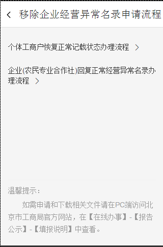
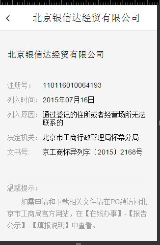
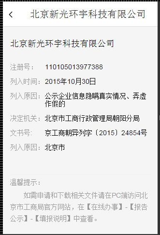
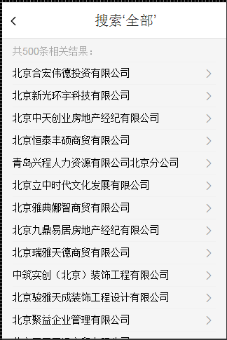
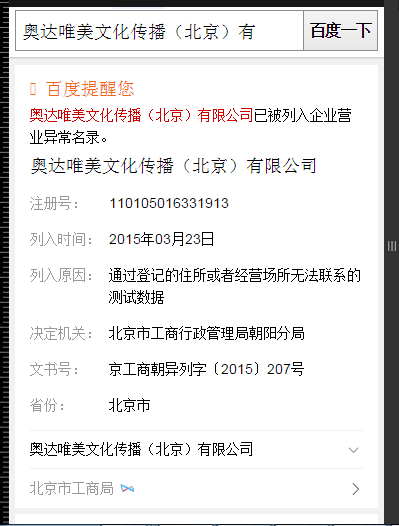

# 李阳阳

> 从2016-01-04到2016-01-08

## 本周跟进

- 【WISE影视sigma迭代优化】糯米运营热映卡片

## 老炮儿线上样式的服用以及白卡样式的修改优化

### 背景与目标

针对已经上线的糯米正在热映的运营卡片，进行优化，优化点在这里详述：
①schema整体结构优化，补充说明，方便后续PM手动填写
②白卡样式补充，补充一个简版样式的白卡

### 完成情况

- PV：30w

- 状态：4号的时候模板上线，线上query='<a href="https://m.baidu.com/pu=sz%401320_2001/s?word=%E5%B0%8F%E9%97%A8%E7%A5%9E&ts=9919309&t_kt=0&ie=utf-8&rsv_iqid=2118562287703335833&rsv_t=a47dSjw%252B1jRYovXoo3ocDC%252B7QxUEq6XVHLBYIgBWroPVxoLNJKjJ&sa=ib&rsv_pq=2118562287703335833&rsv_sug4=3971&ss=101&inputT=1251">小门神</a>'

### 效果图

<table algin="center">
<tr>
<td>新增的白卡样式：</td>
</tr>
<tr>
<td></td>
</tr>
<tr>
<td>sigma卡截图：</td>
</tr>
<tr>
<td></td>
</tr>
</table>

## 企业异常名录模板（无更新）
### 背景与目标

背景：百度政务之窗一期-政务寻址卡片同北京工商局合作初见成效，现同工商局达成进一步合作，从工商局获得一批北京市企业经营异常名录，可复用线上失信人模板展示这批数据。

 完成情况

唯一答案卡和白卡，这周处理了一些里边存在的样式和功能上的问题，其他的无进展

搜具体公司名称的卡片，已准备好，等待数据好了，可以上线

 唯一答案卡效果截图

开始搜‘北京市企业异常名录查询’出现

点击：如何移出企业经营异常名录？出现下图浮层：

点击每条的公司名称出现一下浮层：

点击右下角的查看更多，出现一下浮层：

白卡效果截图

开始搜‘北京市企业异常名录查询’出现

点击：查询：

点击每条的公司名称出现一下浮层：

点击右下角的查看更多，出现一下浮层：

精确卡

## 手表数据watch.json.tpl文件的添加

本周处理了6个模板格式的修改

## 下周计划

- 企业异常名录的资源方数据准备好了，联调

 

