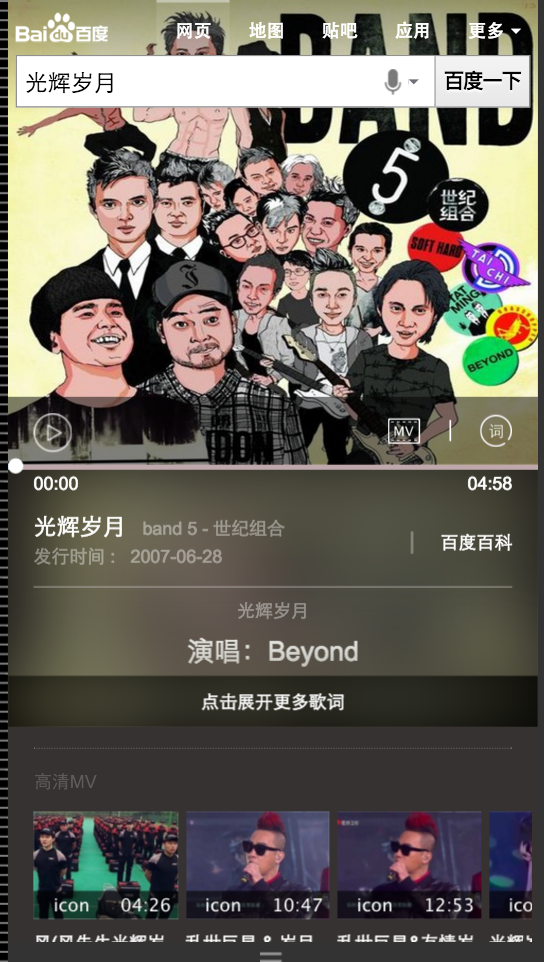
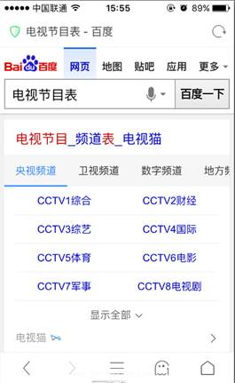
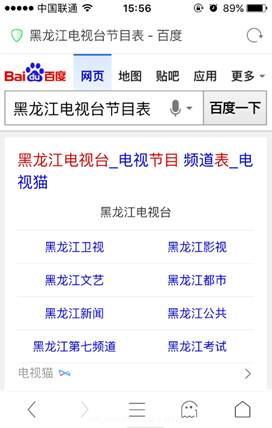
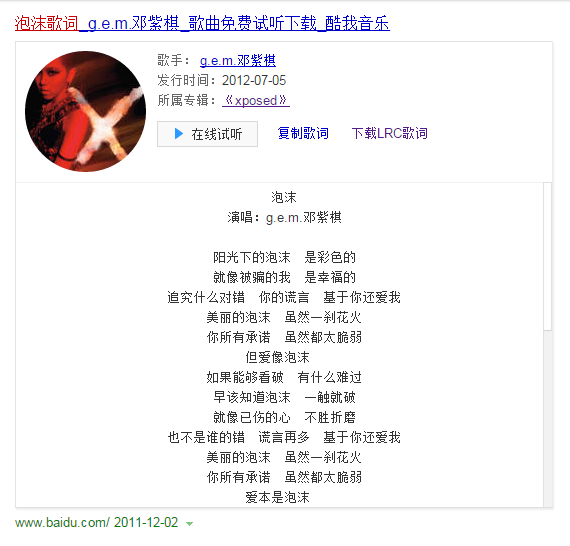

# 【阿拉丁产品方向周报】

> 2015.1.11 - 2015.1.15

产品方向主要在做的事情是哥伦布项目,擎天柱-模板组件化,其他项目

## 哥伦布

### 背景

哥伦布项目是将各个垂类划分给大搜索的几个总监来带，在纵向维度实现2号创新项目、3号创新项目、天使之翼等产品形态。 

目前哥伦布包括的项目有  

#### 一级垂类

* 中途岛: 资讯(owner：吴海，FE：陈锐、王培、黎明),  
* 天宁岛: 旅游、poi出行(owner：谭待，FE：泉友、小武),  
* 民生: 天气、万年历、车主服务(owner：永志，FE：朱雷、玲娟),
* 掘金者: 金融(owner：王闯，FE：WD2个FE，朱雷指导),
* 娱乐: 人物明星、影视视频、音乐(owner：李萌，FE：浪波、佳隆),
* 教育: (owner：王昊),
* 商品: (owner：沈抖)

#### 二级垂类
 
* 问答: 人力待定
* 招聘: FE: 玲玲
* 学术: FE: 郭勇

#### 三级垂类

体育、医疗、母婴、游戏(吴忧、李晓、阳阳、健池）





### 本周进展

### 天宁岛(泉友、小武) 

#### 背景

以一个出行方向为基点，聚合各垂类内容，使用户更便捷获取所需信息。

#### 进度

* 旅游sigma卡mrd产出，场景页mrd下周一产出，UE图未出，数据来源初步确定，预计下周一(1.18)开始开发

### 民生(朱雷、玲娟)

#### 背景

涵盖天气、万年历、车主服务等便民的生活服务类需求，方便用户更便捷地获取生活信息。

#### 进度

* 天气：后端扩量中，预计1.19小流量，1.25全量
* 万年历：UE图1.15出终稿
* 限行：开发中，年前上线
* 违章：开发中，预计1.29完成开发

### 掘金者(WD2个FE,朱雷指导)

#### 背景

将股票的趋势图、消息面、数据面等需求聚合成sigma卡片

#### 进度

UE设计中，预计下周二(1.19日出图),之后朱雷来拆分开发任务，与WD共同完成需求

### 娱乐(浪波、佳隆)

#### 背景

包含了人物明星、影视视频和音乐等娱乐元素的需求。

#### 进度

* 音乐sigma卡片已经完成，1.18提测

### 其他项目开发中

## 创新3号项目

### 背景

* 根据用户的query,尽可能多的提供与query相关的内容,让用户在搜索结果中能找到他需要的信息,在页面上待的时间更久.是纵向的或扩展信息

* 目前3号项目有,场景化人物,餐饮,景点,城市（开发完成以上线）/  大学,菜谱,银行（还没开始）


### 粉丝场景化(李晓)

### 背景

* 为更好地支持场景化的触发，方便pm更快铺量更好干预，与后端rd统一商定迁移为mini机制

* 为更好地视觉体验，新增沉浸式样式

* 为支持团购商品需求——电影《老炮儿》首映礼票务团购，模板需增加活动区域模块

### 最新进展

* 明星行程模块改版、新增明星行程中间页,1.15号ue定稿，1.20号开始联调，争取1.26号之前上线
* 场景化大卡的外部跳转点击率比对照组低，UBS分析的主因是对百科的导流和子卡的标题可点性，人物的样式做相应调整修改，修改后取10%流量实验
* 线上效果: [吴亦凡](https://www.baidu.com/ssid=8a3d73746172c3f7d0c773746172fc4b/from=844b/s?word=%E5%90%B4%E4%BA%A6%E5%87%A1&sa=tb&ts=8665908&t_kt=0&ms=1&rsv_pq=6932049557572375983&ss=101&t_it=1&rsv_sug4=3221&inputT=2313&oq=%E7%8E%8B%E6%BA%90)
* 效果截图


## 3.场景化城市（李晓）

### 背景与目标
不同地方的用户，在搜索相同的地域Query时，需求不同；根据用户所在地，用户搜索时间等条件，判断用户搜索的真实需求，整合现有资源，为用户提供高颜值高精准度的搜索结果展现；

城市场景化将于1231前需扩招至100个城市，影响面增至50w左右。

### 完成情况

* <span style="color:red">整体由90%流量放开至100%，其中50%全卡展现，50%半卡展现，影响面增加至50w</span>

* 

* 线上效果 [上海](https://m.baidu.com/s?word=%E4%B8%8A%E6%B5%B7&sid=102122#|ala_scene_h=0_1)

## 4.组件

* 擎天柱-模板组件化
* 分享组件-朱雷
* 日历组件-浪波

## 4.1 擎天柱-模板组件化

### 背景和目标

* 在2号.3号项目中有非常多相似的模块,故抽离出模板代码为模板组件,由数据来控制展现.目的是覆盖70%左右的需求,快速开发.节省开发成本  
* 目前在开发的组件有 super_imglist滑动图片列表 super_article  左图右文  headinfo 头图

### 完成情况

* 浪波,小晴,泉有,李晓,李佳隆重新梳理了开发规范,统一了数据接口.为了更好的扩展性以及同步异步调用的统一,js代码重构为require模块,[文档](http://sfe.baidu.com/#/阿拉丁/无线网页搜索/开发规范/阿拉丁擎天柱项目开发规范)

* 同步组件基本完成开发,目前可以在平台使用了,为线下调用,充分测试后,下周会上线

* 异步组件,开发中


## 4.2 朱雷-分享组件

### 背景

目前wise上的分享组件无法自定义分享信息，且存在一些过时的分享社区，例如开心网等，所以本次我重构了分享组件，支持分享到QQ空间和新浪微博，也支持使用者自定义分享面板的功能。

### 最新进度

已上线

## 4.3 浪波-日历组件升级

### 背景

支持前一天后一天逻辑

### 进展

已上线，线上地址http://m.baidu.com/s?word=%E5%8C%97%E4%BA%AC%E5%88%B0%E5%A4%A9%E6%B4%A5%E7%81%AB%E8%BD%A6&sid=103128,文档地址http://sfe.baidu.com/#/阿拉丁/无线网页搜索/js组件/日历组件使用说明

## 5.其他上线项目

## 李阳阳- 民生类——电视台卡片优化

### 背景

目前电视节目表-电视台卡片，频道信息显示不全，整体样式没有栅格化，通过优化样式，解决内容阅读问题，增加频道发起性搜索，提升电视频道卡搜索pv，整体提升用户粘性和体验

### 完成情况：
1月12号上线,query=电视节目表,query=黑龙江电视台节目表


## 常健驰 - 星座运势卡

### 背景

将原有星座运势阿拉丁卡片改为sigma形式，线上卡片虽为用户展示了较全的运势信息，但月和年运势用户需求不大，无必要展示，用户在运势中，需求强度为：今日运势>明日运势>本周运势，而该3个运势占比80%。期望对卡片升级以进一步提高星座类需求的流量激发、颜值以及体验提升、以及进一步的搜索动机激活。

### 进度

1.14日已经提测

### 效果图


## 常健驰 - 生肖首页

### 背景

目前无生肖阿拉丁产品，在做竞品分析中，其他搜索产品能对生肖内容有特型展现来满足用户需求；在年底年初之际，用户对生肖query需求较高，所以需生肖卡片，满足这部分用户需求。根据用户query分析，这部分用户搜索需求主要停留在十二生肖，xx属相，xx属相xx年运势，xx属与xx相配

### 进度

1.12日上线完成，影响面20w


# 项目进展汇总

##  2号项目-音乐

### 背景

2号项目的意义是在满足用户主需求的情况下,激发用户的额外需求.
在满足用户单曲精确查找的需求基础上，充分利用搜索结果的后面点击率较少的区域，激发用户在音乐上的需求。  
Query示例：小幸运（只有一位歌手唱过）  
依赖张靓颖（精准明确歌手与歌曲）  
影响面：首先针对可以在线播放的百度音乐资源的，排在首位的资源。  
初步按照圈定歌曲的方式，小流量测试10w/day  
全量约25w/day  

### 完成情况

* 下周一提测

### 效果图


## 擎天柱-imglist组件开发

### 背景

在场景化,2号项目中有非常多相似的模块,故抽离出模板代码为模板组件,由数据来控制展现.节省开发成本  

### 完成情况

* 添加了sto参数前缀
* 添加了gorder日志参数
* 修复bug若干

## 出行-机票、火车票、汽车票

### 背景

资源方更换成携程

### 进展

机票生成抽样模板，支持参数跳转，支持低价日历的UI切换，目前已上线

火车票模板以前一些跳转的逻辑在模板中写死，并且模板名带qunar不太合适，新建模板支持，目前还没后端环境

汽车票出发到达字段更改，原取资源方的，先去RD解析的query的，防止异步有bug 已上线

## 日历组件升级

### 背景

支持前一天后一天逻辑

### 进展

将日历组件迁移至amd规范，支持前一天后一天逻辑

线上地址：http://m.baidu.com/s?word=%E5%8C%97%E4%BA%AC%E5%88%B0%E5%A4%A9%E6%B4%A5%E7%81%AB%E8%BD%A6&sid=103128

文档地址：http://sfe.baidu.com/#/阿拉丁/无线网页搜索/js组件/日历组件使用说明


## 音乐

### 本周进展

沟通音乐台需求，调研中间页实现机制，可能走中途岛的技术实现

付费逻辑梳理 下周统一修改pc和wise

## 1. 场景化出行（wise_scene_trav）

### * 背景与目标
通过时间、地点场景信息定位有出行需求的用户，展现场景化出行卡片，围绕出行需求，集合信息、交通、消费等功能，精准满足其出行需求。

### * 完成情况
- 11月26日上线。
- 实验组/对照组流量各50%，每组影响pv约3.5w/天；策略触发后，场景化卡片覆盖的pv约1w/天。
- Query=香山(天安门，故宫等)，地点策略+时间策略。
- [点这里~点这里~](https://www.baidu.com/from=844b/s?word=%E9%A6%99%E5%B1%B1&ts=0015366&t_kt=0&rsv_iqid=5504612005285293655&rsv_t=f77fpuYM6PishRuwv6A9PSlfWEsQ%252FkBKd%252FtsgBcmqwBGyhR9vBwtIJNd3A&sa=ib&ms=1&rsv_sug4=3888&ss=101&inputT=2065&sid=102251)


<span style="color:red">收起定位改动，添加点击响应</span>

## 2. 场景化餐饮（wise_scene_food）

### * 背景与目标
各种餐饮名店信息聚合，吃货的福利。为用户提供更便捷的餐饮搜索信息，给部分产品线导流。

### * 完成情况
- 12月1日已上线。
- 实验圈定query总 pv约3.5w/天；根据策略，卡片会在午饭和晚饭时段触发；触发后，卡片覆盖的pv约1w/天
- Query=全聚德(麻辣诱惑，海底捞等)。
- [点这里~点这里~](http://cq01-aladdin-product-05.epc.baidu.com:8003/s?word=%E6%B5%B7%E5%BA%95%E6%8D%9E&ts=2862183&t_kt=0&sa=ib&rsv_sug4=5921&inputT=4644&ss=100&cip=47.153.191.255&tn=iphone&sid=102122)

<span style="color:red">收起定位改动，添加点击响应</span>


## 3. 场景化城市（wise_scene_city）

### * 背景与目标
不同地方的用户，在搜索相同的地域Query时，需求不同；根据用户所在地，用户搜索时间等条件，判断用户搜索的真实需求，整合现有资源，为用户提供高颜值高精准度的搜索结果展现。

### * 完成情况

- Query=广州(上海，北京等)。
- [点这里~点这里~](http://cq01-aladdin-product-05.epc.baidu.com:8003/s?word=%E8%A5%BF%E5%AE%89&sa=tb&ts=7886850&t_kt=0&rsv_t=d93dQMJ8oDkEP%252FAP42XH91G2DzxGN7euopVrqPYifT3ciDlwi6TI&rsv_pq=1595416660186666569&ss=101&t_it=1&rsv_sug4=3603&inputT=1781&oq=%E9%A2%90%E5%92%8C%E5%9B%AD)

<span style="color:red">本周场景化城市新增本地出行模块，更改异地出行模块，新增旅游贴士模块，预计周天12月27零流量上线。</span>


<span style="color:red">收起定位改动，添加点击响应</span>

## 4. 自由产品出图

### * 背景与目标
以上五个模板增加出图样式。

### * 完成情况
- 本周完成测试，于12月16日小流量上线知道类模板(www_zhidao_normal, zhidao, wenda)
- 总计PV 3000W+
- Query=自动咖啡机(水星无线路由器设置，高通骁龙等)。
- [点这里~点这里~](https://www.baidu.com/s?word=%E9%87%91%E6%9E%97%E9%92%A3%E9%87%91%E6%89%8B%E6%9C%BA%E7%89%88&sid=102423)

<span style="color:red">本周无更新</span>


## 5. 场景化人物（wise_scene_person_kv）
从现有数据中抽象出这些趋势的一些规律，将其应用到产品设计和召回中，有效减少用户筛选成本，增加产品使用率。因此我们可以通过条件触发的sigma形式，将粉丝的各维度需求在sigma卡片上做聚合展示，让粉丝通过搜索来追星，获取明星的全面信息。
### * 背景与目标

### * 完成情况
- 本周添加微博与热门微博条数限制，已上线。
- Query=鹿晗，暂时只有鹿晗能触发，初始影响面PV=6.5W，试验期间减半。
- [点这里~点这里~](https://www.baidu.com/from=844b/s?word=%E9%B9%BF%E6%99%97&ts=9424931&t_kt=0&rsv_iqid=7099597460254613959&rsv_t=5473vbvJQ6CHpRcFDZVOcjgQ8PfD4HRnZdMdiAW4%252BJY8bnEwuCP4PPXMZA&sa=ib&ms=1&rsv_sug4=1960&ss=101&inputT=733)


`12.11上午沉浸式样式小流量上线，仍保持90%生效，其中10%生效人群识别策略，覆盖人数12人，影响面150w/天`

<span style="color:red">本周无更新</span>


## 6. 场景化大学（wise_scene_colleges）

### * 背景与目标
根据不同用户群体，不同地域，给用户提供不同高校信息的聚合展示。
### * 完成情况

<span style="color:red">本周无更新</span>


## 7. 擎天柱项目article公共组件开发

### * 背景与目标

提高代码复用性于开发效率。

### * 完成情况

- 同步已完成，在根据需求迭代

## 8. 天宁岛类目

### * 背景与目标

以一个出行方向为基点，聚合各垂类内容，使用户更便捷获取所需信息。

### * 完成情况

- 旅游sigma卡mrd产出，场景页mrd下周一产出，UE图未出，数据来源初步确定。
- 预计下周开始开发。


## 1、3号项目 - 人物粉丝场景化

### 背景

* 为更好地支持场景化的触发，方便pm更快铺量更好干预，与后端rd统一商定迁移为mini机制

* 为更好地视觉体验，新增沉浸式样式

* 为支持团购商品需求——电影《老炮儿》首映礼票务团购，模板需增加活动区域模块

### 完成情况

* 升级模板wise_scene_person_kv，12.02日模板上线，12.04日数据切换为mini机制，影响面约125W;

* 沉浸式样式升级，并支持头部颜色可配置,12.10日模板已上线

* 头部文字描述支持可跳转，增加活动区域入口；增加活动区域模块，12.11日模板上线

* 12.11上午沉浸式样式小流量上线，仍保持90%生效，其中10%生效人群识别策略，覆盖人数12人，影响面150w/天

* 增加图片模块，12.25日模板上线

* 粉丝场景化将于1231前需扩招至60人，影响面增至400w左右

* 2016年奥运会采用kv形式复用该模板，调整kv模式下子卡与mini数据格式统一，01.08号模板上线

### 覆盖query

* 鹿晗，迪丽热巴，杨洋，郑爽，李易峰，杨幂

### 线上效果

* [吴亦凡](https://www.baidu.com/ssid=8a3d73746172c3f7d0c773746172fc4b/from=844b/s?word=%E5%90%B4%E4%BA%A6%E5%87%A1&sa=tb&ts=8665908&t_kt=0&ms=1&rsv_pq=6932049557572375983&ss=101&t_it=1&rsv_sug4=3221&inputT=2313&oq=%E7%8E%8B%E6%BA%90)

### 效果截图

* 唯一答案


### todo1

* <span  style="color:red">明星行程模块改版、新增明星行程中间页</span>

* <span  style="color:red">【背景】大搜整体向中间页方向发展，倡导沉浸式体验，提供更多内容，增强对PV把控能力，增长用户停留时长,在中间页展现更多行程内容，同时为后续引入更多资源方、UGC内容打下基础。</span>

* <span  style="color:red">【完成情况】01.15号ue定稿，1.20号开始联调，争取1.26号之前上线</span>

### todo2
* <span  style="color:red">细节样式修改</span>

* <span  style="color:red">【背景】场景化大卡的外部跳转点击率比对照组低，UBS分析的主因是对百科的导流和子卡的标题可点性，人物的样式做相应调整修改，修改后取10%流量实验</span>
1.头图点击修改为去往百科页面，2.  头部百科入口加强 3.  点赞区域底框去了 4.  子卡标题字体颜色修改，外加上icon 5.  子卡标题行，整行可点 6.  粉丝关注和新闻资讯目前没有落地页，暂时不做跳转，但用户点击后发点击日志，从而估算点击跳转的最大值

* <span  style="color:red">【完成情况】待开展</span>

## 2. 3号项目 - 场景化城市（wise_scene_city）

### 背景与目标
不同地方的用户，在搜索相同的地域Query时，需求不同；根据用户所在地，用户搜索时间等条件，判断用户搜索的真实需求，整合现有资源，为用户提供高颜值高精准度的搜索结果展现；

城市场景化将于1231前需扩招至100个城市，影响面增至50w左右。

### 完成情况

- 为铺量做如下修改，模板已于12.30日上线,pm已确认100个城市，1231日外网开放90%流量，影响面增至45w左右,

- 新增本地出行模块、旅游贴士模块；

- 更改异地出行模块、经典行程模块；

- 本地生活/出行锦囊部分四个功能时，修复图标过大问题；

- 不可错过模块tab等分；

- 展开缩起栏的文案调整；

- 本地场景下，底部栏高度往上提一点，确保不展示新闻最后一条的分割线；

- 本地生活&出行锦囊处的icon透明度按照设计稿标注来调整透明度；

- 旅游攻略模块，当展示的字段为路线内容时，不展示行程宽松，出行人数等字段，只展示行程名称和摘要字段;

- 10%流量显示全卡，按照rd春博给出的字段，添加是否显示全卡策略.

- <span  style="color:red">整体由90%流量放开至100%，其中50%全卡展现，50%半卡展现，影响面增加至50w。</span>


### 线上效果

* [上海](https://m.baidu.com/s?word=%E4%B8%8A%E6%B5%B7&sid=102122#|ala_scene_h=0_1)

### todo1

* <span  style="color:red">新增头卡迭代样式（需实验）</span>

* <span  style="color:red">【背景】据ubs评估半卡下展开区域点击率为20%，比期望值低，新增迭代样式激发展开区域点击率</span>

* <span  style="color:red">【完成情况】01.08号模板上线，并取10%小流量上线，影响面约5w,01.13号结束实验，实验结论负向展开区域点击率由20%下降至13%，后续重新迭代实验，pm、ue确认样式中。</span>

## 3. 擎天柱项目

### 背景

sigma头图抽离公共模板组件，增加复用功能，提高开发效率

### 进展

开发完，待上线，后续会持续优化和迭代

使用文档: [http://sfe.baidu.com/#/阿拉丁/无线网页搜索/开发规范/擎天柱-headinfo模板组件](http://sfe.baidu.com/#/阿拉丁/无线网页搜索/开发规范/擎天柱-headinfo模板组件)

## 4、旅游 - 城市卡片优化

### 背景

* 春节项目复用模板功能修改，升级点为：开放tab个数，若tab个数大于三个则调用滑动tab组件、开放下方景点个数、tab根据关键词定位、天气情况预报数据添加是否展现控制

### 完成情况

* 升级模板wise_city_travel，01.14日模板上线

## 星座运势卡

### 背景与目标

将原有星座运势阿拉丁卡片改为sigma形式，线上卡片虽为用户展示了较全的运势信息，但月和年运势用户需求不大，无必要展示，用户在运势中，需求强度为：今日运势>明日运势>本周运势，而该3个运势占比80%。期望对卡片升级以进一步提高星座类需求的流量激发、颜值以及体验提升、以及进一步的搜索动机激活。

### 完成情况

模板已在 `1月14日`提测，[白羊座运势](http://cp01-ala-fe-6.epc.baidu.com:8003/s?word=%E7%99%BD%E7%BE%8A%E5%BA%A7%E8%BF%90%E5%8A%BF&ts=5565706&t_kt=0&rsv_iqid=2793991772156148673&sa=ihr_1&rsv_sug4=1027&ss=001)

### 效果截图

sigma效果


白卡效果图


## 生肖首页

### 背景与目标

目前无生肖阿拉丁产品，在做竞品分析中，其他搜索产品能对生肖内容有特型展现来满足用户需求；在年底年初之际，用户对生肖query需求较高，所以需生肖卡片，满足这部分用户需求。

根据用户query分析，这部分用户搜索需求主要停留在十二生肖，xx属相，xx属相xx年运势，xx属与xx相配

`这里只展现生肖首页模板，运势不展现`

### 完成情况

`1月12日` [生肖首页](http://cp01-ala-fe-6.epc.baidu.com:8003/s?word=%E7%99%BD%E7%BE%8A%E5%BA%A7%E8%BF%90%E5%8A%BF&ts=5565706&t_kt=0&rsv_iqid=2793991772156148673&sa=ihr_1&rsv_sug4=1027&ss=001) 和 [生肖运势卡](https://m.baidu.com/ssid=22266368616e676a69616e636869df09/s?word=1990%E5%B9%B4%E5%B1%9E%E9%A9%AC2016%E5%B9%B4%E8%BF%90%E5%8A%BF&sa=tb&ts=6132979&t_kt=0&ie=utf-8&rsv_t=10dd50N2lLYCj5fQqm0XCyGxYZnr%252FkDapaPkL8foBJyBYtm%252BNsP0&rsv_pq=7246359259479176661&ss=101&t_it=1&rsv_sug4=10438&inputT=9533&oq=%E7%94%9F%E8%82%96) 模板上线完成，两个模板的pv量合计：`20W` 左右。

## pm2.5

### 背景与目标

目前线上pm2.5卡片内容过于单一，样式不够优美，需要对卡片进行优化，增加更多信息，丰富卡片内容

### 完成情况

模板只剩下城市列表数据，`保丹-pm` 正在整理，提前安排qa同学于 `1月15日` 介入，先测试模板的其他功能，城市列表暂不测试。预览：[三亚pm2.5](https://wwwhttps.baidu.com/s?dev_workspace=platform&dev_tpl=pm25&tn=iphone&sid=99999&dev_online=0&dev_module=aladdin-wise&dev_file=default.xml&dev_fileformat=xml&dev_pos=asResult&wd=%E4%B8%89%E4%BA%9Apm2.5&word=%E4%B8%89%E4%BA%9Apm2.5#wa_ui_city_t=1452825251636)

## 度秘适配

### 进展情况

目前适配的模板中，没问题可发布的如下：
* query=热映电影院，模板名：wz_dianyingyuan_new 
* query=家庭怎么养花 模板名：zhidao
* query=中秋节 模板名：cjgeneral
* query=我是你的朋友用英语怎么说 模板名：fanyi
* query=review翻译  模板名：dictwisenew
* query=从上海到合肥的机票  模板名：wise_ticket_lp
* query=百度股价怎么样  模板名：stockdynamic
* query=腾讯股价  模板名：stockdynamic_moretab

适配完，需修复的如下：
* query=豪豪快乐大本营 模板名：wise_video （手百IOS落地页有问题，需要修复）
* query=从合肥到上海的火车  模板名：qunar_train01 （落地页跳转不对）
* query=北京天气  模板名：wise_weather_new （手百有乱码）

## 招聘弱需求卡
   开发中

## 民生类——电视台卡片优化

### 背景与目标

```
目前电视节目表-电视台卡片，频道信息显示不全，整体样式没有栅格化，通过优化样式，解决内容阅读问题，增加频道发起性搜索，提升电视频道卡搜索pv，整体提升用户粘性和体验

```

### 完成情况

- 影响PV日均约 5W/day,1月12号上线,query="<a href="http://m.baidu.com/pu=sz%40224_220/s?word=%E7%94%B5%E8%A7%86%E8%8A%82%E7%9B%AE%E8%A1%A8">电视节目表</a>",query="<a href="http://m.baidu.com/pu=sz%40224_220/s?word=%E9%BB%91%E9%BE%99%E6%B1%9F%E7%94%B5%E8%A7%86%E5%8F%B0%E8%8A%82%E7%9B%AE%E8%A1%A8">黑龙江电视台节目表</a>"

### 效果图

<table algin="center">
<tr>
<td></td>
</tr>
<tr>
<td></td>
</tr>
</table>

## 音乐歌词卡片开发

### 背景与目标

优化线上歌词搜索

### 完成情况

- 状态：

    - 功能基本实现
    - 还没部署到rd的环境上去
    - delay，下周一应该可以跟ue勾兑调好样式，完成开发

### 效果图

<table algin="center">
<tr>
<td></td>
</tr>
</table>

## 【创新2号-春运火车票】(无更新)

### 项目背景
针对用户搜从A地到B地的火车票，给出对应日期和车型的车次列表。同时推荐沿途风景、旅行必备、途经景点的相关推荐。

### 上线情况：1.6上线小流量。pv10w。sid=101486

### 预览效果：

## 【度秘wise_novel_book数据修复】(无更新)

### 项目背景
手百迁移了模板，导致之前线上的dumi.json.tpl数据失效。

### 上线情况：1.7上线。

## 【车主服务-限行】

### 项目背景

二号项目中在车主服务共有2个需求，分别是限行、违章和摇号，基本满足车主用户的搜索需求。

### 进度

开发中，年前上线。

## 北京积分落户计算器 - 测试通过，上线准备中

### 背景与目标

12月10日北京积分落户管理政策公布征集意见，刚发布后wise端用户的检索量一天达到十几万以上的影响面。从12月10日到31日前属于政策意见征集阶段，具有强时效性。因此政务小团队这边想针对积分落户做一个wise上的积分状态查询功能，属于临时需求。希望在本月内能借此时效性待政策先积淀用户，待政策颁布后计划将此计算器作为办事工具型产品

### 完成情况

新模板`gov_calculator`，模板开发完成，处于上线`ready`状态，pm正在走单，预计下周一（01-18）上线，预计pv:12W

### 效果图


## 天宁岛类目

### 背景与目标

以一个出行方向为基点，聚合各垂类内容，使用户更便捷获取所需信息。

### 完成情况

- sigma卡mrd产出，场景页mrd下周一产出，UE图未出，数据来源初步确定。
- 预计下周开始开发。

## 完成的其他需求

* [wise端春节庙会项目模板修改需求](http://icafe.baidu.com/issue/WiseAladdinTemplate-1230/)
* [电影票sigma模板在部分iphone6+safari上有个连接错误问题](http://icafe.baidu.com/issue/WiseAladdinTemplate-1218/)
* [修复sigma底部样式在android搜狗浏览器中变形](http://icafe.baidu.com/issue/psfewebui-3282)

## 正在跟进的其他需求（按优先级排序）

* 天宁岛项目
* 出行模板里`form`跳转修改，涉及的模板：

模板名 | query | 完整版 | 精简版 | 功能版 | sigma版
--- | --- | --- | --- | --- | ---
form3 | 上海高铁 | 已修改 | 目前不支持 | 目前不支持 | 已废弃
wise_ticket_lp | 哈尔滨到三亚机票价格 | 已修改，但js里的待验证 | 目前不支持 | 目前不支持 | 无
kuaixing | 汽车票查询, 汽车票 | 已修改 | 目前不支持 | 目前不支持 | 已修改
wz_qichepiao | 常州恐龙园 | 老模板不支持修改 | 无 | 无 | 无
busticket_more | 北京到天津汽车票 | 未找到跳转代码 | 无 | 无 | 无
qunar_train01 | 待看 | - | - | - | -
trainnumber | k446 | 老模板不支持修改 | 无 | 无 | 无

> 上午的`已修改`是指在平台上修改了，待pm确认

* pc地图修复bug，目前进度70%，样式已修复，目前还有部分链接有问题
* 非标天使之翼优化，使用新的view层处理动画，但目前pm说等等再优化
* 北京积分落户计算器sigma样式
* [sigma_disease模板修复+增加source字段](http://icafe.baidu.com/issue/4263397/)
* [汽车评测卡多tab升级](http://icafe.baidu.com/issue/WiseAladdinTemplate-1011)

## 哥伦布-掘金者

### 背景

掘金者是WD总监王闯负责的项目，主打金融垂类。之后金融类目会完全交给WD负责，本期我们主要负责交接，带着WD的FE共同完成这一次需求。

### 完成情况

目前UE设计中，预计下周二（2016-01-19）产出终稿。届时我会将卡片拆分，和WD的2个FE一起完成需求，排期待定。

## 马文号项目 

### 背景

创新2号项目之一，之前北京天气的探索收益为正，所以本期扩大到13个重点城市，模板从kv机制迁移到AE。

### 完成情况

下线了调起手百功能。目前后端扩量中。预计1.19日小流量，1.25日全量。

#### 示例query

北京天气

### 效果图


## 分享组件

### 背景

目前wise上的分享组件无法自定义分享信息，且存在一些过时的分享社区，例如开心网等，所以本次我重构了分享组件，支持分享到QQ空间和新浪微博，也支持使用者自定义分享面板的功能。

### 进度

组件已经上线可用。


