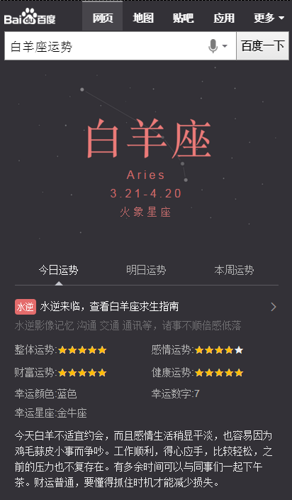
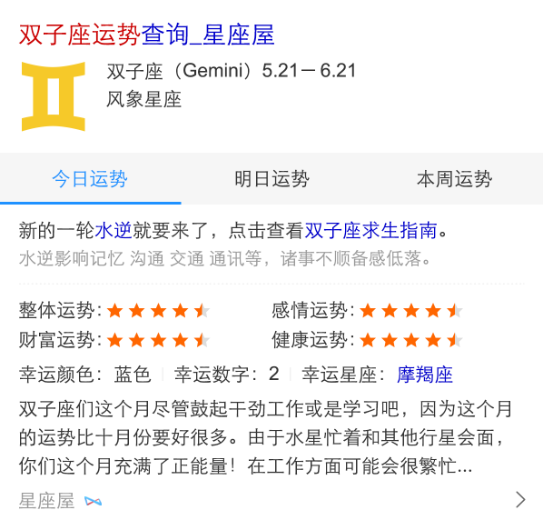

# 常健驰

> 从2016-01-11到2015-01-15

## 星座运势卡

### 背景与目标

将原有星座运势阿拉丁卡片改为sigma形式，线上卡片虽为用户展示了较全的运势信息，但月和年运势用户需求不大，无必要展示，用户在运势中，需求强度为：今日运势>明日运势>本周运势，而该3个运势占比80%。期望对卡片升级以进一步提高星座类需求的流量激发、颜值以及体验提升、以及进一步的搜索动机激活。

### 完成情况

模板已在 `1月14日`提测，[白羊座运势](http://cp01-ala-fe-6.epc.baidu.com:8003/s?word=%E7%99%BD%E7%BE%8A%E5%BA%A7%E8%BF%90%E5%8A%BF&ts=5565706&t_kt=0&rsv_iqid=2793991772156148673&sa=ihr_1&rsv_sug4=1027&ss=001)

### 效果截图

sigma效果

白卡效果图

## 生肖首页

### 背景与目标

目前无生肖阿拉丁产品，在做竞品分析中，其他搜索产品能对生肖内容有特型展现来满足用户需求；在年底年初之际，用户对生肖query需求较高，所以需生肖卡片，满足这部分用户需求。

根据用户query分析，这部分用户搜索需求主要停留在十二生肖，xx属相，xx属相xx年运势，xx属与xx相配

`这里只展现生肖首页模板，运势不展现`

### 完成情况

`1月12日` [生肖首页](http://cp01-ala-fe-6.epc.baidu.com:8003/s?word=%E7%99%BD%E7%BE%8A%E5%BA%A7%E8%BF%90%E5%8A%BF&ts=5565706&t_kt=0&rsv_iqid=2793991772156148673&sa=ihr_1&rsv_sug4=1027&ss=001) 和 [生肖运势卡](https://m.baidu.com/ssid=22266368616e676a69616e636869df09/s?word=1990%E5%B9%B4%E5%B1%9E%E9%A9%AC2016%E5%B9%B4%E8%BF%90%E5%8A%BF&sa=tb&ts=6132979&t_kt=0&ie=utf-8&rsv_t=10dd50N2lLYCj5fQqm0XCyGxYZnr%252FkDapaPkL8foBJyBYtm%252BNsP0&rsv_pq=7246359259479176661&ss=101&t_it=1&rsv_sug4=10438&inputT=9533&oq=%E7%94%9F%E8%82%96) 模板上线完成，两个模板的pv量合计：`20W` 左右。

## pm2.5

### 背景与目标

目前线上pm2.5卡片内容过于单一，样式不够优美，需要对卡片进行优化，增加更多信息，丰富卡片内容

### 完成情况

模板只剩下城市列表数据，`保丹-pm` 正在整理，提前安排qa同学于 `1月15日` 介入，先测试模板的其他功能，城市列表暂不测试。预览：[三亚pm2.5](https://wwwhttps.baidu.com/s?dev_workspace=platform&dev_tpl=pm25&tn=iphone&sid=99999&dev_online=0&dev_module=aladdin-wise&dev_file=default.xml&dev_fileformat=xml&dev_pos=asResult&wd=%E4%B8%89%E4%BA%9Apm2.5&word=%E4%B8%89%E4%BA%9Apm2.5#wa_ui_city_t=1452825251636)

## 接下来的排期

* nba主卡有个遗留问题，需要跟 `安瑞-pm` 对接一下,看如何修改。
