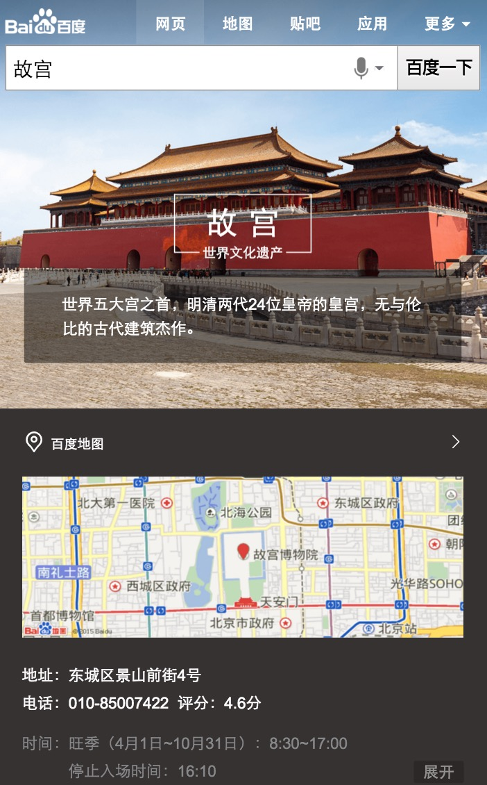
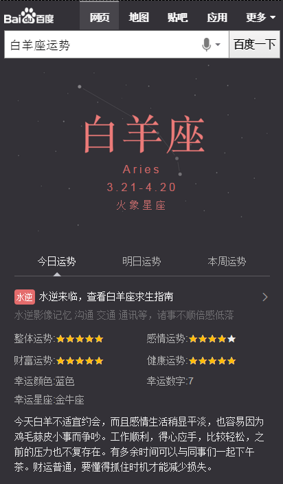
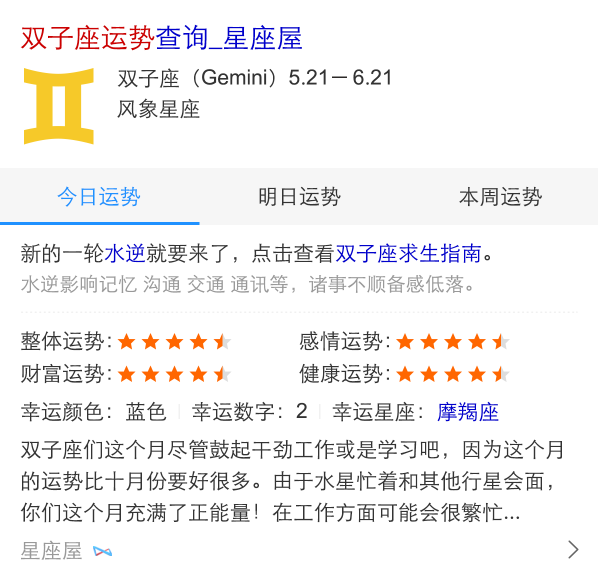

# 【阿拉丁产品方向周报】

> 2015.1.18 - 2015.1.22

产品方向主要在做的事情是哥伦布项目,擎天柱-模板组件化,其他项目

## 1、哥伦布

### 背景

哥伦布项目是将各个垂类划分给大搜索的几个总监来带，在纵向维度实现2号创新项目、3号创新项目、天使之翼等产品形态。 

目前哥伦布包括的项目有  

#### 一级垂类

* 中途岛: 资讯(owner：吴海，FE：陈锐、王培、黎明),  
* 天宁岛: 旅游、poi出行(owner：谭待，FE：泉友、小武),  
* 民生: 天气、万年历、车主服务(owner：永志，FE：朱雷、玲娟),
* 掘金者: 金融(owner：王闯，FE：WD2个FE，朱雷指导),
* 娱乐: 人物明星、影视视频、音乐(owner：李萌，FE：浪波、佳隆),
* 教育: (owner：王昊),
* 商品: (owner：沈抖)

#### 二级垂类
 
* 问答: 人力待定
* 招聘: FE: 玲玲
* 学术: FE: 郭勇

#### 三级垂类

体育、医疗、母婴、游戏(吴忧、李晓、阳阳、健池）

### 本周进展

### 天宁岛-旅游(泉友、小武) 

#### 背景

当前的旅游类搜索结果页包含卡片较多，尤其是同质内容卡片使得页面结构凌乱，体验和用户使用效率上都欠佳。以景区和典型旅游城市作为试水Query，依托于场景化卡片优化搜索结果页整体效果

#### 进度

* 本周1.22前完成确认数据，需求，地图API等准备工作。
* 预计下周一(1-25)开始联调，下周三(1-27)提测，下周五(1-29)达到上线状态。

### 天宁岛-出行，城市，餐饮(泉友、无更新) 

#### 背景

* 出行-不同地方的用户，在搜索相同的地域Query时，需求不同；根据用户所在地，用户搜索时间等条件，判断用户搜索的真实需求，整合现有资源，为用户提供高颜值高精准度的搜索结果展现；

* 城市-春节项目复用模板功能修改，升级点为：开放tab个数，若tab个数大于三个则调用滑动tab组件、开放下方景点个数、tab根据关键词定位、天气情况预报数据添加是否展现控制。

* 餐饮-各种餐饮名店信息聚合，吃货的福利。为用户提供更便捷的餐饮搜索信息，给部分产品线导流。

### 民生(朱雷、玲娟)

#### 背景

涵盖天气、万年历、车主服务等便民的生活服务类需求，方便用户更便捷地获取生活信息。

#### 进度

* 天气：下线了调起手百功能。目前后端扩量中。预计1.19日小流量，1.25日全量。
* 万年历：开发中，预计1.25日提测，1.27日上线
* 限行：数据联调中，年前上线
* 违章：预计2016/01/29完成sigma的基本开发

### 掘金者(WD2个FE,朱雷指导)

#### 背景

将股票的趋势图、消息面、数据面等需求聚合成sigma卡片

#### 进度

目前项目处于开发中，FE预期1.25日下班前完成开发并提测

### 娱乐-音乐(浪波、佳隆)

#### 背景

包含了人物明星、影视视频和音乐等娱乐元素的需求。

#### 进度

* 1.21日上线，小流量测试10w/day；全量约25w/day

* 线上效果

### 娱乐-粉丝场景化(李晓，无更新)

### 背景

* 为更好地支持场景化的触发，方便pm更快铺量更好干预，与后端rd统一商定迁移为mini机制

* 为更好地视觉体验，新增沉浸式样式

* 为支持团购商品需求——电影《老炮儿》首映礼票务团购，模板需增加活动区域模块

## 2、擎天柱-模板组件化

### 背景和目标

* 在2号.3号项目中有非常多相似的模块,故抽离出模板代码为模板组件,由数据来控制展现.目的是覆盖70%左右的需求,快速开发.节省开发成本  
* 目前在开发的组件有 super_imglist滑动图片列表 super_article  左图右文  headinfo 头图

### 完成情况

* 本周imglist组件上线了onTabChange接口

* 异步组件,开发中

## 3、2号激发项目——解梦

### 项目背景

以往我们的产品思路都是通过特型满足用户的直接需求，随着时间的推移，用户的需求变得更加多元化，我们也会尝试在一些需求比较单一的query下，通过各维度挖掘用户原始需求的特征，以横向推荐的方式，激发和满足用户更多的关联需求。 解梦的需求即属于这一类，在用户行为分析中我们发现，用户搜索解梦的内容时，需求非常单一，几乎不会搜索其他内容，而现有的搜索结果也无非是对于各家网站对梦境的解析，内容大同小异，所以在原始需求已经满足较好的前提下，分析这一类用户的共同特征，通过特型的引导，激发并满足用户新的需求。

### 目标

预计1.20上线小流量

### 本周工作

模板开发完成，等待pm评估效果中，预计下周上线

## 4、其他项目

## 阳阳- wise_official模板栅格化

### 背景

栅格样式

### 完成情况：
1月21号模板上线

## 阳阳-音乐综艺卡片跳转逻辑优化

### 背景与目标
将模板中的title和tab标题按季度和期度分开，包括pc和wise模板

### 完成情况
pc的1月21号上线，wise的1.22下午上线

## 常健驰 - 星座运势卡（无更新）

### 背景

将原有星座运势阿拉丁卡片改为sigma形式，线上卡片虽为用户展示了较全的运势信息，但月和年运势用户需求不大，无必要展示，用户在运势中，需求强度为：今日运势>明日运势>本周运势，而该3个运势占比80%。期望对卡片升级以进一步提高星座类需求的流量激发、颜值以及体验提升、以及进一步的搜索动机激活。

## 常健驰 - 生肖首页（无更新）

### 背景

目前无生肖阿拉丁产品，在做竞品分析中，其他搜索产品能对生肖内容有特型展现来满足用户需求；在年底年初之际，用户对生肖query需求较高，所以需生肖卡片，满足这部分用户需求。根据用户query分析，这部分用户搜索需求主要停留在十二生肖，xx属相，xx属相xx年运势，xx属与xx相配

## 刘玲玲 - 兼职精需求

### 背景

修改跳转链接

### 上线情况

已上线周四（1.20）

# 产品需求汇总

> 从2016-15到2016-1-22

##	2号项目-音乐

### 背景

2号项目的意义是在满足用户主需求的情况下,激发用户的额外需求.
在满足用户单曲精确查找的需求基础上，充分利用搜索结果的后面点击率较少的区域，激发用户在音乐上的需求。  
Query示例：小幸运（只有一位歌手唱过）  
依赖张靓颖（精准明确歌手与歌曲）  
影响面：首先针对可以在线播放的百度音乐资源的，排在首位的资源。  
初步按照圈定歌曲的方式，小流量测试10w/day  
全量约25w/day  

### 完成情况

* 1.21日上线

### 效果图

## 擎天柱-imglist组件开发

### 背景

在场景化,2号项目中有非常多相似的模块,故抽离出模板代码为模板组件,由数据来控制展现.节省开发成本  

### 完成情况

* 添加onTabChange接口

## 修复bug

### 计算器高次幂计算错误
### 豆瓣链接文字颜色

> 从2016-01-18到2016-01-22

## 出行-机票、火车票、汽车票

### 背景

资源方更换成携程/快行

### 本周进展

PM加入新人tuwei，fe加入李晓一起跟进，本周和PM、RD一起梳理后续所有计划，并大致确认时间点

汽车票点到点快行接口已经ready，模板与1月21号开发完成 正在联调截断

机票点到点模板优化iframe样式，和iframe提供方进行样式联调，已完成并上线

## 哥伦布项目前端开发框架

### 背景

支持前一天后一天逻辑

### 进展

资源引入方案制定和推进

log相关规范梳理

## qidian2模板生成utouch版

### 本周进展

有人反馈线上utouch的qidian2模板展现样式错乱，原因定位在utouch直接继承的iphone。

1月19号新开发一个utouch模板并上线

> 从2016-01-18到2015-01-22

## 1. 场景化出行（wise_scene_trav）

### * 背景与目标
通过时间、地点场景信息定位有出行需求的用户，展现场景化出行卡片，围绕出行需求，集合信息、交通、消费等功能，精准满足其出行需求。

### * 完成情况
- 11月26日上线。
- 实验组/对照组流量各50%，每组影响pv约3.5w/天；策略触发后，场景化卡片覆盖的pv约1w/天。
- Query=香山(天安门，故宫等)，地点策略+时间策略。
- [点这里~点这里~](https://www.baidu.com/from=844b/s?word=%E9%A6%99%E5%B1%B1&ts=0015366&t_kt=0&rsv_iqid=5504612005285293655&rsv_t=f77fpuYM6PishRuwv6A9PSlfWEsQ%252FkBKd%252FtsgBcmqwBGyhR9vBwtIJNd3A&sa=ib&ms=1&rsv_sug4=3888&ss=101&inputT=2065&sid=102251)

景点场景化外跳优化实验

## 2. 场景化餐饮（wise_scene_food）

### * 背景与目标
各种餐饮名店信息聚合，吃货的福利。为用户提供更便捷的餐饮搜索信息，给部分产品线导流。

### * 完成情况
- 12月1日已上线。
- 实验圈定query总 pv约3.5w/天；根据策略，卡片会在午饭和晚饭时段触发；触发后，卡片覆盖的pv约1w/天
- Query=全聚德(麻辣诱惑，海底捞等)。
- [点这里~点这里~](http://cq01-aladdin-product-05.epc.baidu.com:8003/s?word=%E6%B5%B7%E5%BA%95%E6%8D%9E&ts=2862183&t_kt=0&sa=ib&rsv_sug4=5921&inputT=4644&ss=100&cip=47.153.191.255&tn=iphone&sid=102122)

本周无更新

## 3. 场景化城市（wise_scene_city）

### * 背景与目标
不同地方的用户，在搜索相同的地域Query时，需求不同；根据用户所在地，用户搜索时间等条件，判断用户搜索的真实需求，整合现有资源，为用户提供高颜值高精准度的搜索结果展现。

### * 完成情况

- Query=广州(上海，北京等)。
- [点这里~点这里~](http://cq01-aladdin-product-05.epc.baidu.com:8003/s?word=%E8%A5%BF%E5%AE%89&sa=tb&ts=7886850&t_kt=0&rsv_t=d93dQMJ8oDkEP%252FAP42XH91G2DzxGN7euopVrqPYifT3ciDlwi6TI&rsv_pq=1595416660186666569&ss=101&t_it=1&rsv_sug4=3603&inputT=1781&oq=%E9%A2%90%E5%92%8C%E5%9B%AD)

本周场景化城市新增本地出行模块，更改异地出行模块，新增旅游贴士模块，预计周天12月27零流量上线。

本周无更新

## 4. 天宁岛-旅游

### * 背景与目标

- 当前的旅游类搜索结果页包含卡片较多，尤其是同质内容卡片使得页面结构凌乱，体验和用户使用效率上都欠佳。以景区和典型旅游城市作为试水Query，依托于场景化卡片优化搜索结果页整体效果。

### * 完成情况
- 本周完成确认数据格式，需求细节及地图API等准备工作。
- 预计下周一(1-25)开始联调，下周三(1-27)提测，下周五(1-29)达到上线状态。

## 5. 场景化人物（wise_scene_person_kv）
从现有数据中抽象出这些趋势的一些规律，将其应用到产品设计和召回中，有效减少用户筛选成本，增加产品使用率。因此我们可以通过条件触发的sigma形式，将粉丝的各维度需求在sigma卡片上做聚合展示，让粉丝通过搜索来追星，获取明星的全面信息。
### * 背景与目标

### * 完成情况
- 本周添加微博与热门微博条数限制，已上线。
- Query=鹿晗，暂时只有鹿晗能触发，初始影响面PV=6.5W，试验期间减半。
- [点这里~点这里~](https://www.baidu.com/from=844b/s?word=%E9%B9%BF%E6%99%97&ts=9424931&t_kt=0&rsv_iqid=7099597460254613959&rsv_t=5473vbvJQ6CHpRcFDZVOcjgQ8PfD4HRnZdMdiAW4%252BJY8bnEwuCP4PPXMZA&sa=ib&ms=1&rsv_sug4=1960&ss=101&inputT=733)

`12.11上午沉浸式样式小流量上线，仍保持90%生效，其中10%生效人群识别策略，覆盖人数12人，影响面150w/天`

本周无更新

## 6. 场景化大学（wise_scene_colleges）

### * 背景与目标
根据不同用户群体，不同地域，给用户提供不同高校信息的聚合展示。
### * 完成情况

本周无更新

## 7. 擎天柱项目article公共组件开发

### * 背景与目标

提高代码复用性于开发效率。

### * 完成情况

- 同步已完成，在根据需求迭代

## 8. 天宁岛类目

### * 背景与目标

以一个出行方向为基点，聚合各垂类内容，使用户更便捷获取所需信息。

### * 完成情况

- 旅游sigma卡mrd产出，场景页mrd下周一产出，UE图未出，数据来源初步确定。
- 预计下周开始开发。

> 从2016-01-18到2016-01-22

## 1、娱乐 - 人物粉丝场景化

### 背景

* 为更好地支持场景化的触发，方便pm更快铺量更好干预，与后端rd统一商定迁移为mini机制

* 为更好地视觉体验，新增沉浸式样式

* 为支持团购商品需求——电影《老炮儿》首映礼票务团购，模板需增加活动区域模块

### 完成情况

* 升级模板wise_scene_person_kv，12.02日模板上线，12.04日数据切换为mini机制，影响面约125W;

* 沉浸式样式升级，并支持头部颜色可配置,12.10日模板已上线

* 头部文字描述支持可跳转，增加活动区域入口；增加活动区域模块，12.11日模板上线

* 12.11上午沉浸式样式小流量上线，仍保持90%生效，其中10%生效人群识别策略，覆盖人数12人，影响面150w/天

* 增加图片模块，12.25日模板上线

* 粉丝场景化将于1231前需扩招至60人，影响面增至400w左右

* 2016年奥运会采用kv形式复用该模板，调整kv模式下子卡与mini数据格式统一，01.08号模板上线

### 覆盖query

* 鹿晗，迪丽热巴，杨洋，郑爽，李易峰，杨幂

### 线上效果

* [吴亦凡](https://www.baidu.com/ssid=8a3d73746172c3f7d0c773746172fc4b/from=844b/s?word=%E5%90%B4%E4%BA%A6%E5%87%A1&sa=tb&ts=8665908&t_kt=0&ms=1&rsv_pq=6932049557572375983&ss=101&t_it=1&rsv_sug4=3221&inputT=2313&oq=%E7%8E%8B%E6%BA%90)

### 效果截图

* 唯一答案

### todo1

* 明星行程模块改版、新增明星行程情景页

* 【背景】大搜整体向中间页方向发展，倡导沉浸式体验，提供更多内容，增强对PV把控能力，增长用户停留时长,在中间页展现更多行程内容，同时为后续引入更多资源方、UGC内容打下基础。

* 【完成情况】ue未定稿，待开展

### todo2
* 人物场景化外跳优化实验-细节样式修改

* 【背景】场景化大卡的外部跳转点击率比对照组低，UBS分析的主因是对百科的导流和子卡的标题可点性，人物的样式做相应调整修改，修改后取10%流量实验
1.头图点击修改为去往百科页面，2.  头部百科入口加强 3.  点赞区域底框去了 4.  子卡标题字体颜色修改，外加上icon 5.  子卡标题行，整行可点 6.  粉丝关注和新闻资讯目前没有落地页，暂时不做跳转，但用户点击后发点击日志，从而估算点击跳转的最大值

* 【完成情况】01.21日模板已上线，01.22开始小流量实验，实验组95%，对照组5%，影响面约300w左右

## 2. 天宁岛 - 场景化城市（wise_scene_city）

### 背景与目标
不同地方的用户，在搜索相同的地域Query时，需求不同；根据用户所在地，用户搜索时间等条件，判断用户搜索的真实需求，整合现有资源，为用户提供高颜值高精准度的搜索结果展现；

城市场景化将于1231前需扩招至100个城市，影响面增至50w左右。

### 完成情况

- 为铺量做如下修改，模板已于12.30日上线,pm已确认100个城市，1231日外网开放90%流量，影响面增至45w左右,

- 新增本地出行模块、旅游贴士模块；

- 更改异地出行模块、经典行程模块；

- 本地生活/出行锦囊部分四个功能时，修复图标过大问题；

- 不可错过模块tab等分；

- 展开缩起栏的文案调整；

- 本地场景下，底部栏高度往上提一点，确保不展示新闻最后一条的分割线；

- 本地生活&出行锦囊处的icon透明度按照设计稿标注来调整透明度；

- 旅游攻略模块，当展示的字段为路线内容时，不展示行程宽松，出行人数等字段，只展示行程名称和摘要字段;

- 10%流量显示全卡，按照rd春博给出的字段，添加是否显示全卡策略.

- 整体由90%流量放开至100%，其中50%全卡展现，50%半卡展现，影响面增加至50w。

### 线上效果

* [上海](https://m.baidu.com/s?word=%E4%B8%8A%E6%B5%B7&sid=102122#|ala_scene_h=0_1)

## 3. 擎天柱项目

### 背景

sigma头图抽离公共模板组件，增加复用功能，提高开发效率

### 进展

开发完，待上线，后续会持续优化和迭代

使用文档: [http://sfe.baidu.com/#/阿拉丁/无线网页搜索/开发规范/擎天柱-headinfo模板组件](http://sfe.baidu.com/#/阿拉丁/无线网页搜索/开发规范/擎天柱-headinfo模板组件)

## 4、旅游 - 城市卡片优化

### 背景

* 春节项目复用模板功能修改，升级点为：开放tab个数，若tab个数大于三个则调用滑动tab组件、开放下方景点个数、tab根据关键词定位、天气情况预报数据添加是否展现控制

### 完成情况

* 升级模板wise_city_travel，01.14日模板上线

## 5、旅游 - 国外跟团游自由行卡片

### 背景

* 国外跟团游自由行卡片数据迁移为携程

### 完成情况

* 升级模板lvyouroute，模板开发完，数据评估中，待上线

> 从2016-01-18到2015-01-22

## 星座运势卡

### 背景与目标

将原有星座运势阿拉丁卡片改为sigma形式，线上卡片虽为用户展示了较全的运势信息，但月和年运势用户需求不大，无必要展示，用户在运势中，需求强度为：今日运势>明日运势>本周运势，而该3个运势占比80%。期望对卡片升级以进一步提高星座类需求的流量激发、颜值以及体验提升、以及进一步的搜索动机激活。

### 完成情况

模板已在 `1月14日`提测，[白羊座运势](http://cp01-ala-fe-6.epc.baidu.com:8003/s?word=%E7%99%BD%E7%BE%8A%E5%BA%A7%E8%BF%90%E5%8A%BF&ts=5565706&t_kt=0&rsv_iqid=2793991772156148673&sa=ihr_1&rsv_sug4=1027&ss=001)

### 效果截图

sigma效果

白卡效果图

## pm2.5

### 背景与目标

目前线上pm2.5卡片内容过于单一，样式不够优美，需要对卡片进行优化，增加更多信息，丰富卡片内容

### 完成情况

模板只剩下圆环的颜色渐变没有调好，经 `杨燕雪-qa` 同学测试发现的问题已修改完毕。预览：[三亚pm2.5](https://wwwhttps.baidu.com/s?dev_workspace=platform&dev_tpl=pm25&tn=iphone&sid=99999&dev_online=0&dev_module=aladdin-wise&dev_file=default.xml&dev_fileformat=xml&dev_pos=asResult&wd=%E4%B8%89%E4%BA%9Apm2.5&word=%E4%B8%89%E4%BA%9Apm2.5)

## 接下来的排期

* nba主卡有个遗留问题，需要跟 `安瑞-pm` 对接一下,看如何修改。

## 值周上线问题

* 手百-李惠清 编译后发现没有js文件 重新编译了一次 （群里确认需要上传的静态文件后）

* 糯米团购-吴丽黎 `cr` 和 `编译` 确认后，在发单前发现模板有问题，重新编译了一次，然后到单台后又发现模板有问题，回滚了一次单台，由于 `op` 同学年会导致当天无法继续上线。

> 从2016-01-18 到 2016-01-22

## 度秘适配

### 进展情况

修复度秘有问题的模板如下：(周四1.20号已上线）
* review翻译者 模板名：dictwisenew  （字段为空时判断）
* 家庭怎么养花     zhidao  （去掉source空字段及修复跳转错误）
* 炮打双灯   wz_movie  (新增适配度秘模板)
* 择天记 wz_comic_series  （修复乱码）
* 盗墓笔记/西游记  wise_novel_book （数据乱码非度秘模板问题）

## 兼职精需求（修改跳转链接）

### 进展情况

修改完毕已上线周四（1.20）

### 效果图

## 招聘弱需求卡

   开发完毕，测试中

## 教育考栅格化

### 进展情况

    开发中

> 从2016-01-18到2015-01-22

## wise_official模板栅格化

### 背景与目标

栅格样式

### 完成情况

- 1月21号模板上线

## 音乐综艺卡片跳转逻辑优化

### 背景与目标

将模板中的title和tab标题按季度和期度分开，包括pc和wise模板

### 完成情况

- pc的1月21号上线，wise的今天下午上线

## 手表数据适配

### 背景与目标

- 星座、日历、火车出行三类里涉及到的四个模板数据映射~~还有航班的没弄~~~慢慢弄吧~~

### 完成情况

- 继续ing~~~

> 2016.1.18 - 2016.1.22

## 【创新2号-春运火车票】(无更新)

### 项目背景
针对用户搜从A地到B地的火车票，给出对应日期和车型的车次列表。同时推荐沿途风景、旅行必备、途经景点的相关推荐。

### 上线情况：1.15已下线。

### 预览效果：

## 【车主服务-限行】

### 项目背景

二号项目中在车主服务共有2个需求，分别是限行、违章和摇号，基本满足车主用户的搜索需求。

### 进度

开发中，年前上线。

> 从2016-01-18到2015-01-22

## 天宁岛-情景页开发

### 背景与目标

- 当前的旅游类搜索结果页包含卡片较多，尤其是同质内容卡片使得页面结构凌乱，体验和用户使用效率上都欠佳。以景区和典型旅游城市作为试水Query，依托于场景化卡片优化搜索结果页整体效果。

### 完成情况

- 本周完成确认数据格式，需求细节
- 预计下周一(1-25)开始联调，下周三(1-27)提测，下周五(1-29)达到上线状态。

### 下周

* superframe拼接tc链接方法依赖
* 日志ubs对接日志参数
* 栅格对superframe的支持

## 完成的其他需求

* 旅游的tc链接修改

## 跟进的需求

* 天宁岛项目开发。
* pc地图修复bug，目前进度70%，样式已修复，目前还有部分链接有问题
* 非标天使之翼优化，使用新的view层处理动画，但目前pm说等等再优化
* 北京积分落户计算器sigma样式

> 从2016-01-11到2016-01-15

## 哥伦布-掘金者

### 背景

掘金者是WD总监王闯负责的项目，主打金融垂类。之后金融类目会完全交给WD负责，本期我们主要负责交接，带着WD的FE共同完成这一次需求。

### 完成情况

目前项目处于开发中，FE预期1.25日下班前完成开发并提测

## 哥伦布-生活服务-万年历

### 背景

由复合搜索部总监永志负责，在万年历这个生活入口尝试进行需求前置，实验流量激发的效果

### 进度

开发中，预计1.25日提测，1.27日上线

## 马文号项目（无更新）

### 背景

创新2号项目之一，之前北京天气的探索收益为正，所以本期扩大到13个重点城市，模板从kv机制迁移到AE。

### 完成情况

下线了调起手百功能。目前后端扩量中。预计1.19日小流量，1.25日全量。

#### 示例query

北京天气

### 效果图

## 分享组件(无更新)

### 背景

目前wise上的分享组件无法自定义分享信息，且存在一些过时的分享社区，例如开心网等，所以本次我重构了分享组件，支持分享到QQ空间和新浪微博，也支持使用者自定义分享面板的功能。

### 进度

组件已经上线可用。
