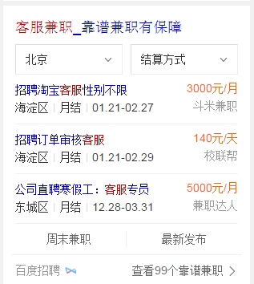

# 刘玲玲

> 从2016-01-18 到 2016-01-22

## 度秘适配

### 进展情况

修复度秘有问题的模板如下：(周四1.20号已上线）
* review翻译者 模板名：dictwisenew  （字段为空时判断）
* 家庭怎么养花     zhidao  （去掉source空字段及修复跳转错误）
* 炮打双灯   wz_movie  (新增适配度秘模板)
* 择天记 wz_comic_series  （修复乱码）
* 盗墓笔记/西游记  wise_novel_book （数据乱码非度秘模板问题）

## 兼职精需求（修改跳转链接）

### 进展情况

修改完毕已上线周四（1.20）

### 效果图

## 招聘弱需求卡

   开发完毕，测试中

## 教育考栅格化

### 进展情况

    开发中

