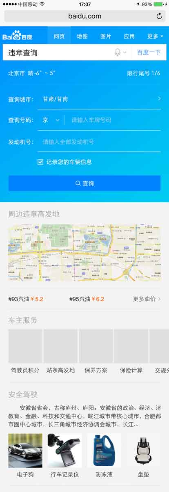

# 【阿拉丁产品方向周报】

> 从2015-01-25到2015-01-29

产品方向主要在做的事情是哥伦布项目,擎天柱-模板组件化,其他项目

## 1、哥伦布

### 背景

哥伦布项目是将各个垂类划分给大搜索的几个总监来带，在纵向维度实现2号创新项目、3号创新项目、天使之翼等产品形态。 

目前哥伦布包括的项目有  

#### 一级垂类

* 中途岛: 资讯(owner：吴海，FE：陈锐、王培、黎明),  
* 天宁岛: 旅游、poi出行(owner：谭待，FE：泉友、小武),  
* 民生: 天气、万年历、车主服务(owner：永志，FE：朱雷、玲娟),
* 掘金者: 金融(owner：王闯，FE：WD2个FE，朱雷指导),
* 娱乐: 人物明星、影视视频、音乐(owner：李萌，FE：浪波、佳隆),
* 教育: (owner：王昊),
* 商品: (owner：沈抖)

#### 二级垂类
 
* 问答: 人力待定
* 招聘: FE: 玲玲
* 学术: FE: 郭勇

#### 三级垂类

体育、医疗、母婴、游戏(吴忧、李晓、阳阳、健池）

### 本周进展

### 天宁岛-旅游(泉友、小武) 

#### 背景

当前的旅游类搜索结果页包含卡片较多，尤其是同质内容卡片使得页面结构凌乱，体验和用户使用效率上都欠佳。以景区和典型旅游城市作为试水Query，依托于场景化卡片优化搜索结果页整体效果

#### 进度

### 完成情况

这是新模板，模板名为`clbus_trav`，年前showcase召回5个key，属于内网全流量召回，外网0流量。预计01-29模板上线。外网全量后预计影响面pv为4W

目前测试完成，只有以下图片问题：

* 在情景页发现有3个图片老是加载失败，并且有的机型里ok，有的不ok，但资源方数据里的图片是ok

### 天宁岛-出行，城市，餐饮(泉友、无更新) 

#### 背景

* 出行-不同地方的用户，在搜索相同的地域Query时，需求不同；根据用户所在地，用户搜索时间等条件，判断用户搜索的真实需求，整合现有资源，为用户提供高颜值高精准度的搜索结果展现；

* 城市-春节项目复用模板功能修改，升级点为：开放tab个数，若tab个数大于三个则调用滑动tab组件、开放下方景点个数、tab根据关键词定位、天气情况预报数据添加是否展现控制。

* 餐饮-各种餐饮名店信息聚合，吃货的福利。为用户提供更便捷的餐饮搜索信息，给部分产品线导流。

#### 本周进展

- 11月26日上线。
- 实验组/对照组流量各50%，每组影响pv约3.5w/天；策略触发后，场景化卡片覆盖的pv约1w/天。
- Query=香山(天安门，故宫等)，地点策略+时间策略。
- [点这里~点这里~](https://www.baidu.com/from=844b/s?word=%E9%A6%99%E5%B1%B1&ts=0015366&t_kt=0&rsv_iqid=5504612005285293655&rsv_t=f77fpuYM6PishRuwv6A9PSlfWEsQ%252FkBKd%252FtsgBcmqwBGyhR9vBwtIJNd3A&sa=ib&ms=1&rsv_sug4=3888&ss=101&inputT=2065&sid=102251)

更改半卡全卡后判断逻辑。

### 民生(朱雷、玲娟)

#### 背景

涵盖天气、万年历、车主服务等便民的生活服务类需求，方便用户更便捷地获取生活信息。

#### 进度

* 天气：下线了调起手百功能。目前后端扩量中。预计1.19日小流量，1.25日全量。
* 万年历：
	已上线，影响面约30w，线上效果地址https://m.baidu.com/ssid=794557616465334a756e65ae10/s?word=%E4%B8%87%E5%B9%B4%E5%8E%86&rq=&ss=0&ts=5867831&t_kt=0&dit=0&sa=tb&oq=%E4%B8%87%E5%B9%B4%E5%8E%86&sid=103271

	效果图

* 限行：提测中，下周上线。
* 违章：
	- `UE图已确认`
    - `子卡『车主服务』开发完成，待数据完善`
    - `子卡『安全驾驶』开发完成，带数据完善`
    - `主卡开发中, 改中间页形式为superframe组件`
        1. 第一层中间页已开发完
        - 第二层开发中...
    - `其余子卡待数据完善后开发`
    - 预计`2016/02/02` 前端开发，达到上线状态
    

	效果图

<table algin="center">
<tr>
<td></td>
</tr>
</table>

### 掘金者(WD2个FE,朱雷指导)

#### 背景

将股票的趋势图、消息面、数据面等需求聚合成sigma卡片

#### 进度

目前FE开发基本完成，预计1.29日（今天）提测，2.1上线

### 娱乐-音乐(浪波、佳隆)

#### 背景

包含了人物明星、影视视频和音乐等娱乐元素的需求。

#### 进度

* 修复在iphone4下播放不灵敏
* 调整歌词在收起时不可滑动,展开时才允许滑动
* 优化拖拽体验

* 线上效果

### 娱乐-粉丝场景化(李晓，无更新)

### 背景

* 为更好地支持场景化的触发，方便pm更快铺量更好干预，与后端rd统一商定迁移为mini机制

* 为更好地视觉体验，新增沉浸式样式

* 为支持团购商品需求——电影《老炮儿》首映礼票务团购，模板需增加活动区域模块

## 2、擎天柱-模板组件化

### 背景和目标

* 暂无更新

## 3、2号激发项目——解梦

### 项目背景

以往我们的产品思路都是通过特型满足用户的直接需求，随着时间的推移，用户的需求变得更加多元化，我们也会尝试在一些需求比较单一的query下，通过各维度挖掘用户原始需求的特征，以横向推荐的方式，激发和满足用户更多的关联需求。 解梦的需求即属于这一类，在用户行为分析中我们发现，用户搜索解梦的内容时，需求非常单一，几乎不会搜索其他内容，而现有的搜索结果也无非是对于各家网站对梦境的解析，内容大同小异，所以在原始需求已经满足较好的前提下，分析这一类用户的共同特征，通过特型的引导，激发并满足用户新的需求。

### 目标

预计1.20上线小流量

### 本周工作

模板开发完成，等待pm评估效果中，预计下周上线

## 4、其他项目

## Wise前端交互日志修正

### 背景

* 目前Wise结果页内的前端交互日志存在误发的情况（历史原因导致），情况主要体现在：用户拖动非跳转的点击区域时，会误发交互日志。这部分误发的日志给造成了实验评估的不准确。从UBS的小流量实验结论上看，误发比例整体在25%（苏珺提供）左右，对于个别点击区域较大的卡片，误发比例会更高。为保证接下来产品评估指标可以正确计算，由前端整体进行交互日志的修正。

### 完成情况

* 升级模板sam_scene_person、wise_scene_city、wise_scene_trav、wise_scene_food、wise_scene_person_kv横滑相关组件iscroll为bscroll,日志加sto,其中wise_scene_person_kv跟pm确认可下线，其他四个模板01.26号已上线。

## 卡片复用升级 - 旅游 - 城市卡片优化

### 背景

* 春节项目复用模板功能修改，预计影响面10W，升级点为：开放tab个数，若tab个数大于三个则调用滑动tab组件、开放下方景点个数、tab根据关键词定位、天气情况预报数据添加是否展现控制

### 完成情况

* 升级模板wise_city_travel，01.22日模板上线

## 卡片复用升级 - 旅游 - 景点卡片优化

### 背景

* 春节庙会项目，需要复用wise模板进行覆盖，因个别模板和schema不符合庙会特型，需要修改/增加字段

### 完成情况

* 升级模板travel_strategy，01.28日模板上线

## 数据迁移 - 旅游 - 签证卡片

### 背景

* 签证卡片资源方切换为携程

### 完成情况

* 模板加兼容处理，升级模板lvyouvisa，01.28日模板上线

## 数据迁移 - 旅游 - 国外跟团游自由行卡片

### 背景

* 国外跟团游自由行卡片数据迁移为携程

### 完成情况

* 升级模板lvyouroute，模板开发完，数据评估中，待上线

## 数据迁移 - 旅游 - 火车票点到点

### 背景

* 火车票点到点卡片数据迁移为快行

### 完成情况

* 新增模板ptp_train，联调中，节前联调完，节后上线

