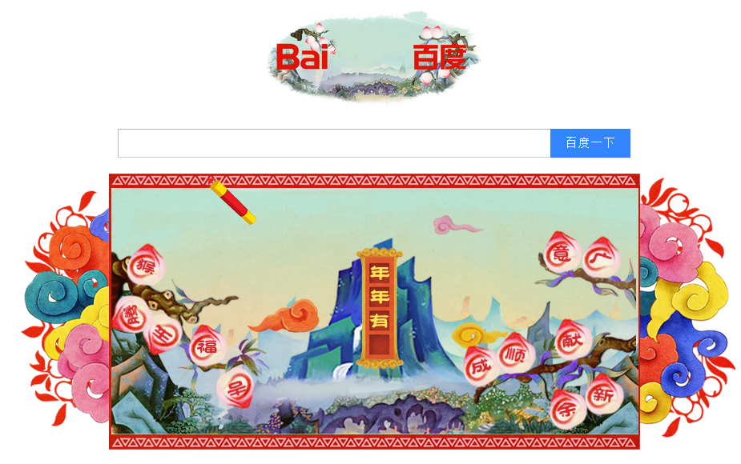
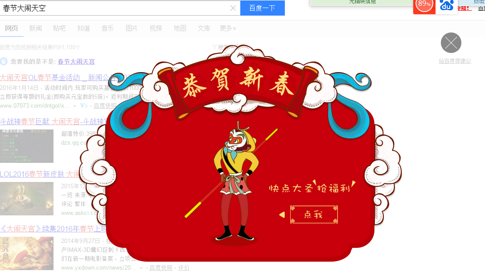

# 陈锐

> 从2015-01-18到2015-01-22

## 1. WISE 春节拍福项目
### 背景和目标
拍福抢红包，亿万福到家，预期上线：2月1日~2月14日。结合图像搜索在wise上新的功能大力推下搜索的活动，主要将春节期间搜索为用户提供的服务串联起来。

关键词：办年货，民俗，大搜情怀，图像搜索，庙会、春晚、祝福语、对联、灯谜、年夜饭等

### 完成进度
* 模板已上线

## 2. PC 春节首页LOGO + 结果页动画

### 背景和目标
以大闹天宫为题材的交互小游戏，完成填字游戏解救大圣，游戏结束后有一个小动画。最后导流到结果页（初步定query=春节），会有一个猴子变成大福字的动画。

### 项目截图

### 完成进度
* 首页LOGO游戏：完成开发，以及下周一上线。
    * 预览地址：http://cp01-ps-fe-11.epc.baidu.com:8088/static/share/guest/logo.html
* 结果页动画：基本完成开发，周五（1/29）压测并走单，预计下周二上线。
    * 预览地址：http://cp01-ala-plat-1.epc.baidu.com:8012/s?dev_workspace=platform&dev_tpl=right_spring2016&tn=tpldev&dev_online=0&dev_module=dev-aladdin&dev_file=default.xml&dev_fileformat=xml&dev_pos=rightResult&wd=%E6%98%A5%E8%8A%82%E5%A4%A7%E9%97%B9%E5%A4%A9%E7%A9%BA&word=%E6%98%A5%E8%8A%82%E5%A4%A7%E9%97%B9%E5%A4%A9%E7%A9%BA

## 4. 运营项目开发改进进度
- 本周无进度
- 列表

<table border="1">
    <tr>
        <td>序号</td><td>类别</td><td>任务名</td><td>负责人</td><td>进度</td>
    </tr>
    <tr>
        <td>1</td><td>base模板</td><td>运营基类模板c_base_optl</td><td>王培</td><td>完成初版</td>
    </tr>
    <tr>
        <td>2</td><td>运营模板</td><td>旧的运营模版迁移改造</td><td>王培</td><td>待定</td>
    </tr>
    <tr>
        <td>3</td><td>运营模板</td><td>通用浮层模板</td><td>陈锐</td><td>已完成浮层导流模板，后续基于此模版改进</td>
    </tr>
    <tr>
        <td>4</td><td>中间页</td><td>PC/WISE统计</td><td>陈锐</td><td>WISE已完成，PC待定</td>
    </tr>
    <tr>
        <td>5</td><td>中间页</td><td>PC/WISE登录</td><td>陈锐</td><td>待定</td>
    </tr>
    <tr>
        <td>6</td><td>运营组件</td><td>动画效果库优化</td><td>陈锐</td><td>待定</td>
    </tr>
    <tr>
        <td>7</td><td>平台</td><td>用户登录和统计</td><td>小琴</td><td>平台二期</td>
    </tr>
    <tr>
        <td>8</td><td>平台</td><td>实现平台测速</td><td>小琴</td><td>平台二期</td>
    </tr>
    <tr>
        <td>9</td><td>平台</td><td>运营项目预览平台</td><td>小琴</td><td>平台二期</td>
    </tr>
    <tr>
        <td>10</td><td>平台</td><td>中间页开发整合到平台</td><td>小琴</td><td>平台二期</td>
    </tr>
    <tr>
        <td>11</td><td>中间页</td><td>WISE中间页的统计（log.js）和分享（share.js）</td><td>陈锐</td><td>已完成</td>
    </tr>
</table>

## 5. 其他项目
- 旧的运营卡片升级改造，包括事件通用（generalevent）和节日节气（cjgeneral）（节后进行）
- 唯一答案入口banner模板迁移（目前导流banner模板图片会发虚）（节后进行）
- 传情产品升级（PM：卉子，FE：王培）
