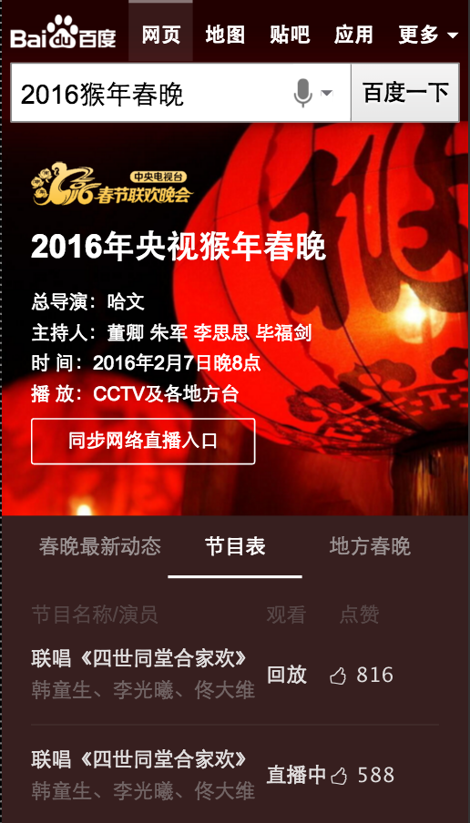
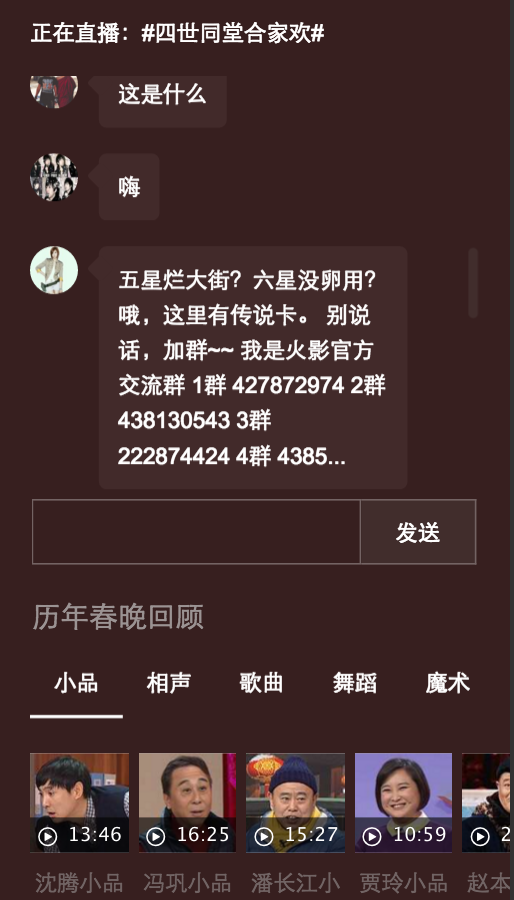
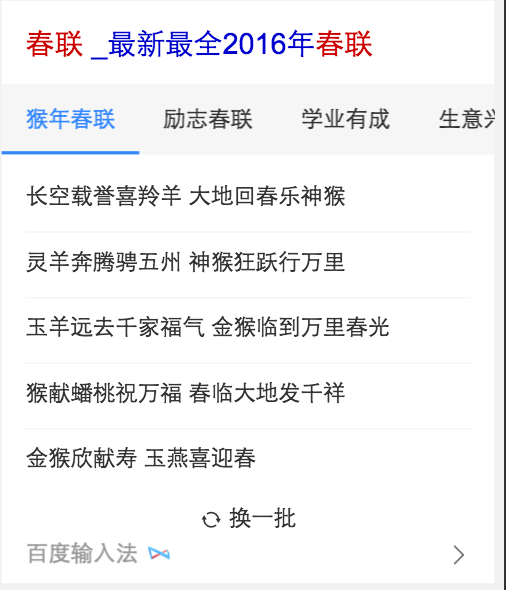
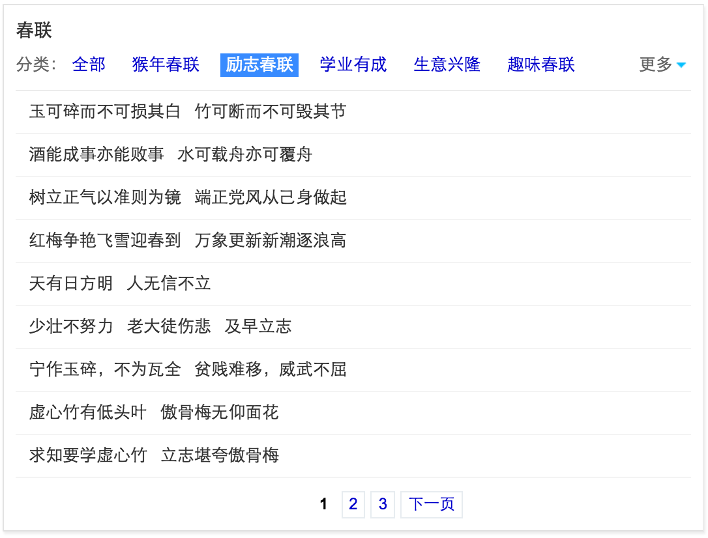
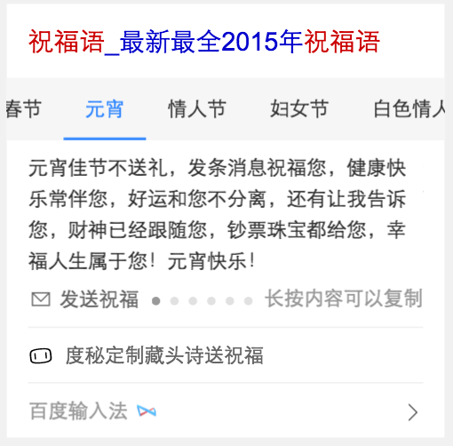

# 范黎明

> 从2016-01-22到2016-01-29

## 春节相关阿拉丁卡片

### 背景和目标
春节相关的阿拉丁卡片需求，包括 春晚，年货，春联，灯谜，庙会，习俗，年夜饭，祝福语。

## 春晚

### 完成进度

wise、pc都模板已经上线

### 效果预览

## 春联、谜语

### 完成进度

pc昨天已经上线， wise的今天再上一次

### 效果预览

## 祝福语

### 完成进度

等多模fe完成sigma卡开发后预计今天上模板

### 效果预览

## 下周计划

修复已上线模板的bug

