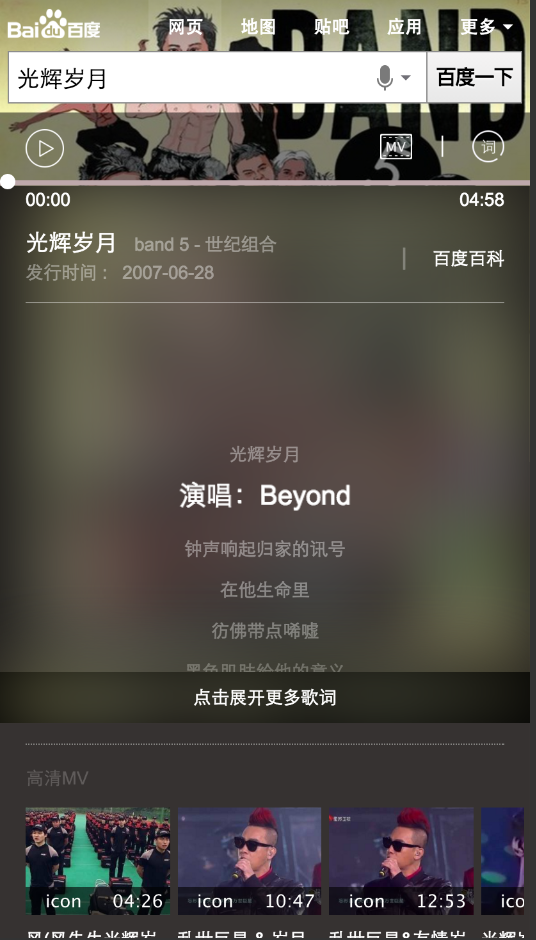

# 李佳隆

> 从2016-25到2016-1-29

##	2号项目-音乐

### 背景

2号项目的意义是在满足用户主需求的情况下,激发用户的额外需求.
在满足用户单曲精确查找的需求基础上，充分利用搜索结果的后面点击率较少的区域，激发用户在音乐上的需求。  
Query示例：小幸运（只有一位歌手唱过）  
依赖张靓颖（精准明确歌手与歌曲）  
影响面：首先针对可以在线播放的百度音乐资源的，排在首位的资源。  
初步按照圈定歌曲的方式，小流量测试10w/day  
全量约25w/day  

目前拿到的第一版数据来看,换query率明显增高,用户最关心的是歌词.当前的设计方案却是突出海报(关总强制要求),后续可能会换回第一版设计方案,展现更多的歌词.

### 最新进展

* 修复在iphone4下播放不灵敏
* 调整歌词在收起时不可滑动,展开时才允许滑动
* 优化拖拽体验

### 效果图

## 擎天柱-imglist组件开发

### 背景

* 在场景化,2号项目中有非常多相似的模块,故抽离出模板代码为模板组件,由数据来控制展现.节省开发成本  

### 最新进展

* 在不允许list滑动的时候,不会初始化scroll,避免多发日志

## pc端歌词反查

### 背景

* 用户搜索歌词,可以直接定位到该歌曲的歌词,并且可以播放音乐.

### 最新进展

* 1.28日,rd给到环境,开始开发,年后上线

## 修复bug

* album_v2 singer_v2 修改iscroll为bdscroll

## 下周计划

* 开发歌词反查
* 优化音乐2号项目
