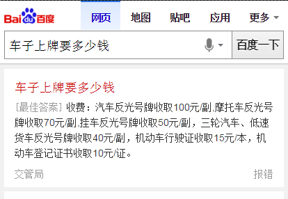
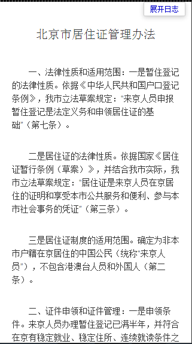

# 李阳阳

> 从2016-02-01到2015-02-05

## wise_qanda模板，问答模板复用~~~

### 背景与目标

复用线上的问答模板，政务的摘要是没有链接的，将点击的时候将链接从跳转链接改为弹层链接~~~

### 完成情况

- 状态：

    - 已开发完成~~

### 效果图

<table algin="center">
<tr>
<td></td>
</tr>
<tr>
<td></td>
</tr>
</table>

## 手表数据映射

### 背景与目标

将模板数据，映射到watch.json.tpl里

### 完成情况

- 状态：

    - 以往数据结构上有修改的地方，这周就零零散散的改啊改~~~醉醉的~~~

## dumi数据映射

### 背景与目标

将aladdin模板的数据映射给dumi

### 完成情况

- 状态：

    wise_video和wise_car_rank模板数据修改，已上线~~~
