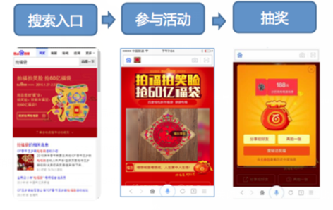
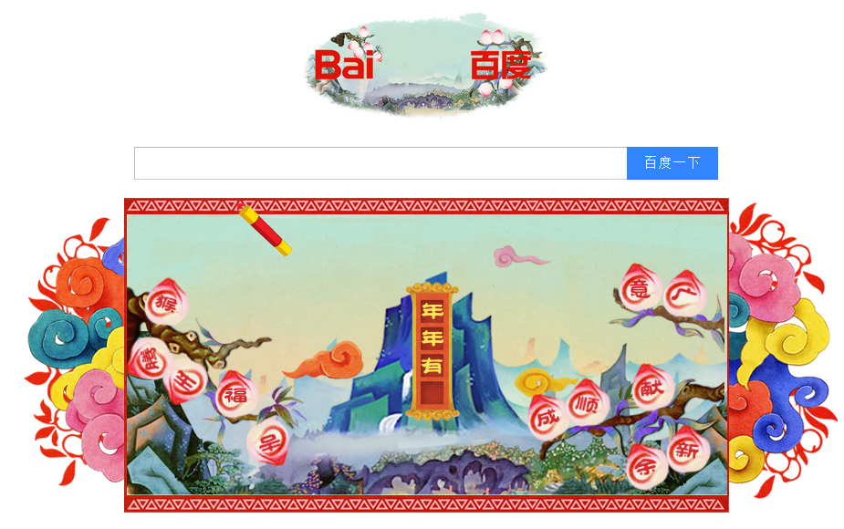
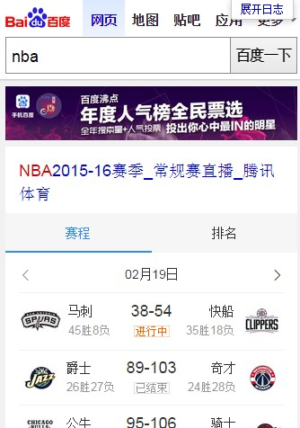

# 【阿拉丁运营方向周报】

> 从2015-02-14到2015-02-19

## 1. WISE 春节拍福项目（已下线）
### 背景和目标
拍福抢红包，亿万福到家，预期上线：2月1日~2月14日。结合图像搜索在wise上新的功能大力推下搜索的活动，主要将春节期间搜索为用户提供的服务串联起来。

关键词：办年货，民俗，大搜情怀，图像搜索，庙会、春晚、祝福语、对联、灯谜、年夜饭等

### 项目截图


### 影响面
激发检索：528W，活动参与用户：113W，活动参与次数：443W，下载手百用户：7.5W

## 2. PC 春节首页LOGO + 结果页动画（已下线）

### 背景和目标
以大闹天宫为题材的交互小游戏，完成填字游戏解救大圣，游戏结束后有一个小动画。最后导流到结果页（初步定query=春节），会有一个猴子变成大福字的动画。

### 项目截图



### 影响面
活动运营期间（2016/02/06-2016/02/10）
* 结果页浮层按照浮层卡片的标准评估，影响pv：103.6w、浮层点击率：53.5%、浮层直接关闭率：16.9%、无行为比例29.7%。
* 首页logo游戏按钮点击pv 79w，logo游戏参与pv 54w，跳转结果页pv 103w。

## 3. 春节相关阿拉丁卡片（已下线）
### 背景和目标
春节相关的阿拉丁卡片需求，包括 春晚，年货，春联，灯谜，庙会，习俗，年夜饭，祝福语。

### 完成进度
##### 春晚sigma卡片（`@PM:张子童; @FE:黎明`）
##### 春联/灯谜卡片（`@PM:王保丹; @FE:黎明`）
##### 祝福语卡片（`@PM:王保丹; @FE:黎明`）
##### 礼物卡片（`@PM:张雅雯; @FE:陈锐`）

### 影响面
展现量: 2000w   有点击： 90%


## 4. 运营类通用事件模板升级

### 背景与目标

```
老模板不能满足新的功能需求，修改及维护成本较大。因此开发新的模板，栅格迁移及功能升级，
```

### 完成情况

- PV：暂无

- 状态『sigma』：
    - 新增模板optl_generalevent
    - 第一版UE图确认，基本功能开发完成
    - 点赞功能，和feed页功能待完善
    - 预计下周五（2.26）达到上线状态

### 效果图

<table algin="center">
<tr>
<td></td>
</tr>
</table>

## 5. 唯一答案入口banner模板迁移

### 背景和目标
该模板线上显示图片模糊，与fe沟通为模板图片压缩策略导致。希望对该模板进行迁移，并采用新的图片压缩策略。

### 解决方案
新建了一个运营类的入口banner模板，与原来的模板schema一致，图片不走后端压缩策略，由PM统一压缩
* 图片尺寸标准：尺寸 696*128，大小 20k 以下

### 项目截图


### 完成进度
* 本周三（02/17）完成开发，周四（02/18）上线模板


## 6. 运营项目开发改进进度
- 计划下周重新拟一下计划

## 7. 其他项目
- 修复了新首页在缩小浏览器窗口的情况下，小度无法点击的问题（调整层级）（@陈锐）
- 春晚模板兼容两会：因为两会节目区没有演员，所以加上判断逻辑样式上兼容（@黎明）
- 身份证查询https兼容：第三方接口https证书过期导致，建议先联系资源方升级证书（@陈锐）


