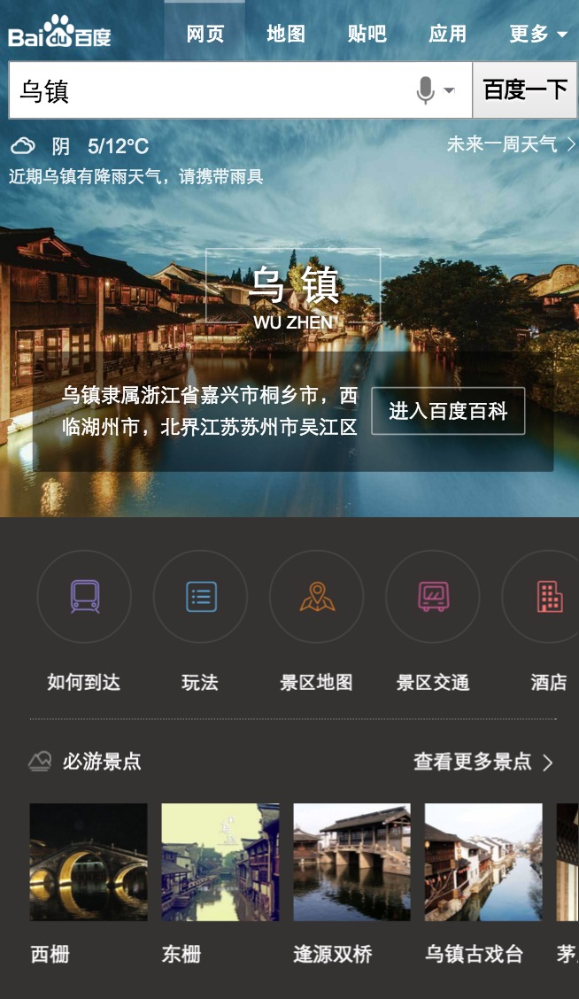
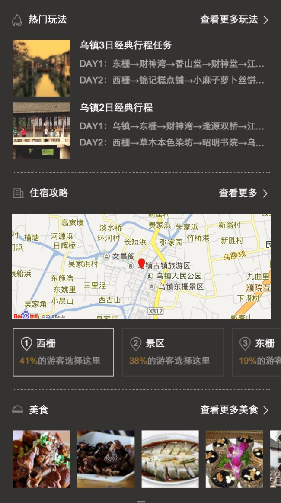
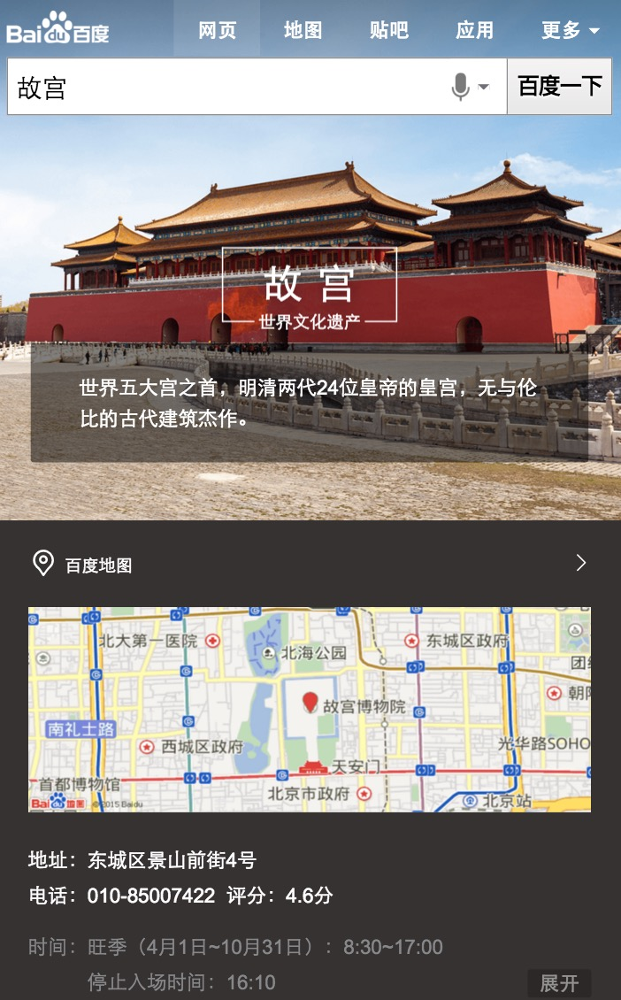
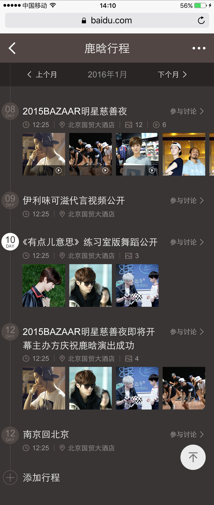
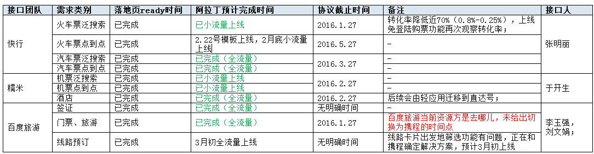

# 【阿拉丁产品方向周报】

> 从2015-02-15到2015-02-19

产品方向主要在做的事情是哥伦布项目,擎天柱-模板组件化,其他项目

## 1、哥伦布

### 背景

哥伦布（Columbus）项目，是大搜索在2016年的重点创新大方向，主要在移动搜索上开展，目标是把“传统搜索”演进为“有灵魂的搜索”

目前哥伦布包括的项目有  

#### 一级垂类

* 中途岛: 资讯(owner：吴海，FE：陈锐、王培、黎明),  
* 天宁岛: 旅游、poi出行(owner：谭待，FE：泉友、小武),  
* 民生: 天气、万年历、车主服务(owner：永志，FE：朱雷、玲娟),
* 掘金者: 金融(owner：王闯，FE：WD2个FE，朱雷指导),
* 娱乐: 人物明星、影视视频、音乐(owner：李萌，FE：浪波、佳隆、李晓),
* 教育: (owner：王昊),
* 商品: (owner：沈抖)

#### 二级垂类
 
* 问答: 人力待定
* 招聘: FE: 斐凡、玲玲
* 学术: FE: 郭勇

#### 其他

体育、医疗、母婴、游戏、政务、自有产品(吴忧、李晓、阳阳、健驰）

### 本周进展

### 1、天宁岛-旅游(泉友、小武) 

#### 背景

当前的旅游类搜索结果页包含卡片较多，尤其是同质内容卡片使得页面结构凌乱，体验和用户使用效率上都欠佳。以景区和典型旅游城市作为试水Query，依托于场景化卡片优化搜索结果页整体效果

#### 完成情况
- 01-29内网全流量上线。
- 景点跳转展开大卡新需求节前已上线
- 本周部分子卡日志调整,UE图标修改,横滑组件属性调整
- 已于2月15日17:20分在外网小流量上线，Query: 乌镇、丽江、桂林、三亚、香港，影响面日均4.5W.
#### 实验策略：
- 33%天宁岛屏蔽阿拉丁（抽样ID为103639）
- 33%天宁岛不屏蔽阿拉丁（抽样ID为103640）
- 33%城市原样式（抽样ID为103641）
- [点这里~点这里~](https://www.baidu.com/ssid=303b7363686f6575c808/from=844b/s?word=%E4%B9%8C%E9%95%87&ts=8455359&t_kt=0&ie=utf-8&rsv_iqid=4779496194617090106&rsv_t=fbb32vuIyem3JR0xKLf906qDkaLFpGwCs8cBT1lS0VdvJU%252FAlvYbC77%252BEg&sa=ib&ms=1&rsv_pq=4779496194617090106&rsv_sug4=3689&inputT=963&ss=100)

#### 效果截图：

### 2、天宁岛-出行，城市，餐饮(泉友、无更新) 

#### 背景

* 出行-不同地方的用户，在搜索相同的地域Query时，需求不同；根据用户所在地，用户搜索时间等条件，判断用户搜索的真实需求，整合现有资源，为用户提供高颜值高精准度的搜索结果展现；

* 城市-春节项目复用模板功能修改，升级点为：开放tab个数，若tab个数大于三个则调用滑动tab组件、开放下方景点个数、tab根据关键词定位、天气情况预报数据添加是否展现控制。

* 餐饮-各种餐饮名店信息聚合，吃货的福利。为用户提供更便捷的餐饮搜索信息，给部分产品线导流。

#### 本周进展

- 11月26日上线。
- 实验组/对照组流量各50%，每组影响pv约3.5w/天；策略触发后，场景化卡片覆盖的pv约1w/天。
- Query=香山(天安门，故宫等)，地点策略+时间策略。
- [点这里~点这里~](https://www.baidu.com/from=844b/s?word=%E9%A6%99%E5%B1%B1&ts=0015366&t_kt=0&rsv_iqid=5504612005285293655&rsv_t=f77fpuYM6PishRuwv6A9PSlfWEsQ%252FkBKd%252FtsgBcmqwBGyhR9vBwtIJNd3A&sa=ib&ms=1&rsv_sug4=3888&ss=101&inputT=2065&sid=102251)
- 更改半卡全卡后判断逻辑。

### 3、民生(朱雷、玲娟，无更新)

#### 背景

涵盖天气、万年历、车主服务等便民的生活服务类需求，方便用户更便捷地获取生活信息。

#### 进度

* 天气：下线了调起手百功能。目前后端扩量中。预计1.19日小流量，1.25日全量。
* 万年历：
	已上线，影响面约30w，线上效果地址https://m.baidu.com/ssid=794557616465334a756e65ae10/s?word=%E4%B8%87%E5%B9%B4%E5%8E%86&rq=&ss=0&ts=5867831&t_kt=0&dit=0&sa=tb&oq=%E4%B8%87%E5%B9%B4%E5%8E%86&sid=103271

	效果图

* 限行：提测中，下周上线。
* 违章：
	- `UE图已确认`
    - `子卡『车主服务』开发完成，待数据完善`
    - `子卡『安全驾驶』开发完成，带数据完善`
    - `主卡开发中, 改中间页形式为superframe组件`
        1. 第一层中间页已开发完
        - 第二层开发中...
    - `其余子卡待数据完善后开发`
    - 预计`2016/02/02` 前端开发，达到上线状态
    

	效果图

<table algin="center">
<tr>
<td></td>
</tr>
</table>

### 4、掘金者(WD2个FE,朱雷指导，无更新)

#### 背景

将股票的趋势图、消息面、数据面等需求聚合成sigma卡片

#### 进度

目前FE开发基本完成，预计1.29日（今天）提测，2.1上线

### 5、娱乐-音乐(浪波、佳隆)

#### 背景
在满足用户主需求的情况下,激发用户的额外需求，满足用户单曲精确查找的需求基础上，充分利用搜索结果的后面点击率较少的区域，激发用户在音乐上的需求。  
Query示例：小幸运（只有一位歌手唱过）  
依赖张靓颖（精准明确歌手与歌曲）  
影响面：首先针对可以在线播放的百度音乐资源的，排在首位的资源。  
初步按照圈定歌曲的方式，小流量测试10w/day  
全量约25w/day

#### 进度

* 修复在iphone4下播放不灵敏
* 调整歌词在收起时不可滑动,展开时才允许滑动
* 优化拖拽体验
* 根据第一版实验数据来看,换query率明显增高,用户最关心的是歌词.年后第一周会优化一版,将头图缩短,歌词区域变长看效果. 后续会将歌词单独提出为super_frame浮层
* 调整歌词区域长度,修复一些兼容性. 2-18日已上线

#### 线上效果

### 6、pc端歌词反查 （佳隆）

#### 背景

* 用户搜索歌词,可以直接定位到该歌曲的歌词,并且可以播放音乐.

#### 最新进展

* 2-19日 上线

### 7、娱乐-粉丝场景化-新增明星行程情景页(李晓)

#### 背景

* 大搜整体向中间页方向发展，倡导沉浸式体验，提供更多内容，增强对PV把控能力，增长用户停留时长,在中间页展现更多行程内容，同时为后续引入更多资源方、UGC内容打下基础。

#### 效果截图

#### 完成情况

* 开发完，预计02.23号模板上线。

### 8、娱乐 - 漫画情景页（李晓）

#### 背景

* 为积极探索沉浸式阅读体验，打造创新型媒体时长，同时提升搜索的对外分发能力和流量的危机抵御能力，哥伦布项目应运而生。
其中，娱乐漫画领域的相关需求，因漫画本身定期更新，具有一定的时间周期性，现聚焦于漫画更新的中间空档期，以搜索结果页—漫画情景页—漫画内容页，三级跳转的形式，希望为用户提供较为全面的周边信息聚合。

#### 效果截图

#### 完成情况

* 开发中，预计02.24开始联调、3月初小流量上线

## 9、sigma体验问题（浪波）

### 背景

* 哥伦布项目节前上线的几个case，都是以现有的sigma机制上实现的，体验都非常差，整体比较卡顿

* android手百下面sigma展现明显白屏

### 完成情况

* 本周调试图片横滑和上下滑动卡的问题，发现是部分css引起，去掉问题css后，体验能够提升一些，但低端机的手百上下滑动的卡顿问题仍然存在。

* 先上线初版解决部分体验问题。16号提交测试，发现北京天气的cavase在android手百下存在问题，遂回归整体sigma用了canvas的模板，一一进行修复。

* 17号初版优化上线，提升了左右横滑的体验

* android sigma展现慢的问题18号查明原因，是因为css是在底部加载的，用css将sigma展现出来，所以只有到底部的时候才会出现，之前这段时间是白屏的，修复方案19号定，22号上线修复。

## 10、sigma头图统一机制（浪波）

### 背景

sigma头图

### 进展

19号上线www模块的代码改动，模板需要case by case处理

## 2、擎天柱-模板组件化(无更新)

### 背景和目标

* 暂无更新

## 3、2号激发项目——解梦(小琴，无更新)

### 项目背景

以往我们的产品思路都是通过特型满足用户的直接需求，随着时间的推移，用户的需求变得更加多元化，我们也会尝试在一些需求比较单一的query下，通过各维度挖掘用户原始需求的特征，以横向推荐的方式，激发和满足用户更多的关联需求。 解梦的需求即属于这一类，在用户行为分析中我们发现，用户搜索解梦的内容时，需求非常单一，几乎不会搜索其他内容，而现有的搜索结果也无非是对于各家网站对梦境的解析，内容大同小异，所以在原始需求已经满足较好的前提下，分析这一类用户的共同特征，通过特型的引导，激发并满足用户新的需求。

### 完成情况

1.20小流量上线

## 4、其他项目

## 旅游 - 数据迁移（李晓）

### 背景

* 公司和携程签订了若干合作协议，需要接入到搜索阿拉丁中，目前是火车票、汽车票携程通过快行对接；门票线路通过百度旅游对接；相关团购类通过糯米对接；

### 完成情况

## Wise前端交互日志修正（李晓、本周无进展）

### 背景

* 目前Wise结果页内的前端交互日志存在误发的情况（历史原因导致），情况主要体现在：用户拖动非跳转的点击区域时，会误发交互日志。这部分误发的日志给造成了实验评估的不准确。从UBS的小流量实验结论上看，误发比例整体在25%（苏珺提供）左右，对于个别点击区域较大的卡片，误发比例会更高。为保证接下来产品评估指标可以正确计算，由前端整体进行交互日志的修正。

### 完成情况

* 升级模板sam_scene_person、wise_scene_city、wise_scene_trav、wise_scene_food、wise_scene_person_kv横滑相关组件iscroll为bscroll,日志加sto,其中wise_scene_person_kv跟pm确认可下线，其他四个模板01.26号已上线。

## 大搜样式协同项目（浪波）

### 背景

* 将通过样式整改、非首位时样式退化、去掉非必要样式模板等进行样式缩减，达到整体样式协同的目的。

### 完成情况

* 设计模板：
sam_wise_car_rank:1
sam_wise_3c_brand:1
sam_wise_3c_general:1
sam_wise_3c_price_3:1
sam_wise_digital:1
sam_wise_3c_comment:1
sam_mobile_compare:1
wise_car_rank:1
wise_3c_brand:1
wise_3c_general:1
wise_3c_price:1
wise_digital:1
wise_3c_comment:1
mobile_compare:1
2月14号部署环境，并进行ue和pm的回归，15号修复完成回归的问题，并上线模板。16日发现部分模板数据只有一条时有问题，又迭代上线一版

