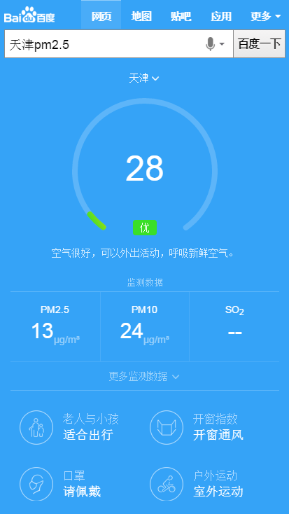

# 常健驰

> 从2016-02-15到2016-02-19

## pm2.5

### 背景与目标

目前线上pm2.5卡片内容过于单一，样式不够优美，需要对卡片进行优化，增加更多信息，丰富卡片内容

### 完成情况

模板已完成，可以开始走单。预览：[天津pm2.5](https://wwwhttps.baidu.com/s?dev_workspace=platform&dev_tpl=pm25&tn=iphone&sid=99999&dev_online=0&dev_module=aladdin-wise&dev_file=default.xml&dev_fileformat=xml&dev_pos=asResult&wd=%E5%A4%A9%E6%B4%A5pm2.5&word=%E5%A4%A9%E6%B4%A5pm2.5)

### 效果截图

## 栅格化高考模板  tpl=gaokao_will

### 完成情况

模板功能基本已完成，可以pm确认下效果，预览：[北京高考录取分数线](https://wwwhttps.baidu.com/s?dev_workspace=platform&dev_tpl=gaokao_will&tn=iphone&sid=99999&dev_online=1&wd=%E5%8C%97%E4%BA%AC%E9%AB%98%E8%80%83%E5%BD%95%E5%8F%96%E5%88%86%E6%95%B0%E7%BA%BF&word=%E5%8C%97%E4%BA%AC%E9%AB%98%E8%80%83%E5%BD%95%E5%8F%96%E5%88%86%E6%95%B0%E7%BA%BF)

### 效果截图

## 接下来的排期

* 图片阿拉丁沉浸式体验项目 pm负责人-王玥
* nba主卡有个遗留问题，需要跟 `安瑞-pm` 对接一下,看如何修改。
