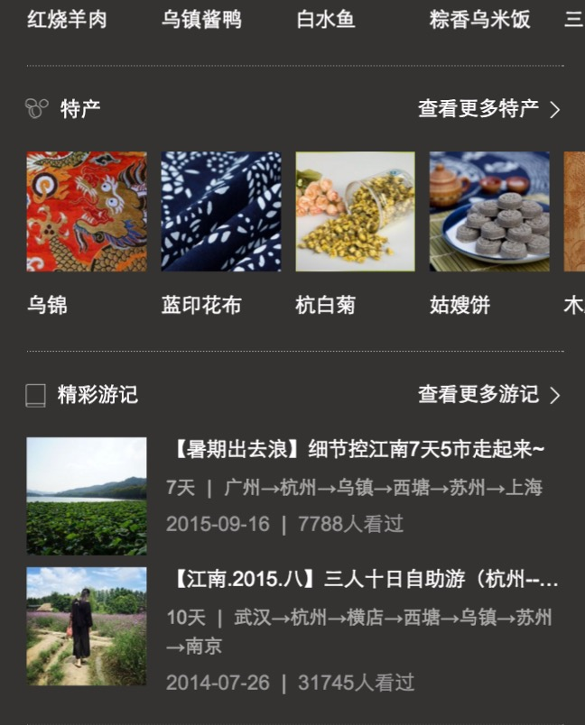

# 【阿拉丁产品方向周报】

> 从2015-02-21到2015-02-26

## 1、哥伦布

### 背景

哥伦布（Columbus）项目，是大搜索在2016年的重点创新大方向，主要在移动搜索上开展，目标是把“传统搜索”演进为“有灵魂的搜索”

- 基于对移动互联网内容的深度理解，展现有组织的、结构化的、有机联系的搜索结果
- 根据用户需求，来重新定义具体的各个搜索功能元素
- 功能元素布局合理、逻辑清晰、交互简捷
- 深度满足用户需求，实现沉浸式的搜索体验
- 通过对用户自身特点和用户所在场景的理解，引导和激发用户的“更广义”的需求，使得用户的“更广义”的需求，更多地得到“一站式”的、更快捷的满足.

目前哥伦布包括的项目有  

#### 一级垂类

* 中途岛: 资讯(owner：吴海，FE：陈锐、王培、黎明),  
* 天宁岛: 旅游、poi出行(owner：谭待，FE：泉有、小武),
* 民生: 天气、万年历、车主服务(owner：永志，FE：朱雷、玲娟),
* 掘金者: 金融(owner：王闯，FE：WD2个FE，朱雷指导),
* 娱乐: 人物明星、影视视频、音乐(owner：李萌，FE：浪波、佳隆、李晓),
* 教育: (owner：王昊),
* 商品: (owner：沈抖)

#### 二级垂类
 
* 问答: 人力待定
* 招聘: FE: 斐凡、玲玲
* 学术: FE: 郭勇

#### 其他

体育、医疗、母婴、游戏、政务、自有产品(吴忧、李晓、阳阳、健驰）

### 本周进展

### 1、天宁岛-旅游(泉有、小武)

#### 背景

当前的旅游类搜索结果页包含卡片较多，尤其是同质内容卡片使得页面结构凌乱，体验和用户使用效率上都欠佳。以景区和典型旅游城市作为试水Query，依托于场景化卡片优化搜索结果页整体效果

#### 完成情况
- 01-29内网全流量上线。
- 已于2月15日17:20分在外网小流量上线。
- Query: 乌镇、丽江、桂林、三亚、香港
- 影响面日均4.5W.
#### 实验策略：
- 33%天宁岛屏蔽阿拉丁（抽样ID为103639）
- 33%天宁岛不屏蔽阿拉丁（抽样ID为103640）
- 33%城市原样式（抽样ID为103641）
- [点这里~点这里~](https://www.baidu.com/ssid=303b7363686f6575c808/from=844b/s?word=%E4%B9%8C%E9%95%87&ts=8455359&t_kt=0&ie=utf-8&rsv_iqid=4779496194617090106&rsv_t=fbb32vuIyem3JR0xKLf906qDkaLFpGwCs8cBT1lS0VdvJU%252FAlvYbC77%252BEg&sa=ib&ms=1&rsv_pq=4779496194617090106&rsv_sug4=3689&inputT=963&ss=100)

- sigma机制首展速度体验差短线方案更改上线,部分日志调整.

#### 效果截图：

### 2、天宁岛-出行，城市，餐饮(泉有)

#### 背景

* 出行-不同地方的用户，在搜索相同的地域Query时，需求不同；根据用户所在地，用户搜索时间等条件，判断用户搜索的真实需求，整合现有资源，为用户提供高颜值高精准度的搜索结果展现；

* 城市-春节项目复用模板功能修改，升级点为：开放tab个数，若tab个数大于三个则调用滑动tab组件、开放下方景点个数、tab根据关键词定位、天气情况预报数据添加是否展现控制。

* 餐饮-各种餐饮名店信息聚合，吃货的福利。为用户提供更便捷的餐饮搜索信息，给部分产品线导流。

#### 完成情况

- 三个类目均为2015年末上线.
- Query=香山,上海,海底捞。
- [点这里~点这里~](https://www.baidu.com/from=844b/s?word=%E9%A6%99%E5%B1%B1&ts=0015366&t_kt=0&rsv_iqid=5504612005285293655&rsv_t=f77fpuYM6PishRuwv6A9PSlfWEsQ%252FkBKd%252FtsgBcmqwBGyhR9vBwtIJNd3A&sa=ib&ms=1&rsv_sug4=3888&ss=101&inputT=2065&sid=102251)

- 三个类目的sigma机制首展速度体验差短线方案更改上线

### 3、民生(朱雷、玲娟)

#### 背景

涵盖天气、万年历、车主服务等便民的生活服务类需求，方便用户更便捷地获取生活信息。

#### 进度

* 摇号: 测试中，预计2月26日上线

* 马文号(天气)：无更新。
* 万年历：无更新

### 4、掘金者(WD2个FE,朱雷指导，无更新)

#### 背景

- 将股票的趋势图、消息面、数据面等需求聚合成sigma卡片

- 已移交WD童鞋维护.

### 5、娱乐-音乐(浪波、佳隆, 无更新)

#### 背景
在满足用户主需求的情况下,激发用户的额外需求，满足用户单曲精确查找的需求基础上，充分利用搜索结果的后面点击率较少的区域，激发用户在音乐上的需求。  
Query示例：小幸运（只有一位歌手唱过）  
依赖张靓颖（精准明确歌手与歌曲）  
影响面：首先针对可以在线播放的百度音乐资源的，排在首位的资源。  
初步按照圈定歌曲的方式，小流量测试10w/day  
全量约25w/day

#### 进度

* 修复在iphone4下播放不灵敏
* 调整歌词在收起时不可滑动,展开时才允许滑动
* 优化拖拽体验
* 根据第一版实验数据来看,换query率明显增高,用户最关心的是歌词.年后第一周会优化一版,将头图缩短,歌词区域变长看效果. 后续会将歌词单独提出为super_frame浮层
* 无更新

#### 线上效果

### 6、pc端歌词反查 （佳隆, 无更新）

#### 背景

* 用户搜索歌词,可以直接定位到该歌曲的歌词,并且可以播放音乐.

#### 最新进展

* 2-19日 模板上线,还未开流量.

### 7、娱乐-粉丝场景化-新增明星行程情景页(李晓)

#### 背景

* 大搜整体向中间页方向发展，倡导沉浸式体验，提供更多内容，增强对PV把控能力，增长用户停留时长,在中间页展现更多行程内容，同时为后续引入更多资源方、UGC内容打下基础。

#### 效果截图

#### 完成情况

* sigma机制首展速度体验差短线方案更改
* 情景页改为etpl形式，预计03.01号模板上线

### 8、娱乐 - 漫画情景页（李晓）

#### 背景

* 为积极探索沉浸式阅读体验，打造创新型媒体时长，同时提升搜索的对外分发能力和流量的危机抵御能力，哥伦布项目应运而生。
其中，娱乐漫画领域的相关需求，因漫画本身定期更新，具有一定的时间周期性，现聚焦于漫画更新的中间空档期，以搜索结果页—漫画情景页—漫画内容页，三级跳转的形式，希望为用户提供较为全面的周边信息聚合。

#### 效果截图

#### 完成情况

* 26号开始联调，3月初小流量上线

## 2、擎天柱-模板组件化(无更新)

### 背景和目标

* 暂无更新

## 3、2号激发项目——解梦(小琴，无更新)

### 项目背景

以往我们的产品思路都是通过特型满足用户的直接需求，随着时间的推移，用户的需求变得更加多元化，我们也会尝试在一些需求比较单一的query下，通过各维度挖掘用户原始需求的特征，以横向推荐的方式，激发和满足用户更多的关联需求。 解梦的需求即属于这一类，在用户行为分析中我们发现，用户搜索解梦的内容时，需求非常单一，几乎不会搜索其他内容，而现有的搜索结果也无非是对于各家网站对梦境的解析，内容大同小异，所以在原始需求已经满足较好的前提下，分析这一类用户的共同特征，通过特型的引导，激发并满足用户新的需求。

### 完成情况

1.20已小流量上线,预计PV15W.

## 4、其他项目

## 分享组件（zhulei)

### 背景

目前wise上的分享组件无法自定义分享信息，且存在一些过时的分享社区，例如开心网等，所以本次我重构了分享组件，支持分享到QQ空间和新浪微博，也支持使用者自定义分享面板的功能。

- 无更新,组件已经上线可用

## 擎天柱项目

### 背景

提高开发效率,提高代码复用性.

- head,article无更新.
- imglist修复部分BUG(jialong).

## 数据迁移 - 旅游 - 火车票点到点 (lixiao)

### 背景

火车票点到点卡片数据迁移为快行

### 完成情况

* query: [北京到上海](https://m.baidu.com/s?word=%E5%8C%97%E4%BA%AC%E5%88%B0%E4%B8%8A%E6%B5%B7&sid=103689&sa=tb&ts=6070413&t_kt=0&ie=utf-8&rsv_t=94e0lZtU6tyisRrP6jdeY%252FArKoHCfCg%252Fy9BdTi4UkfxvvfV4BWFF&rsv_pq=1624451589114669917&ss=100&rsv_sug4=890&oq=%E5%8C%97%E4%BA%AC%E5%88%B0%E4%B8%8A%E6%B5%B7)
* 新增模板ptp_train，02.24号50%小流量上线，影响面约60W，sid:103689

## pm2.5 （jianchi）

### 背景与目标

目前线上pm2.5卡片内容过于单一，样式不够优美，需要对卡片进行优化，增加更多信息，丰富卡片内容

### 完成情况

模板 `2月25日` 上线，由于上线封禁，延迟到26日上午上线。预览：[天津pm2.5](https://wwwhttps.baidu.com/s?dev_workspace=platform&dev_tpl=pm25&tn=iphone&sid=99999&dev_online=0&dev_module=aladdin-wise&dev_file=default.xml&dev_fileformat=xml&dev_pos=asResult&wd=%E5%A4%A9%E6%B4%A5pm2.5&word=%E5%A4%A9%E6%B4%A5pm2.5)

### 效果截图

## 栅格化高考模板  （jianchi）

### 完成情况

模板 `2月24日` 已上线。 预览：[北京高考](https://m.baidu.com/ssid=22266368616e676a69616e636869df09/s?word=%E5%8C%97%E4%BA%AC%E9%AB%98%E8%80%83&ts=4432905&t_kt=0&ie=utf-8&rsv_iqid=14524830343677894058&rsv_t=918bE7wlAI593E%252BFi4XDRKhs2zldd9EXQSmR3nXU79ghdzQWolc7&sa=ib&rsv_pq=14524830343677894058&rsv_sug4=5767&ss=101&inputT=3344)

### 效果截图

## 奥斯卡颁奖卡片（yangyang）

### 背景与目标
针对国内外大型奖项颁奖礼，百度没有很好地数据进行覆盖，所以设计sigma样式进行覆盖。

### 完成情况
- 2月25日上线,模板发不上了，预计02-26上线一版。
- 预计全量上线后PV10W.
-样式图： 

## 模板复用需求（yangyang）（关爱自杀模板，pc的lovesuicide和wise的lovesuicide_mb的复用）

### 背景与目标

公关部2.29要上线“关爱罕见病的公益活动”，pr的预期是以此为引爆点，不断向外界宣传百度的正面信息，达到公司做一系列的公益举措来提升公司正面形象的目的；我们的主要目的是将情怀类项目以复用“自杀”项目的通用模板继续。此次活动从2.29日开始到3.29日结束，共为期一个月。

### 完成情况

- 模板逻辑已处理完成，下午模板上线

##	糯米卡片ae迁移 (lili)

### 最新进展

* 完成wise_tuan,wise_tuan2,wise_tuan3,wise_tuan_nuo,wise_tuan_brand,wise_brand2,wise_tuan_act的联调，23号已经上线。

## 音悦台v榜,中间页 (lili)

### 背景

* 方便用户查看打榜歌曲

### 最新进展

* 预计3月2号完成测试

## superframe aladdin-base (yaowu)

### 背景和目标

由于在 wise-aladdin 中开发情景页需要依赖于 superframe 框架，但经实际项目中使用发现需要写大量的重复代码（是指不同情景页中代码的重复），基于这种原因可以根据 superframe 的生命周期来扩展一个 aladdin-base.js 的文件，在开发情景页时可以继承于这个文件，使用者可以使用简单的配置（配置是指初始化 sfview 时需要的参数）以达到快速使用，当然如果需求、交互很多还是可以直接使用 superframe 本身，aladdin-base.js 只是封装一层基础的方法以供让使用者更简洁。

[点这里查看更多 aladdin-base.js 相关的讨论](http://gitlab.baidu.com/psfe/psdoc/issues/6)

### 完成情况

目前初版评审方案已完成，初版 js 已完成，等待跟大家一起评审

## 【星河二期】(lingjuan)

### 项目背景

星河二期是星河一期的迭代实验。在一期实验正向的成果下，新增新闻和问答类的推荐尝试。为了最大程度地激发和满足用户对搜索query的不同维度的需求，尝试产品创新将相关推荐卡的Title可点击，点击后出推荐结果页（sigma大卡），给用户以更深度的相关需求领域内容，从而提升用户对通用推荐卡的进一步需求决策体验。

### 进度

2.29提测。

## 招聘弱需求卡片 (lingling)

### 进展情况

 * 样式优化升级，需求是新、旧样式均保留，通过抽样id(sid)的不同召回新旧样式。

 * 因odp修改了配置文件aladdin.conf，致新模板（sam_wz_zhaopinexactnew）及老模板（wz_zhaopinexactnew）出现乱码，新已修复（2.25）上线！

## 高考查询栅格化  (lingling)

### 进展情况

 周三（2.24）栅格化上线完成！

###效果图

## wise sigma体验优化项目 (langbo)

### 背景与目标

sigma展现明显有白屏，然后再出现模板

### 完成情况

* 1、sigma提前展现：重构www块sigma代码，支持提前展现功能

* 2、sigma下滑浏览后置顶修复：方案已经拍定，ecom置顶策略避让哥伦布和sigma，杨帆跟进上线中

* 3、sigma提前展现全量回归：2月26号上线

## 哥伦布媒体时长方案 (langbo)

### 背景与目标

随着哥伦布项目的持续开展和进行，哥伦布媒体时长计算方法以及评估标准需要尽快确认

### 进度

会议结论：

1、情景页、详情页：目前能通过superframe准确的计算出来

2、结果页整体时长：走已有的通用结果页媒体时长的统计方式和评估标准

3、卡片时长：目前存在争议，初步结论是先不计算
- 方案：需要定义一个比较明确的策略，卡片在可视区域的比例  卡片超过比例但是点击的是下面的结果，这种不能算进卡片时长。
- UBS意见：卡片时长可以用其他指标来衡量，性价比不高。短期不建议做。后续随着产品形态来添加

4、情景页和搜索结果页的区分：具体是算情景页还是结果页（情景页用的搜索结果）  @咏志 pm层面定义即可

5、媒体时长怎么用：根据产品的设计和整个指标体系来判断（UBS给出）

## 横滑日志统一方案和批量修改 (langbo)

### 背景

目前横滑日志是在组件中发送的，并且在tabs横滑的情况下，并没有发送日志，和刘悦、UBS共同规范横滑交互日志规范，减少开发者疑惑和开发难度

### 进度

* 整体解决方案已经签订，组件和公共代码已支持

* 梳理线上所有模板，每个需要修改的模板按垂类划分找到对应责任人，目前已经在修复阶段，陆续有上线

* wiki地址：http://sfe.baidu.com/#/阿拉丁/无线网页搜索/开发指导/横滑组件and可滑动tabs组件支持日志使用规范

