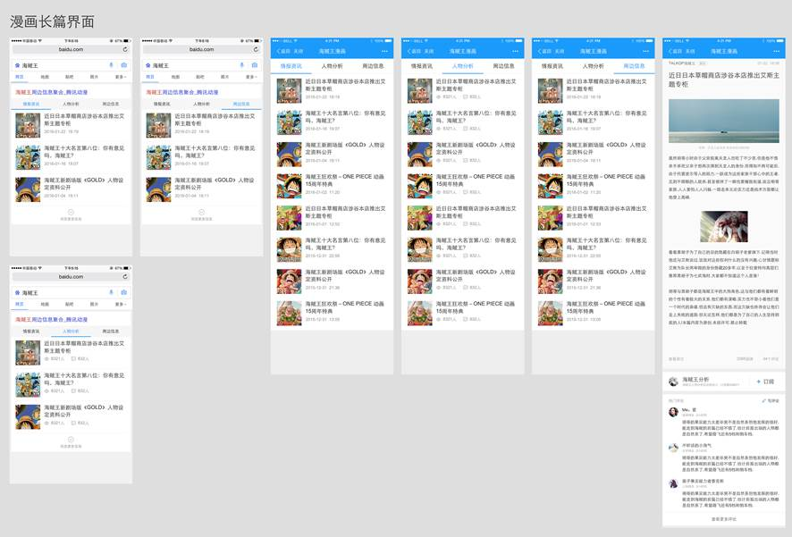

# 李晓

> 从2016-02-22到2016-02-26

## 1、娱乐 - 人物粉丝场景化

### 背景

* 为更好地支持场景化的触发，方便pm更快铺量更好干预，与后端rd统一商定迁移为mini机制

* 为更好地视觉体验，新增沉浸式样式

* 为支持团购商品需求——电影《老炮儿》首映礼票务团购，模板需增加活动区域模块

### 完成情况

* 升级模板wise_scene_person_kv，12.02日模板上线，12.04日数据切换为mini机制，影响面约125W;

* 沉浸式样式升级，并支持头部颜色可配置,12.10日模板已上线

* 头部文字描述支持可跳转，增加活动区域入口；增加活动区域模块，12.11日模板上线

* 12.11上午沉浸式样式小流量上线，仍保持90%生效，其中10%生效人群识别策略，覆盖人数12人，影响面150w/天

* 增加图片模块，12.25日模板上线

* 粉丝场景化将于1231前需扩招至60人，影响面增至400w左右

* 2016年奥运会采用kv形式复用该模板，调整kv模式下子卡与mini数据格式统一，01.08号模板上线

* 人物场景化外跳优化实验-细节样式修改,01.21日模板已上线，01.22开始小流量实验，实验组95%，对照组5%，影响面约300w左右

### 覆盖query

* 鹿晗，迪丽热巴，杨洋，郑爽，李易峰，杨幂

### 线上效果

* [吴亦凡](https://www.baidu.com/ssid=8a3d73746172c3f7d0c773746172fc4b/from=844b/s?word=%E5%90%B4%E4%BA%A6%E5%87%A1&sa=tb&ts=8665908&t_kt=0&ms=1&rsv_pq=6932049557572375983&ss=101&t_it=1&rsv_sug4=3221&inputT=2313&oq=%E7%8E%8B%E6%BA%90)

### 效果截图

* 唯一答案

### todo1

* 明星行程模块改版、新增明星行程情景页

* 【背景】大搜整体向中间页方向发展，倡导沉浸式体验，提供更多内容，增强对PV把控能力，增长用户停留时长,在中间页展现更多行程内容，同时为后续引入更多资源方、UGC内容打下基础。

* 【完成情况】情景页改为etpl形式，预计03.01号模板上线

## 2、娱乐 - 漫画情景页

### 背景

* 为积极探索沉浸式阅读体验，打造创新型媒体时长，同时提升搜索的对外分发能力和流量的危机抵御能力，哥伦布项目应运而生。
其中，娱乐漫画领域的相关需求，因漫画本身定期更新，具有一定的时间周期性，现聚焦于漫画更新的中间空档期，以搜索结果页—漫画情景页—漫画内容页，三级跳转的形式，希望为用户提供较为全面的周边信息聚合。

### 效果截图

### 完成情况

* 26号开始联调，3月初小流量上线

## 3. 擎天柱项目

### 背景

sigma头图抽离公共模板组件，增加复用功能，提高开发效率

### 进展

已上线，后续会持续优化和迭代

使用文档: [http://sfe.baidu.com/#/阿拉丁/无线网页搜索/开发规范/擎天柱-headinfo模板组件](http://sfe.baidu.com/#/阿拉丁/无线网页搜索/开发规范/擎天柱-headinfo模板组件)

## 4、Wise前端交互日志修正

### 背景

* 目前Wise结果页内的前端交互日志存在误发的情况（历史原因导致），情况主要体现在：用户拖动非跳转的点击区域时，会误发交互日志。这部分误发的日志给造成了实验评估的不准确。从UBS的小流量实验结论上看，误发比例整体在25%（苏珺提供）左右，对于个别点击区域较大的卡片，误发比例会更高。为保证接下来产品评估指标可以正确计算，由前端整体进行交互日志的修正。

### 完成情况

* 升级模板sam_scene_person、wise_scene_city、wise_scene_trav、wise_scene_food、wise_scene_person_kv横滑相关组件iscroll为bscroll,日志加sto,其中wise_scene_person_kv跟pm确认可下线，其他四个模板01.26号已上线。

## 5、数据迁移 - 旅游 - 国外跟团游自由行卡片

### 背景

* 国外跟团游自由行卡片数据迁移为携程

### 完成情况

* 升级模板lvyouroute，模板开发完，数据评估中，待上线

## 6、数据迁移 - 旅游 - 火车票点到点

### 背景

* 火车票点到点卡片数据迁移为快行

### 完成情况

* 新增模板ptp_train，02.24号50%小流量上线，影响面约60W，sid:103689
* query: [北京到上海](https://m.baidu.com/s?word=%E5%8C%97%E4%BA%AC%E5%88%B0%E4%B8%8A%E6%B5%B7&sid=103689&sa=tb&ts=6070413&t_kt=0&ie=utf-8&rsv_t=94e0lZtU6tyisRrP6jdeY%252FArKoHCfCg%252Fy9BdTi4UkfxvvfV4BWFF&rsv_pq=1624451589114669917&ss=100&rsv_sug4=890&oq=%E5%8C%97%E4%BA%AC%E5%88%B0%E4%B8%8A%E6%B5%B7)

