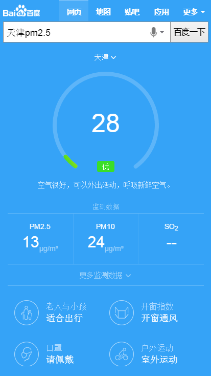
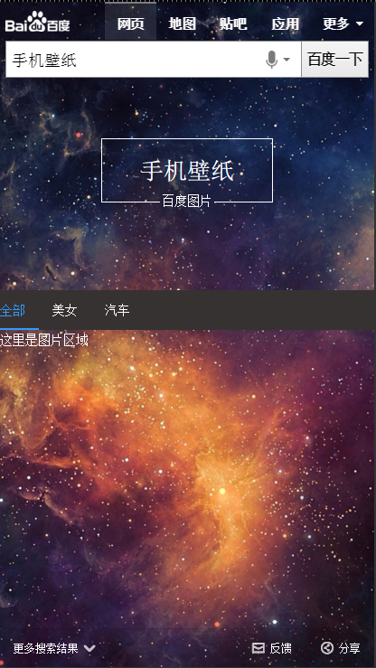

# 常健驰

> 从2016-02-22到2016-02-26

## pm2.5

### 背景与目标

目前线上pm2.5卡片内容过于单一，样式不够优美，需要对卡片进行优化，增加更多信息，丰富卡片内容

### 完成情况

模板 `2月25日` 上线，由于上线封禁，延迟到26日上午上线。预览：[天津pm2.5](https://wwwhttps.baidu.com/s?dev_workspace=platform&dev_tpl=pm25&tn=iphone&sid=99999&dev_online=0&dev_module=aladdin-wise&dev_file=default.xml&dev_fileformat=xml&dev_pos=asResult&wd=%E5%A4%A9%E6%B4%A5pm2.5&word=%E5%A4%A9%E6%B4%A5pm2.5)

### 效果截图

## 栅格化高考模板  tpl=gaokao_will

### 完成情况

模板 `2月24日` 已上线。 预览：[北京高考](https://m.baidu.com/ssid=22266368616e676a69616e636869df09/s?word=%E5%8C%97%E4%BA%AC%E9%AB%98%E8%80%83&ts=4432905&t_kt=0&ie=utf-8&rsv_iqid=14524830343677894058&rsv_t=918bE7wlAI593E%252BFi4XDRKhs2zldd9EXQSmR3nXU79ghdzQWolc7&sa=ib&rsv_pq=14524830343677894058&rsv_sug4=5767&ss=101&inputT=3344)

### 效果截图

## 图片阿拉丁沉浸式体验项目

### 背景与目标

在用户需求明确为图片时，对该情景下的图片样式进行优化，采用sigma+瀑布流形式，提升用户体验。

### 完成情况

模板完成10%，预览：[手机壁纸](https://wwwhttps.baidu.com/s?dev_workspace=platform&dev_tpl=image_waterfall&tn=iphone&sid=99999&dev_online=0&dev_module=aladdin-wise&dev_file=default.xml&dev_fileformat=xml&dev_pos=asResult&wd=%E6%89%8B%E6%9C%BA%E5%A3%81%E7%BA%B8&word=%E6%89%8B%E6%9C%BA%E5%A3%81%E7%BA%B8)

### 效果截图

## 接下来的排期

* nba主卡有个遗留问题，需要跟 `安瑞-pm` 对接一下,看如何修改。
