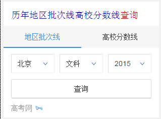

# 刘玲玲

> 从2016-02-22 到 2016-02-26

## 招聘弱需求卡片

### 进展情况
 
 * 样式优化升级，需求是新、旧样式均保留，通过抽样id(sid)的不同召回新旧样式。
 
 * 因odp修改了配置文件aladdin.conf，致新模板（sam_wz_zhaopinexactnew）及老模板（wz_zhaopinexactnew）出现乱码，新已修复（2.25）上线！

## 高考查询栅格化

### 进展情况
 
 周三（2.24）上线完成！

###效果图

 

