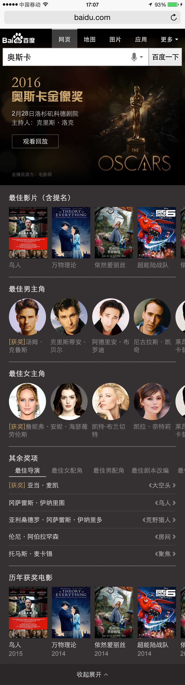
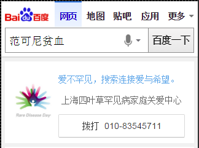
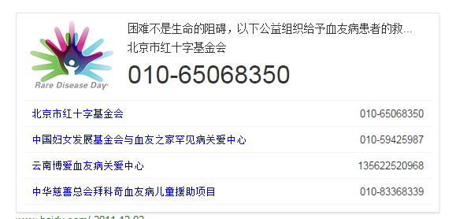
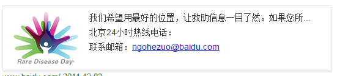

 # 李阳阳

> 从2016-02-21到2015-02-26

## 1. 奥斯卡颁奖卡片（wise_scene_awards）

### * 背景与目标
针对国内外大型奖项颁奖礼，百度没有很好地数据进行覆盖，所以设计sigma样式进行覆盖。

### * 完成情况
- 2月25日上线,模板发不上了，今天应该上线一版。
-样式图： 

## 2. 手表数据

### * 背景与目标
手表三期，涉及到五类模板（比赛赛事、电视台、通用简短模板、翻译、空气质量）

### * 完成情况
- 翻译涉及到三个模板的修改，其中的两个模板一会儿改，其他的已映射完成~~

## 3. 模板复用需求（关爱自杀模板，pc的lovesuicide和wise的lovesuicide_mb的复用）

### * 背景与目标

公关部2.29要上线“关爱罕见病的公益活动”，pr的预期是以此为引爆点，不断向外界宣传百度的正面信息，达到公司做一系列的公益举措来提升公司正面形象的目的；我们的主要目的是将情怀类项目以复用“自杀”项目的通用模板继续。此次活动从2.29日开始到3.29日结束，共为期一个月。

### * 完成情况

- 模板逻辑已处理完成，下午模板上线

