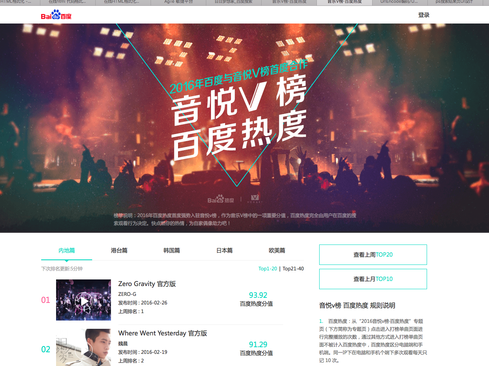

# 【阿拉丁产品方向周报】

> 从2016-02-29到2015-03-04

    <h3>哥伦布</h3>
    <ul>
        <li><a href="#哥伦布sigma机制重构">哥伦布sigma机制重构</a></li>
        <li><a href="#天宁岛-旅游">天宁岛-旅游</a></li>
        <li><a href="#天宁岛-周边游">天宁岛-周边游</a></li>
        <li><a href="#天宁岛-景点二期">天宁岛-景点二期</a></li>
        <li><a href="#音悦台v榜,pc中间页">娱乐-v榜,pc中间页</a></li>
        <li><a href="#音悦台v榜,wise情景页">娱乐-v榜,wise</a></li>
        <li><a href="#娱乐-短漫范需求">娱乐-短漫范需求</a></li>
        <li><a href="#娱乐-漫画情景页">娱乐-漫画情景页</a></li>
        <li><a href="#娱乐-人物粉丝场景化">娱乐-人物粉丝场景化</a></li>
        <li><a href="#民生-限行">民生-限行</a></li>
        <li><a href="#民生类-摇号">民生类-摇号</a></li>
        <li><a href="#民生类-天气-马文号">民生类-天气-马文号</a></li>
        <li><a href="/doc/2016-03-04/ala_optl.md#中途岛">中途岛</a></li>
    </ul>
    <h3>非哥伦布项目</h3>
    <ul>
        <li><a href="#数据迁移 - 旅游迁移">数据迁移 - 旅游迁移</a></li>
        <li><a href="#wise_qanda模板复用">wise_qanda模板复用</a></li>
        <li><a href="#通用推荐新闻版">通用推荐新闻版</a></li>
        <li><a href="#关注点问答">关注点问答</a></li>
        <li><a href="#商业pc端及pad端卡片的迁移">商业pc+pad端卡片迁移</a></li>
    </ul>
    <h3>非产品需求项目</h3>
    <ul>
        <li><a href="#横滑日志统一方案和批量修改">wise滑动日志修改</a></li>
        <li><a href="#wise端滑动、tabs按需加载优化方案">按需加载逻辑优化</a></li>
    </ul>

## 哥伦布

### 哥伦布sigma机制重构

> @浪波

#### 背景与目标

线上sigma机制优化已接近尾声，但整体实现方案还是存在问题，固重构新的实现方案，老的机制保留

#### 进度

1、大致完成整体阿拉丁sigma base开发，完成www模块逻辑开发，等待与ODP联调

2、皮肤模块正在开发进行中，有广告的灰色背景机制方案正在确定中

### 天宁岛-旅游

> owner：谭待，FE：泉有、小武

#### 背景

当前的旅游类搜索结果页包含卡片较多，尤其是同质内容卡片使得页面结构凌乱，体验和用户使用效率上都欠佳。以景区和典型旅游城市作为试水Query，依托于场景化卡片优化搜索结果页整体效果

#### 更新

pm正在联系rd扩量，扩量query list:

* XX好玩的地方排名
* XX旅游
* XX旅游攻略
* XX旅游攻略自助游
* XX旅游必去景点
* XX旅游景点
* XX旅游景点大全
* XX哪里好玩
* XX有什么好玩的地方

### 天宁岛-周边游

#### 背景与目标

- 由于用户对周边出行呈迅猛增长的势头,且现有市场各竞品并没有明显优势来满足对于用户所需信息。

#### 完成情况
- 02-24第一次评审,细节PM与UE商定.

暂无更新

### 天宁岛-景点二期

#### 背景与目标

- 通过对现有子卡的设计优化,结构重组和增加新子卡,提升用户体验,适配进一步扩招.

#### 完成情况
- 02-24第一次评审

暂时PM与UE在更改展现细节,预计下周开始开发

---

### 音悦台v榜,pc中间页

> @佳隆，[详情链接](/doc/2016-03-04/lijialong01.md#音悦台v榜,pc中间页)

#### 背景

* 方便用户查看打榜歌曲
* 效果图

#### 最新进展

* 3.3日上线了AE,0流量.需要观察模板,和数据是否有bug,完整线上测试后.会上线pc结果页阿拉丁

### 音悦台v榜,wise情景页

> @吴丽黎，[详情链接](http://ala-fe.baidu.com/doc/2016-03-04/wulili.md#音悦台v榜,中间页)

#### 背景

方便用户查看打榜歌曲

#### 最新进展

完成卡片的开发，3月2号已经提测。因中间有关分享及多处细节的需求变更，加上修复bug，3月4号零流量上线自测可能存在风险。

### 娱乐-短漫范需求

> @佳隆，[详情链接](/doc/2016-03-04/lijialong01.md#哥伦布-短漫范需求)

#### 背景

* 为积极探索沉浸式阅读体验，打造创新型媒体时长，同时提升搜索的对外分发能力和流量的危机抵御能力，哥伦布项目应运而生。
* 其中，娱乐漫画领域的相关需求，因漫画本身定期更新，具有一定的时间周期性，现聚焦于漫画更新的中间空档期，以搜索结果页—漫画情景页—漫画内容页，三级跳转的形式，希望为用户提供较为全面的周边信息聚合。
* 展现形式

* 预计收益  pv 2w

#### 最新进展

* 3.1号已评审
* 3.7号开始跟进,具体排期待定

### 娱乐-漫画情景页

> @李晓，[详情链接](/doc/2016-03-04/lixiao12.md#2、娱乐 - 漫画情景页)

#### 背景

聚焦长篇漫画的更新空档期，提供一站式情报资讯聚合服务，优化用户搜索体验的同时，提升媒体停留时长。 第一期以【航海王】这一头部漫画试水，在航海王/海贼王的关键词下召回，以哥伦布三级跳转的形式，进行沉浸式体验的满足。

#### 最近更新

3.3下午50%小流量上线([query：航海王](http://m.baidu.com/s?word=%E8%88%AA%E6%B5%B7%E7%8E%8B&sid=103857))，整体影响面约30w。

### 娱乐-人物粉丝场景化

> @李晓，[详情链接](/doc/2016-03-04/lixiao12.md#1、娱乐 - 人物粉丝场景化)

#### 背景

大搜整体向中间页方向发展，倡导沉浸式体验，提供更多内容，增强对PV把控能力，增长用户停留时长,在中间页展现更多行程内容，同时为后续引入更多资源方、UGC内容打下基础。

#### 最近更新

模板已上线，待子卡迁移到新资源与情景页打通后统一开流量，子卡迁移预计03.15号开发完

#### 后续计划

* 明星行程模块改版、新增明星行程情景页

### 民生-限行

> @玲娟，[详情链接](/doc/2016-03-04/xielingjuan.md#扫一扫上线项目的效果)

#### 背景

由于实验数据有点为负，pm希望通过在sigma头部增加点击入口来增加有点

#### 流量&&全量影响面

50%小流量/5w，下周出结论

#### 最新进展

sigma_limit_line模板于2.29上线

### 民生类-摇号

> @朱雷，[详情链接](/doc/2016-03-04/zhulei05.md#哥伦布-民生类-摇号)

### 背景

摇号这部分用户画像清晰，这部分用户主要为有买车打算但当前无车（或无购买本地车牌资格）的用户，因为摇车中签比例日渐走低，这部分用户数量可观且持续变多，目前及未来对各类新车的需求庞大，有激发的潜力，同时对政策车（如新能源车）有较强的需求。

在用户搜索摇号后，且主需求满足很好，我们将针对这部分用户推荐用户新车（尤其是不摇号车）等汽车信息，以及推荐用户新车试驾等服务内容。

### 进度

已上线小流量, sid=103868，影响面3w。

### 示例query

[杭州摇号](https://m.baidu.com/s?from=844b&vit=fps&word=%E6%9D%AD%E5%B7%9E%E6%91%87%E5%8F%B7&sid=103868)

### 民生类-天气-马文号

> @朱雷，[详情链接](/doc/2016-03-04/zhulei05.md#哥伦布-民生类-天气-马文号)

#### 背景

哥伦布项目的探索先驱，在满足用户对天气情况的搜索主需求之后前置其他与天气相关的需求，如饮食、娱乐、运动等。

#### 完成情况

目前线上有50+城市全流量，100+城市小流量中，影响面合计1100w。

#### 最新进展

* 头部rem适配方案调研：已完成，预计3.4上线
* 24小时展现优化：已完成，3.3上线
* 二级页面迁移superframe：已完成，预计3.4上线

#### 后续计划

* 头部高度缩减样式开发
* 添加记录媒体时长日志

## 非哥伦布项目

### 数据迁移 - 旅游迁移

> @李晓

#### 背景

公司和携程签订了若干合作协议，需要接入到搜索阿拉丁中，目前是火车票、汽车票携程通过快行对接；门票线路通过百度旅游对接；相关团购类通过糯米对接；

#### 完成情况

* wise端 糯米【机票、酒店】，已全部完成迁移
* wise端 百度快行【火车票、汽车票】，已全部完成迁移
* wise端 百度旅游【度假、签证、门票、旅游线路】，剩余度假卡片03。04号模板上线
* pc端 糯米【机票】，机票点到点、机票范搜索，已评审，03.04号开始迁移，1-2周内完成切换。
* pc端 百度快行 【火车票、汽车票】待开展
* pc 百度旅游【度假、签证、门票、旅游线路】 无

### wise_qanda模板复用

> @阳阳，[详情链接](/doc/2016-03-04/v_liyangyang01.md#wise_qanda模板复用)

#### 背景

政务类问答官方解答方向，民众对具体服务等疑问及官方输出解读。因政府机构普遍存在无移动站问题，且部分数据第三方公司无法替代，因此为线上能够覆盖官方数据，修改了问答卡片模板。以浮层展示的交互替代落地页。

#### 进度

3月4号（下午）上线~~预计pv是1k

### 通用推荐新闻版

> @玲娟，[详情链接](/doc/2016-03-04/xielingjuan.md#扫一扫上线项目的效果)

#### 背景

永志老大的需求，搜索结果前几条就可以满足用户主需求，所以只展示前几条内容下面做了折叠，内容推荐的部分目的是能满足用户深层次的需求并激发用户新需求

#### 最新进展

模板sigma_celebrity_news(新增)于2.29上线，15%小流量/200w，下周出结论

### 关注点问答

> @玲娟，[详情链接](/doc/2016-03-04/xielingjuan.md#扫一扫上线项目的效果)

#### 背景

为了验证推荐的新样式可行，复用原有问答聚合，新增更多点击入口，优化交互

#### 最新进展

模板wise_qustion_answer于3.4上线，30%小流量/30w，下周出结论

### 商业pc端及pad端卡片的迁移

> @吴丽黎，[详情链接](http://ala-fe.baidu.com/doc/2016-03-04/wulili.md#商业pc端及pad端卡片的迁移)

#### 最新进展

3月3号，已经对ecl_tg_home_grid/ecl_tg_catg_opt/ecl_merchant_opt卡片分别成功迁移到咱自己的对应的管理平台文件下的 ala_home_grid/ala_catg_opt/ala_merchant_opt,和rd刘晨自测通过，已经成功上线。

## 非产品需求项目

### 横滑日志统一方案和批量修改

> owner：浪波，FE：alafe

### 背景

目前横滑日志是在组件中发送的，并且在tabs横滑的情况下，并没有发送日志，和刘悦、UBS共同规范横滑交互日志规范，减少开发者疑惑和开发难度

### 进度

* 本周进展
    
目前已经上线90%的模板，后续收尾中

* 整体解决方案已经敲定，组件和公共代码已支持

* 梳理线上所有模板，每个需要修改的模板按垂类划分找到对应责任人，目前已经在修复阶段，陆续有上线

* wiki地址：[http://sfe.baidu.com/#/阿拉丁/无线网页搜索/开发指导/横滑组件and可滑动tabs组件支持日志使用规范](http://sfe.baidu.com/#/阿拉丁/无线网页搜索/开发指导/横滑组件and可滑动tabs组件支持日志使用规范)

### wise端滑动、tabs按需加载优化方案

> @浪波，@泉有，@谢耀武

#### 背景

现在wise端图片一下加载过多导致整体响应时间超长，针对wise滑动图片、滑动分页、tabs切换做出相应的优化方案

具体请看@清乾发的badcase邮件

声明：这个跟图片质量、图片大小无关，主要是模板逻辑上的按需加载处理

#### 思路

* 针对滑动图片类在滑动的时候去请求，避免首屏加载
* 针对tabs是在点击切换的时候请求，避免首屏加载

针对以上2点做出调研，并给出相关规范文档、例子让后续开发者参考，如果再有类似加载超多badcase就请吃饭
