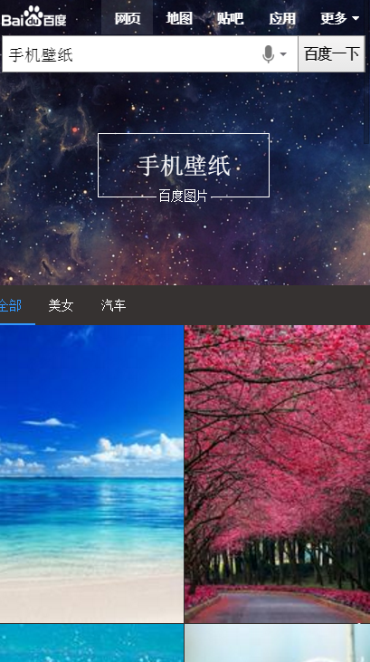

# 常健驰

> 从2016-02-29到2016-03-04

## 图片阿拉丁沉浸式体验项目

### 背景与目标

在用户需求明确为图片时，对该情景下的图片样式进行优化，采用sigma+瀑布流形式，提升用户体验。

### 完成情况

模板完成80%，异步给的数据格式跟schema不一致，导致重新修改了模板。预览：[手机壁纸](https://wwwhttps.baidu.com/s?dev_workspace=platform&dev_tpl=image_waterfall&tn=iphone&sid=99999&dev_online=0&dev_module=aladdin-wise&dev_file=default.xml&dev_fileformat=xml&dev_pos=asResult&wd=%E6%89%8B%E6%9C%BA%E5%A3%81%E7%BA%B8&word=%E6%89%8B%E6%9C%BA%E5%A3%81%E7%BA%B8)

### 效果截图

## 组件升级

已完成

### 完成情况

1.sh_house 2.short_video 3.sam_wise_car_rank 4.appsearch 5.star_stroke 6.star_variety 7.wise_astro 8.wise_car_rank 9.wise_fortune

## 接下来的排期

* 客服电话模板待开发
* 复用线上模板
