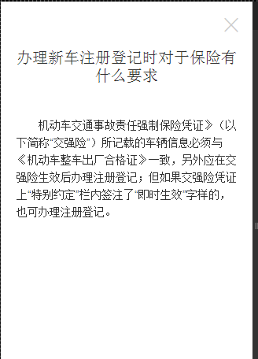
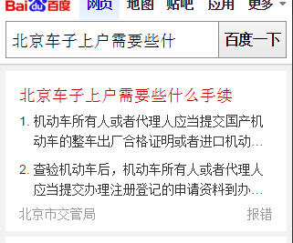

# 李阳阳

> 从2016-02-29到2015-03-04

## wise_qanda模板复用

### 背景

背景： 政务类问答官方解答方向，民众对具体服务等疑问及官方输出解读。因政府机构普遍存在无移动站问题，且部分数据第三方公司无法替代，因此为线上能够覆盖官方数据，修改了问答卡片模板。以浮层展示的交互替代落地页。

### 进度

3月4号（下午）上线~~预计pv是1k

### 效果图（摘要样式和列表样式）

<table algin="center">
<tr>
<td></td>
</tr>
<tr>
<td></td>
</tr>
<tr>
<td></td>
</tr>
<tr>
<td></td>
</tr>
</table>

## 日志迁移

### 背景

tabs和srcoll组件日志升级

### 完成情况

涉及celebrity_muying_rela、sam_moviesongs、singer_v2、wise_car_brand、wise_car_comment、single_variety、wise_dish_menu、tv_fan、tv_precision这些模板~3月3号前已完成上线

## 度秘数据格式修改

### 背景

视频模板加上type='play',出现视频图标

### 完成情况

wz_movielist、short_video，上线的路上

### Todo

那个ue今天设计，下周一给初稿。
【问答聚合】14日nlp的人会先给几个query做数据测试，14日之前给schema标准。等ue图出来就可开始搞这个数据标准啦~
【法律法规推理】的后端数据下周四搞定，下周可以介入