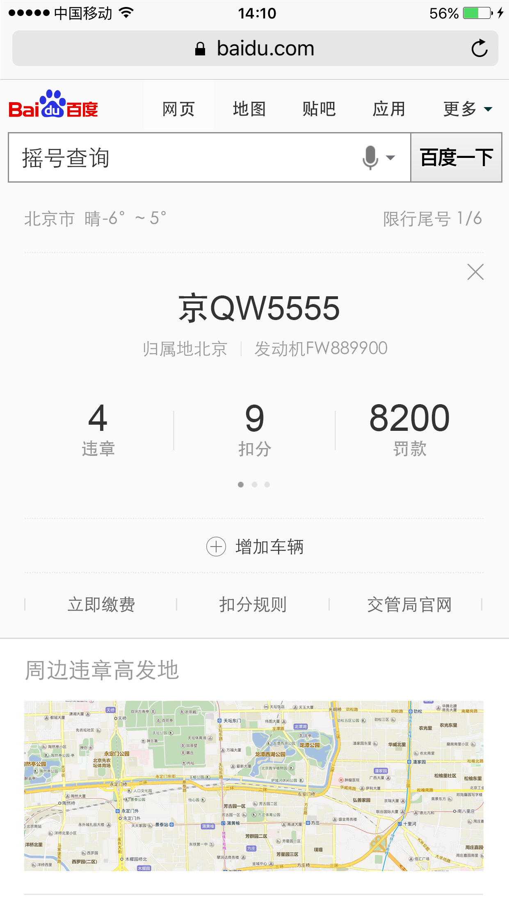
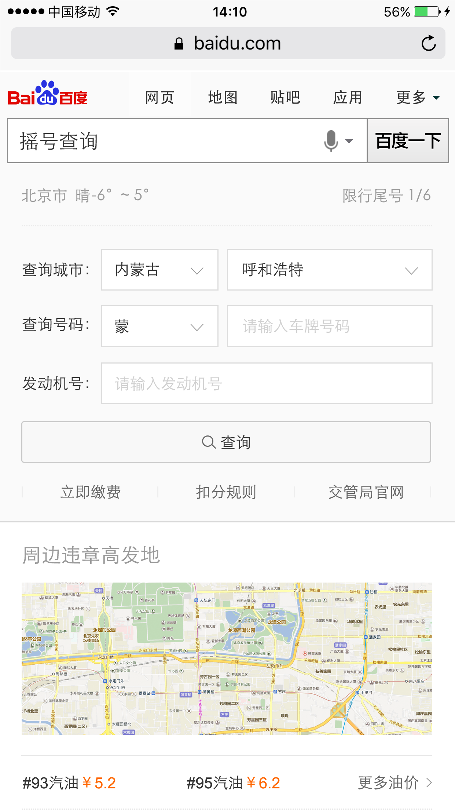
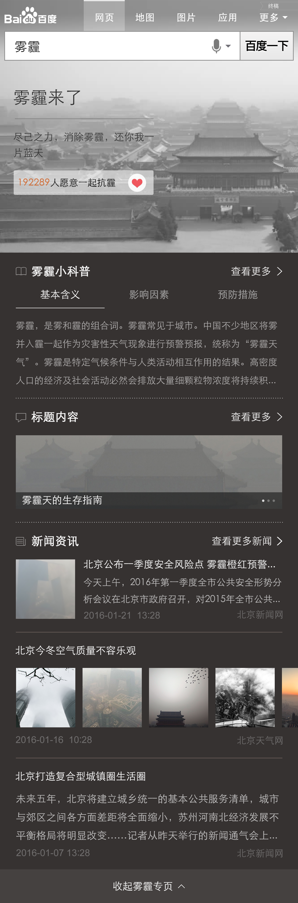

# 王培

> 从2016-02-29到2016-03-04

## 本周跟进

- 哥伦布民生-违章
- 运营类通用事件模板升级

## 违章查询

### 背景与目标

```
为提升用户体验，满足创新2号项目需求，违章查询增加sigma卡
```

### 完成情况（测试中）

- PV：暂无

- 状态『sigma』：
    
    - 已上线，0流量环境下测试线上各个接口中...
  
    - 白卡预计下周一（2016/03/07）提测，周二（2016/03/08）上线

### 效果图

<table algin="center">
<tr>
<td></td>
<td></td>
</tr>
</table>

## 运营类通用事件模板升级

### 背景与目标

```
老模板不能满足新的功能需求，修改及维护成本较大。因此开发新的模板，栅格迁移及功能升级，
```

### 完成情况

- PV：暂无

- 状态『sigma』：

    - 新增模板optl_generalevent

    - 测试中，预计今天（2016/03/04）,最晚下周一(2016/03/07)上线
    
- 状态『白卡』：

    - 测试中，预计今天（2016/03/04）,最晚下周一(2016/03/07)上线


### 效果图

<table algin="center">
<tr>
<td></td>
</tr>
</table>


## 明星人物运营项目二期（测试中）
### 背景与目标

```
1、背景：为了更加突出明星人物的时效性，丰富模板应用场景，提升用户体验。

2、目标：
    
    1) 在明星人物模板原有的基础上，在Banner部分“个人信息区域”添加最新动态和祈福两个新功能
    
    2) 卡片时间轴状态下，由之前的新闻标题显示3条、更多可上下滑动——改为：最多显示4条，取消滑动功能
    
    3) 增加白卡样式        
```

<table algin="center">
<tr>
<td></td>
<td></td>
</tr>
<tr>
<td></td>
<td></td>
</tr>
<tr>
<td colspan="2"></td>
</tr>
<tr>
<td colspan="2"></td>
</tr>
<tr>
<td colspan="2"></td>
</tr>
</table>

### 完成情况

- sigma已提测

- 白卡样式模板已上线

### 效果图

- 见上表格    


## 下周计划

- 创新2号项目-违章

- wise节日通用卡升级（UE图已确认）


 


