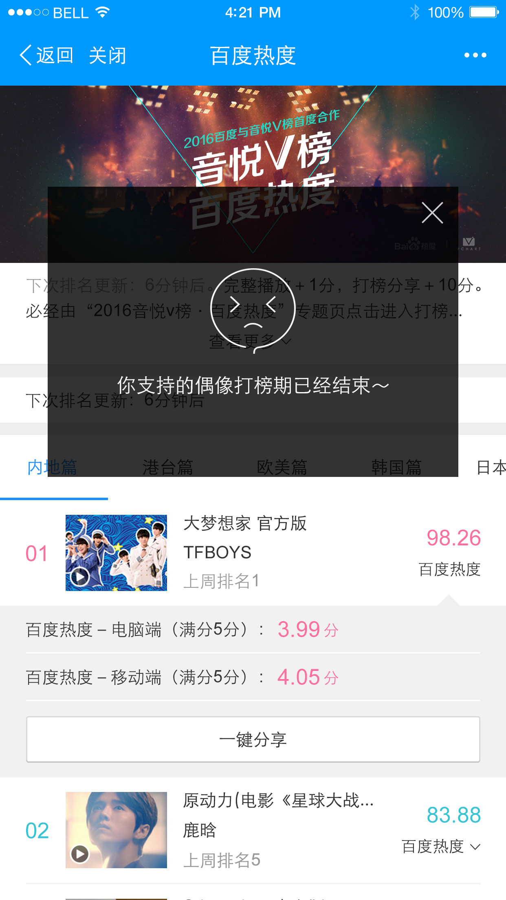
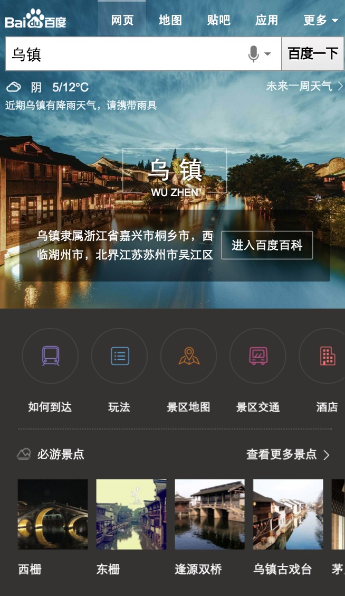
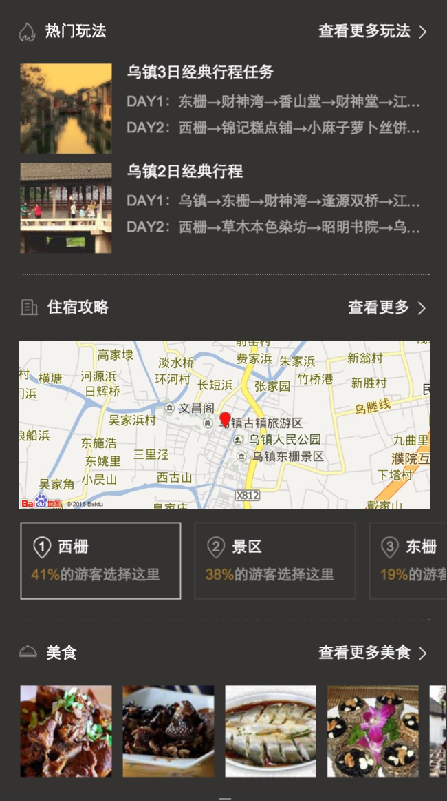

# 【阿拉丁产品方向周报】

> 从2016-03-04到2015-03-01

<style type="text/css">
    .balabala {
        position: fixed;
        right: 10px;
        z-index: 10000;
        opacity: 0.07; 
        background-color: #fff; 
        -webkit-transition: opacity .2s; 
        -o-transition: opacity .2s; 
        transition: opacity .2s; 
        top: 10px; 
        padding: 10px; 
        border: 1px solid  #f0f0f0; 
    }
    .balabala:hover {
        opacity: 1; 
    }
    .balabala h3 {
        margin-top: 0; 
        margin-bottom: 0; 
    }
</style>

## 哥伦布

### 背景

哥伦布（Columbus）项目，是大搜索在2016年的重点创新大方向，主要在移动搜索上开展，目标是把“传统搜索”演进为“有灵魂的搜索”

- 基于对移动互联网内容的深度理解，展现有组织的、结构化的、有机联系的搜索结果
- 根据用户需求，来重新定义具体的各个搜索功能元素
- 功能元素布局合理、逻辑清晰、交互简捷
- 深度满足用户需求，实现沉浸式的搜索体验
- 通过对用户自身特点和用户所在场景的理解，引导和激发用户的“更广义”的需求，使得用户的“更广义”的需求，更多地得到“一站式”的、更快捷的满足.


目前哥伦布包括的项目有  

* 中途岛: 资讯(owner：吴海，FE：陈锐、王培、黎明),  
* 天宁岛: 旅游、poi出行(owner：谭待，FE：泉有、小武),
* 民生: 天气、万年历、车主服务(owner：永志，FE：朱雷、玲娟),
* 娱乐: 人物明星、影视视频、音乐(owner：李萌，FE：浪波、佳隆、李晓),
* 商品: (兆远)

## 其他垂类
 
* 招聘: FE: 斐凡、玲玲
* 学术: FE: 郭勇
* 体育、游戏、汽车、房产、医疗、母婴、政务、自有产品(吴忧、李晓、阳阳、健驰）


## 哥伦布-中途岛

### 背景和目标
哥伦布（Columbus）项目，是大搜索在2016年的重点创新大方向。中途岛作为哥伦布的一级垂类，针对新闻资讯领域，致力给用户提供更好的搜索体验。

### 本周进度

#### 体验相关

* <span style="color:red;">全量高优BUG修复</span>（PM邮件提出的4个）：修复中（@陈锐@范黎明）
* 分享组件迁移（与自媒体页保持一致）：开发中，本周五（3/11）给出环境（@范黎明）
* 文字改用rem单位：开发中

#### 广告相关

* 手百下载广告：开发完成，中途岛全流量之后上线（@范黎明）
<div></div>
1. 数据格式：格式已确定，本周四（3/10）少峰提供接口
2. 反作弊：
* 详情页接入广告：js插入iframe方式（@陈锐）
1. 网盟暂时支持不了https，先采用开环http方式


#### 视频相关

* 播放器：暂定用百度云的视频插件（在移动端有一些BUG），已经将播放器demo提交给QA测试（@陈锐）
* 视频feed页/详情页：与 PM 勾兑了初版方案（@陈锐）

#### 评论系统相关

* 待定（@陈锐）

#### 订阅功能相关

* 查看我的订阅：待 PM 输出最终方案（@陈锐）

#### MIB框架相关：

* 背景:
* 线下调试环境：已经输出一版，并提供给站长使用（@陈锐）
* 测速：监控方案本周完成，下周输出初版的测试数据（@王培@陶清乾）
* 迁移：下周完成代码模块跟名，业务 mibhtml -> headline，框架 mibman -> mibhtml（@陶清乾）

#### mib页性能监控
<a href="" >具体监控指标</a>

- 监控体系

    - 暂制定出各个监控指标，待和清乾讨论后更新最后确定的指标
    
- 监控机制

    - 下周一（2016/03/11）开始开发
    
- 测试

    - 下周三（2016/03/11）之前给出线上mib页性能的测试数据


## 哥伦布-民生类-摇号

### 背景

摇号这部分用户画像清晰，这部分用户主要为有买车打算但当前无车（或无购买本地车牌资格）的用户，因为摇车中签比例日渐走低，这部分用户数量可观且持续变多，目前及未来对各类新车的需求庞大，有激发的潜力，同时对政策车（如新能源车）有较强的需求。

在用户搜索摇号后，且主需求满足很好，我们将针对这部分用户推荐用户新车（尤其是不摇号车）等汽车信息，以及推荐用户新车试驾等服务内容。

### 进度

已上线小流量, sid=103868，影响面3w。

### 本周更新

<span style="color:red;">本周玲娟完成了摇号白卡的开发，已上线。目前仍在小流量实验中。</span>

### 示例query

[杭州摇号](https://m.baidu.com/s?from=844b&vit=fps&word=%E6%9D%AD%E5%B7%9E%E6%91%87%E5%8F%B7&sid=103868)


### 效果图


## 哥伦布-民生类-天气（马文号项目）

### 背景

哥伦布项目的探索先驱，在满足用户对天气情况的搜索主需求之后前置其他与天气相关的需求，如饮食、娱乐、运动等。

### 完成情况

目前线上有50+城市全流量，100+城市小流量中，影响面合计1100w。

### 本周更新

* <span class="style:color:red;">头部rem适配方案调研：已上线</span>
* <span class="style:color:red">24小时展现优化：已上线</span>
* <span class="style:color:red">二级页面迁移superframe：已上线</span>
* <span class="style:color:red">添加媒体时长日志：已上线</span>

### Todo

* <span style="color:red;">头部高度缩减样式开发</span>

#### 示例query

[北京天气](https://m.baidu.com/from=844b/s?word=%E5%8C%97%E4%BA%AC%E5%A4%A9%E6%B0%94)


### 效果图


## 哥伦布-民生类-万年历

### 背景

在万年历和一些日期搜索的query下进行需求激发，在满足用户对日期信息获取的主需求下，将当下的热点新闻、热卖商品推荐给用户，激发用户与日期相关的潜在需求。

### 完成情况

年前做了3天小流量实验，结论如下:

* 实验抽样下（50%流量）日均PV为19W/天；点击率提升1.98%（82.19%->84.17%）,有点降低6.55%（42.87%->36.32%）,换query比例升高1.84%（6.16%->8%）

* 日历主体交互点击率实验组提升6.66%（55.35%->62.01%）

### Todo

* <span style="color:red;">万年历二期迭代：由于RD环境delay，导致FE介入时间延迟，预计3.11开始，3.14日提测</span>

## 哥伦布-民生类-pc违章

### 背景

pc违章项目资源方和后端接口有变更，前端需要做接口迁移，同时还有产品形态的调整，把查询结果页面放到车辆列表下面。

### 完成情况

<span style="color:red;">目前缺少可登录的view-ui环境，与登录相关的样式暂时无法开发，其余功能已经开发完毕。RD预计3.11提供可登录环境。</span>


## 哥伦布-民生类-创新二号项目违章

#### 背景与目标

```
为提升用户体验，满足创新2号项目需求，违章查询增加sigma卡
```

#### 完成情况（测试中）

- PV：暂无

- 状态『sigma』：
    
    - <span style="color:red;">0流量测试中</span>

#### 效果图

<table algin="center">
<tr>
<td></td>
<td></td>
</tr>
</table>


类目 | 项目 | 上线时间 | 模板 | 背景 | 流量&&全量影响面 
--- | --- | --- | --- | --- | --- 
哥伦布-民生 | 限行 | 做负了，增加头部点击 | 50%/5w | 还是负了，pm已下线。二期迭代计划是3.11出产品方案ue排期 


## 哥伦布-娱乐类-音乐2号项目

### 背景

2号项目的意义是在满足用户主需求的情况下,激发用户的额外需求.
在满足用户单曲精确查找的需求基础上，充分利用搜索结果的后面点击率较少的区域，激发用户在音乐上的需求。  
Query示例：小幸运（只有一位歌手唱过）  
依赖张靓颖（精准明确歌手与歌曲）  
影响面：首先针对可以在线播放的百度音乐资源的，排在首位的资源。  
初步按照圈定歌曲的方式，小流量测试10w/day  
全量约25w/day  

### 最新进展

* <span style="color:red;">歌词中间页优化,下周一,ue出优化稿,再评估工作量</span>

### 效果图


## 音悦台v榜

### 背景

* 方便用户查看打榜歌曲
* 效果图


<div></div>


### 最新进展

* <span style="color:red;">pc: 计划3.10日迭代一版,目前AE部分机器报警,等待上线中</span>
* <span style="color:red;">wise: 所提bug基本修复完成，还剩分享点击触发一个问题今天会解决。 qa3.11日回归测试，整体上线根据mv合作方的修复时间再定。</span>


## 哥伦布-娱乐-人物-粉丝场景化

### 背景

* 为更好地支持场景化的触发，方便pm更快铺量更好干预，与后端rd统一商定迁移为mini机制

* 为更好地视觉体验，新增沉浸式样式

* 为支持团购商品需求——电影《老炮儿》首映礼票务团购，模板需增加活动区域模块

### 完成情况

* 升级模板wise_scene_person_kv，12.02日模板上线，12.04日数据切换为mini机制，影响面约125W;

* 沉浸式样式升级，并支持头部颜色可配置,12.10日模板已上线

* 头部文字描述支持可跳转，增加活动区域入口；增加活动区域模块，12.11日模板上线

* 12.11上午沉浸式样式小流量上线，仍保持90%生效，其中10%生效人群识别策略，覆盖人数12人，影响面150w/天

* 增加图片模块，12.25日模板上线

* 粉丝场景化将于1231前需扩招至60人，影响面增至400w左右

* 2016年奥运会采用kv形式复用该模板，调整kv模式下子卡与mini数据格式统一，01.08号模板上线

* 人物场景化外跳优化实验-细节样式修改,01.21日模板已上线，01.22开始小流量实验，实验组95%，对照组5%，影响面约300w左右

### 覆盖query

* 鹿晗，迪丽热巴，杨洋，郑爽，李易峰，杨幂

### 线上效果

* [吴亦凡](https://www.baidu.com/ssid=8a3d73746172c3f7d0c773746172fc4b/from=844b/s?word=%E5%90%B4%E4%BA%A6%E5%87%A1&sa=tb&ts=8665908&t_kt=0&ms=1&rsv_pq=6932049557572375983&ss=101&t_it=1&rsv_sug4=3221&inputT=2313&oq=%E7%8E%8B%E6%BA%90)

### 效果截图

* 唯一答案


### todo1

* 明星行程模块改版、新增明星行程情景页

* 【背景】大搜整体向中间页方向发展，倡导沉浸式体验，提供更多内容，增强对PV把控能力，增长用户停留时长,在中间页展现更多行程内容，同时为后续引入更多资源方、UGC内容打下基础。

* <span style="color:red;">【完成情况】模板已上线，子卡迁移新资源，模板开发完，03.11开始联调。</span>

### <span style="color:red;">todo2</span>

* 开发MV打榜卡片，实时更新排名，给出粉丝打榜入口。点击打榜卡片，进入“打榜中间页”

* 【背景】娱乐领域与音悦台MV榜单达成2016年全年合作，将把“百度热度”计入MV榜单排名中。音悦台榜单涉及明星与粉丝场景有部分重合，“打榜”活动与粉丝活动契合度极高，适合将音悦台“百度热度”入口纳入到粉丝场景化产品中。。

* 【完成情况】模板开发完，待音乐打榜中间页没问题后同步上线。

## 数据迁移 - 旅游迁移

### 背景

* 公司和携程签订了若干合作协议，需要接入到搜索阿拉丁中，目前是火车票、汽车票携程通过快行对接；门票线路通过百度旅游对接；相关团购类通过糯米对接；

### 完成情况

* wise端 糯米【机票、酒店】，已全部完成迁移
* wise端 百度快行【火车票、汽车票】，已全部完成迁移
* wise端 百度旅游【度假、签证、门票、旅游线路】，剩余度假卡片，模板已搞定，待资源方落地页ready后开流量。
* pc端 糯米【机票】，机票点到点、机票范搜索，已评审，03.04号开始迁移，<span style="color:red"><br />点到点联调中、预计03.14开发完，<br />机票范搜索03.15开始开发。</span>
* pc端 百度快行 【火车票、汽车票】待开展
* pc 百度旅游【度假、签证、门票、旅游线路】 无

## 哥伦布-娱乐-漫画情景页

### 背景

* 聚焦长篇漫画的更新空档期，提供一站式情报资讯聚合服务，优化用户搜索体验的同时，提升媒体停留时长。
第一期以【航海王】这一头部漫画试水，在航海王/海贼王的关键词下召回，以哥伦布三级跳转的形式，进行沉浸式体验的满足。

### 效果截图


### 完成情况

* 3.3下午50%小流量上线[(query：航海王)](http://m.baidu.com/s?word=%E8%88%AA%E6%B5%B7%E7%8E%8B&sid=103857)，整体影响面约30w。


## 哥伦布-糯米

###	wise_tuan2新增糯米app下载弱样式试验卡片

### 最新进展

* qa已经回归测试，确认效果Ok,3月11上线。

## 哥伦布-天宁岛-旅游

### * 背景与目标

- 以一个出行方向为基点，聚合各垂类内容，使用户更便捷获取所需信息。

### * 完成情况
- 01-29内网全流量上线。
- 已于2月15日17:20分在外网小流量上线。
- Query: 乌镇、丽江、桂林、三亚、香港
- 影响面日均4.5W.
#### * 实验策略：
- 33%天宁岛屏蔽阿拉丁（抽样ID为103639）
- 33%天宁岛不屏蔽阿拉丁（抽样ID为103640）
- 33%城市原样式（抽样ID为103641）
- [点这里~点这里~](https://www.baidu.com/ssid=303b7363686f6575c808/from=844b/s?word=%E4%B9%8C%E9%95%87&ts=8455359&t_kt=0&ie=utf-8&rsv_iqid=4779496194617090106&rsv_t=fbb32vuIyem3JR0xKLf906qDkaLFpGwCs8cBT1lS0VdvJU%252FAlvYbC77%252BEg&sa=ib&ms=1&rsv_pq=4779496194617090106&rsv_sug4=3689&inputT=963&ss=100)

<p style="color:red">图片加载优化+日志调整</p>

- 近期计划: 城市/景区扩量和增加Query变换


<br/>

<br/>


## 天宁岛-旅游(二期)

### * 背景与目标

- 当前的旅游类搜索结果页包含卡片较多，尤其是同质内容卡片使得页面结构凌乱。以景区和典型旅游城市作为试水Query，依托于场景化卡片优化搜索结果页整体效果，优化内容包括：增加特价线路子卡、百度图片子卡、相关地点推荐子卡、相关咨询子卡，同时尝试兼容广告的浅色大卡样式和自然结果融合的样式。

### * 完成情况
- 需用两套模板来满足试验需求（分黑白卡两种），白卡黑卡UE图已出，白卡弱样式UE图今天提供。
- 排期:3.11~3.3.16开发（4天开发时间）,3.17联调（一天）,3.18,3.21测试（两天)达到上线状态.
- 扩展到108个城市,全量后预计80W PV.

<p style="color:red">今天开始开发</p>


## 天宁岛-餐饮(二期)

### * 背景与目标

- 整合地图、糯米、美味不用等的poi基础数据和团购、买单、排号服务，打造闭环就餐体验；
- 利用sigma和天使之翼的产品形态，提升交互体验；
- 并在美食泛搜索下尝试主题推荐；

### * 完成情况
<p style="color:red">第一次需求评审后需UE调整设计细节</p>


## 天宁岛-景点（二期)

### * 背景与目标

- 通过对现有子卡的设计优化,结构重组和增加新子卡,提升用户体验,适配进一步扩招.

### * 完成情况
- 02-24第一次评审
<p style="color:red">03-08已给PM提供schema，PM与资源方提数据.</p>


#########################################
# 非哥伦布上线


类目 | 项目 | 上线时间 | 模板 | 背景 | 流量&&全量影响面 
--- | --- | --- | --- | --- | --- 
推荐 | 星河二期 | 3.10 | sigma_recommend_search_second(新增) | 在一期实验正向的成果下，新增新闻和问答类的推荐尝试 | 0.1%/450w
推荐 | 通用推荐切tab版 | 3.10 | sigma_celebrity_tab(新增) | UE关总的需求，目前通用推荐的滑动率较低，想尝试多种推荐样式的可行性 | 1%/2亿

## 图片阿拉丁沉浸式体验项目

### 背景与目标

在用户需求明确为图片时，对该情景下的图片样式进行优化，采用sigma+瀑布流形式，提升用户体验。

### 完成情况

模板基本完成，存在一些bug，正在修复。xml格式修改成了和异步返回的结构一样的格式，（因为异步格式他们不能改动），模板从两列展现变成了三列。预览：[手机壁纸](http://cp01-sys-rath4-c32-qa270.cp01.baidu.com:8003/s?dev_workspace=platform&dev_tpl=image_waterfall&tn=iphone&sid=99999&dev_online=0&dev_module=aladdin-wise&dev_file=default.xml&dev_fileformat=xml&dev_pos=asResult&wd=%E6%89%8B%E6%9C%BA%E5%A3%81%E7%BA%B8&word=%E6%89%8B%E6%9C%BA%E5%A3%81%E7%BA%B8)

### 效果截图


## 度秘

#### 项目背景

wise结果同步度秘，度秘访问wise的json接口和度秘对大搜索阿拉丁截图通用展现方案已经完成，
下一步展开阿拉丁模板适配度秘信息模板的映射，以便获得最优展现。

#### 本周工作

* 修复wise_tuan2适配数据为空的bug，已上线
* 修复wise_noval_book落地页死链bug，已上线
* img\_comm多图模板中增加hover\_imgs数组及查看更多落地页，周五上线

#### 目标

度秘为用户提供更优的数据资源，大大提高用户体验

#### 整体计划及排期

* 一期适配（24个），现有信息模板已经支持的，预计12.7上线
* 二期适配（14个），需要多实体卡片上线后支持的（NA1.1和手百7.1），预计12.14上线
* <span style="color:green">三期适配（15个+13个问题模板），多实体卡片升级和现有模板调整的（NA和手百的下一个版本，时间待定）</span>
* 四期适配（17个），多实体15个，单实体2个，预计3.15开发，3月底上线

## xml转mcpack

### 背景

* gss从mola获取的原始数据是mcpack的，gss代码中将mcpack先转成了xml，xml传给odp又转成了array,xml数据大小比mcpack大，需要和pc端打平

### 问题
* 单个result转mcpack是数组形式，xml是object形式，7个模板需兼容，预计3.15之前上线
* mini属性字段现状是_xxx，转mcpack后变成@xxx，7个模板需兼容，预计3.15之前上线
* num_baidu字段diff存在17个模板需兼容处理，预计3.15之前上线
* kv资源转mcpack的属性字段会跟pc一样，变成二维数组，涉及模板约200多个，需分批迁移

### 进度

* 待升级的30个模板，3.11日完成上线


