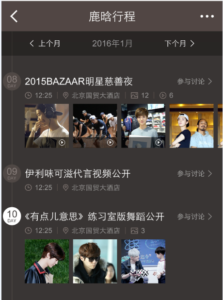

# 李晓

> 从2016-02-22到2016-02-26

## 1、娱乐 - 人物粉丝场景化

### 背景

* 为更好地支持场景化的触发，方便pm更快铺量更好干预，与后端rd统一商定迁移为mini机制

* 为更好地视觉体验，新增沉浸式样式

* 为支持团购商品需求——电影《老炮儿》首映礼票务团购，模板需增加活动区域模块

### 完成情况

* 升级模板wise_scene_person_kv，12.02日模板上线，12.04日数据切换为mini机制，影响面约125W;

* 沉浸式样式升级，并支持头部颜色可配置,12.10日模板已上线

* 头部文字描述支持可跳转，增加活动区域入口；增加活动区域模块，12.11日模板上线

* 12.11上午沉浸式样式小流量上线，仍保持90%生效，其中10%生效人群识别策略，覆盖人数12人，影响面150w/天

* 增加图片模块，12.25日模板上线

* 粉丝场景化将于1231前需扩招至60人，影响面增至400w左右

* 2016年奥运会采用kv形式复用该模板，调整kv模式下子卡与mini数据格式统一，01.08号模板上线

* 人物场景化外跳优化实验-细节样式修改,01.21日模板已上线，01.22开始小流量实验，实验组95%，对照组5%，影响面约300w左右

### 覆盖query

* 鹿晗，迪丽热巴，杨洋，郑爽，李易峰，杨幂

### 线上效果

* [吴亦凡](https://www.baidu.com/ssid=8a3d73746172c3f7d0c773746172fc4b/from=844b/s?word=%E5%90%B4%E4%BA%A6%E5%87%A1&sa=tb&ts=8665908&t_kt=0&ms=1&rsv_pq=6932049557572375983&ss=101&t_it=1&rsv_sug4=3221&inputT=2313&oq=%E7%8E%8B%E6%BA%90)

### 效果截图

* 唯一答案

### todo1

* 明星行程模块改版、新增明星行程情景页

* 【背景】大搜整体向中间页方向发展，倡导沉浸式体验，提供更多内容，增强对PV把控能力，增长用户停留时长,在中间页展现更多行程内容，同时为后续引入更多资源方、UGC内容打下基础。

* 【完成情况】模板已上线，子卡迁移新资源，模板开发完，03.11开始联调。

### todo2

* 开发MV打榜卡片，实时更新排名，给出粉丝打榜入口。点击打榜卡片，进入“打榜中间页”

* 【背景】娱乐领域与音悦台MV榜单达成2016年全年合作，将把“百度热度”计入MV榜单排名中。音悦台榜单涉及明星与粉丝场景有部分重合，“打榜”活动与粉丝活动契合度极高，适合将音悦台“百度热度”入口纳入到粉丝场景化产品中。。

* 【完成情况】模板开发完，待音乐打榜中间页没问题后同步上线。

## 2、娱乐 - 漫画情景页

### 背景

* 聚焦长篇漫画的更新空档期，提供一站式情报资讯聚合服务，优化用户搜索体验的同时，提升媒体停留时长。
第一期以【航海王】这一头部漫画试水，在航海王/海贼王的关键词下召回，以哥伦布三级跳转的形式，进行沉浸式体验的满足。

### 效果截图

### 完成情况

* 3.3下午50%小流量上线[(query：航海王)](http://m.baidu.com/s?word=%E8%88%AA%E6%B5%B7%E7%8E%8B&sid=103857)，整体影响面约30w。

## 3、数据迁移 - 旅游迁移

### 背景

* 公司和携程签订了若干合作协议，需要接入到搜索阿拉丁中，目前是火车票、汽车票携程通过快行对接；门票线路通过百度旅游对接；相关团购类通过糯米对接；

### 完成情况

* wise端 糯米【机票、酒店】，已全部完成迁移
* wise端 百度快行【火车票、汽车票】，已全部完成迁移
* wise端 百度旅游【度假、签证、门票、旅游线路】，剩余度假卡片，模板已搞定，待资源方落地页ready后开流量。
* pc端 糯米【机票】，机票点到点、机票范搜索，已评审，03.04号开始迁移， 点到点联调中、预计03.14开发完， 机票范搜索03.15开始开发。
* pc端 百度快行 【火车票、汽车票】待开展
* pc 百度旅游【度假、签证、门票、旅游线路】 无