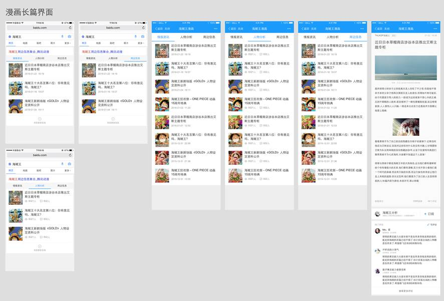
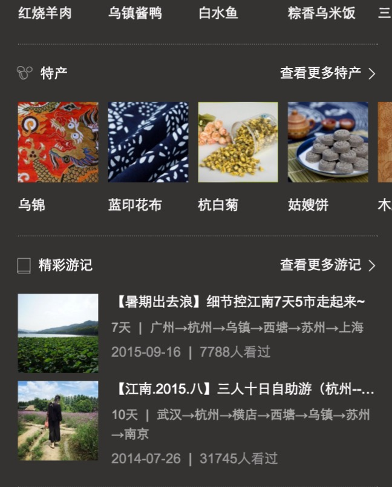
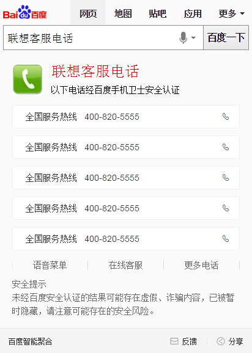
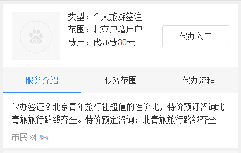

# 【阿拉丁产品方向周报】

> 从2016-03-14到2015-03-18

<style type="text/css">
    .balabala {
        position: fixed;
        right: 10px;
        z-index: 10000;
        opacity: 0.07; 
        background-color: #fff; 
        -webkit-transition: opacity .2s; 
        -o-transition: opacity .2s; 
        transition: opacity .2s; 
        top: 10px; 
        padding: 10px; 
        border: 1px solid  #f0f0f0; 
    }
    .balabala:hover {
        opacity: 1; 
    }
    .balabala h3 {
        margin-top: 0; 
        margin-bottom: 0; 
    }
</style>

## 哥伦布

### 背景

哥伦布（Columbus）项目，是大搜索在2016年的重点创新大方向，主要在移动搜索上开展，目标是把“传统搜索”演进为“有灵魂的搜索”

- 基于对移动互联网内容的深度理解，展现有组织的、结构化的、有机联系的搜索结果
- 根据用户需求，来重新定义具体的各个搜索功能元素
- 功能元素布局合理、逻辑清晰、交互简捷
- 深度满足用户需求，实现沉浸式的搜索体验
- 通过对用户自身特点和用户所在场景的理解，引导和激发用户的“更广义”的需求，使得用户的“更广义”的需求，更多地得到“一站式”的、更快捷的满足.


目前哥伦布包括的项目有  

* 中途岛: 资讯(owner：吴海，FE：陈锐、王培、黎明),  
* 天宁岛: 旅游、poi出行(owner：谭待，FE：泉有、小武),
* 民生: 天气、万年历、车主服务(owner：永志，FE：朱雷、玲娟),
* 娱乐: 人物明星、影视视频、音乐(owner：李萌，FE：浪波、佳隆、李晓),
* 招聘: FE: 斐凡、玲玲
* 学术: FE: 郭勇

## 其他垂类

* 体育、游戏、汽车、房产、医疗、母婴、政务、自有产品(吴忧、李晓、阳阳、健驰）


## 哥伦布-中途岛

### 背景和目标
哥伦布（Columbus）项目，是大搜索在2016年的重点创新大方向。中途岛作为哥伦布的一级垂类，针对新闻资讯领域，致力给用户提供更好的搜索体验。

### 本周进度

#### 体验相关
    * 本周BUG修复：（@黎明@王培@根磊@陈锐）
        1. 高优BUG 16个
```
已修复 * 1
修复待上线 * 1
待解决 * 1
无法解决 * 4
FE未复现 * 4
手百问题 * 2
描述不清 * 1
符合预期 * 1
先忽略 * 1
```
        2. 中低优 31个
```
修复待上线 * 1
无法解决 * 2
FE未复现 * 8
手百问题 * 5
可先忽略 * 14
描述不清 * 1
```
* 上周BUG修复：4个高优BUG已修复上线3个，另外一个手百4月中旬上线（@陈锐@黎明）
* 分享组件迁移：本周三（3/16）已上线（@黎明）
* 文字改用rem单位：开发中（@杨帆）

#### 广告相关
    * 手百下载广告：本周二（3/15）小流量上线（@黎明）
    * feed页接入广告：（@陈锐）
        1. 本周三（3/16）开发完成，已提交QA测试
        2. 预计周六（3/19）完成联调测试，并上线
        3. 预览环境：http://cp01-sys-rath4-c32-qa270.cp01.baidu.com:8003/s?dev_workspace=platform&dev_tpl=optl_sf_news&tn=iphone&sid=99999&dev_online=0&dev_module=aladdin-wise&dev_file=default.xml&dev_fileformat=xml&dev_pos=asResult&wd=%E4%B8%AD%E9%80%94%E5%B2%9B%E6%96%B0%E9%97%BB%E6%8E%A8%E8%8D%90&word=%E4%B8%AD%E9%80%94%E5%B2%9B%E6%96%B0%E9%97%BB%E6%8E%A8%E8%8D%90#|act=activity%2Fnews_feed%2Ffeedsub.debug%3D%257B%2522srcid%2522%253A14989%252C%2522order%2522%253A1%257D
    * 详情页接入广告：引用js插入iframe方式（@黎明）
        1. 本周四（3/17）输出了预览环境，PM正在调整样式
        2. 预览环境：http://cq02-wise-sftc6.cq02.baidu.com:8524/doc/detail/http%3A%2F%2Fheadline.baidu.com%2Farticle%2Fb283986f33c39047af0fc8826164679f/1458126954/#from=pub

#### 视频相关
    * 播放器：百度云视频插件不符合要求，方案定为基于浏览器自己开发（@清乾）
    * 视频feed页/详情页：方案未定

#### 评论系统相关
    * 待定（@陈锐）

#### 订阅功能相关
    * 订阅页面：已经确定将订阅页面从feed页中迁出到headline模块（@王培）
    * 入口方式：通过ODP配置，搜索“我的订阅”直接跳转到headline（@王培）

#### MIB框架相关：
    * 线下调试环境：已经输出第一版（@陈锐）
    * 测速：开发中（@王培@清乾）
    * 迁移：待定（@清乾）
    * 调研/日志/广告/视频插件/平台：TODO

#### mib页性能监控
<a href="" >具体监控指标</a>

- 监控体系

    - 各个监控指标已确定，在实际测试中会根据测试数据进行调整
    
- 监控机制

    - 开发中
    
- 测试

    - delay


## 哥伦布-民生类-摇号

### 背景

摇号这部分用户画像清晰，这部分用户主要为有买车打算但当前无车（或无购买本地车牌资格）的用户，因为摇车中签比例日渐走低，这部分用户数量可观且持续变多，目前及未来对各类新车的需求庞大，有激发的潜力，同时对政策车（如新能源车）有较强的需求。

在用户搜索摇号后，且主需求满足很好，我们将针对这部分用户推荐用户新车（尤其是不摇号车）等汽车信息，以及推荐用户新车试驾等服务内容。

### 进度

已上线小流量, sid=103868，影响面3w。

### 本周更新

* <span style="color: red;">小流量实验初步结论为负收益，具体指标等待UBS同学产出</span>

* <span style="color: red;">评审了摇号二期需求</span>

### 示例query

[杭州摇号](https://m.baidu.com/s?from=844b&vit=fps&word=%E6%9D%AD%E5%B7%9E%E6%91%87%E5%8F%B7&sid=103868)


### 效果图


## 哥伦布-民生类-天气（马文号项目）

### 背景

哥伦布项目的探索先驱，在满足用户对天气情况的搜索主需求之后前置其他与天气相关的需求，如饮食、娱乐、运动等。

### 完成情况

目前线上有50+城市全流量，100+城市小流量中，影响面合计1100w。

### 本周更新

* <span class="style:color:red;">头部rem实验的对照组效果：已上线/span>
* <span class="style:color:red">温度柱状图实验：已上线</span>
* <span class="style:color:red">本地出游推荐实验：已上线</span>
* <span class="style:color:red">时效性新闻实验：开发中，预计2016-03-18完成并上线</span>

### Todo

* <span style="color:red;">头部高度缩减样式开发</span>

#### 示例query

[北京天气](https://m.baidu.com/from=844b/s?word=%E5%8C%97%E4%BA%AC%E5%A4%A9%E6%B0%94)


### 效果图


## 哥伦布-民生类-万年历

### 背景

在万年历和一些日期搜索的query下进行需求激发，在满足用户对日期信息获取的主需求下，将当下的热点新闻、热卖商品推荐给用户，激发用户与日期相关的潜在需求。

### 完成情况

年前做了3天小流量实验，结论如下:

* 实验抽样下（50%流量）日均PV为19W/天；点击率提升1.98%（82.19%->84.17%）,有点降低6.55%（42.87%->36.32%）,换query比例升高1.84%（6.16%->8%）

* 日历主体交互点击率实验组提升6.66%（55.35%->62.01%）

### 本周更新

* 完成了开发，2016-03-18上线模板

## 哥伦布-民生类-pc违章

### 背景

pc违章项目资源方和后端接口有变更，前端需要做接口迁移，同时还有产品形态的调整，把查询结果页面放到车辆列表下面。

### 完成情况

模板测试中


## 哥伦布-民生类-违章

#### 背景与目标

```
为提升用户体验，满足创新2号项目需求，违章查询增加sigma卡
```

#### 完成情况（测试中）

- PV：暂无

- 状态『sigma』：
    
    - <span style="color:red;">0流量测试中</span>

#### 效果图

<table algin="center">
<tr>
<td></td>
<td></td>
</tr>
</table>


## 哥伦布-民生-快递 

### 背景

主要针对海外购和寄送东西的用户 ，搜索快递单号或者快递公司时候除了常规的快递跟踪信息之外，新增快递助手、手机号码跟踪快递、以及免邮好物的推荐。满足更深需求。

### 进度

预计3.18小流量。pv2w。

### express_delivery线上日志优化 

### 背景

作为sigma快递的样式对照组，日志修复

### 进度

3.18上线


## 哥伦布-娱乐类-音乐

### 背景

2号项目的意义是在满足用户主需求的情况下,激发用户的额外需求.
在满足用户单曲精确查找的需求基础上，充分利用搜索结果的后面点击率较少的区域，激发用户在音乐上的需求。  
Query示例：小幸运（只有一位歌手唱过）  
依赖张靓颖（精准明确歌手与歌曲）  
影响面：首先针对可以在线播放的百度音乐资源的，排在首位的资源。  
初步按照圈定歌曲的方式，小流量测试10w/day  
全量约25w/day  

### 最新进展

* <span style="color:red;">歌词优化方案已经定了,由于人物哥伦布的高优插入.先hold. 这个需要在3.25前上线.</span>


### 效果图


## 音悦台v榜,wise中间页

### 背景

* 方便用户查看打榜歌曲

### 最新进展

* bug修复完毕。
* ue第一次验收，3月18号再修改一版。
* 3月17日上线一版。
* 音乐台的mv播放存在手百兼容问题，3月18号上午11点后与音悦台的同学协同一起解决问题。

## 音悦台v榜,pc中间页

### 背景

* 方便用户查看打榜歌曲
* 效果图


### 最新进展

* <span style="color:red;">pc模板已经ready,等待开流量</span>

## 哥伦布-人物通用框架实验

### 背景

* 哥伦布要求对整体生态有更强把控力，不仅局限于阿拉丁和sigma的内容增加，而是从用户需求出发整体考虑搜索结果的组织形式。
* 娱乐人物相关需求主要由阿拉丁和八卦自然结果满足
* 在明星query下增加八卦、图片、作品导流入口
* 将八卦类自然结果纳入到“明星八卦中心”里，搜索结果页结构改为阿拉丁+重点需求入口

### 样式图


### 最新进展

* 为了节省成本,最终确定自然结果那块儿的方案为先上2个入口卡片,后续再迁移到哥伦布新机制.
* 中间页数据数据方案,以及模板复用的方案,pm那边还是没有确定.
* pm希望是下周上线,感觉有风险

## 下周计划

* 跟进人物哥伦布
* 跟进音乐二号项目的迭代

## 哥伦布-娱乐-人物-粉丝场景化

### 背景

* 为更好地支持场景化的触发，方便pm更快铺量更好干预，与后端rd统一商定迁移为mini机制

* 为更好地视觉体验，新增沉浸式样式

* 为支持团购商品需求——电影《老炮儿》首映礼票务团购，模板需增加活动区域模块

### 完成情况

* 升级模板wise_scene_person_kv，12.02日模板上线，12.04日数据切换为mini机制，影响面约125W;

* 沉浸式样式升级，并支持头部颜色可配置,12.10日模板已上线

* 头部文字描述支持可跳转，增加活动区域入口；增加活动区域模块，12.11日模板上线

* 12.11上午沉浸式样式小流量上线，仍保持90%生效，其中10%生效人群识别策略，覆盖人数12人，影响面150w/天

* 增加图片模块，12.25日模板上线

* 粉丝场景化将于1231前需扩招至60人，影响面增至400w左右

* 2016年奥运会采用kv形式复用该模板，调整kv模式下子卡与mini数据格式统一，01.08号模板上线

* 人物场景化外跳优化实验-细节样式修改,01.21日模板已上线，01.22开始小流量实验，实验组95%，对照组5%，影响面约300w左右

### 覆盖query

* 鹿晗，迪丽热巴，杨洋，郑爽，李易峰，杨幂

### 线上效果

* [吴亦凡](https://www.baidu.com/ssid=8a3d73746172c3f7d0c773746172fc4b/from=844b/s?word=%E5%90%B4%E4%BA%A6%E5%87%A1&sa=tb&ts=8665908&t_kt=0&ms=1&rsv_pq=6932049557572375983&ss=101&t_it=1&rsv_sug4=3221&inputT=2313&oq=%E7%8E%8B%E6%BA%90)

### 效果截图

* 唯一答案


### todo1

* 明星行程模块改版、新增明星行程情景页

* 【背景】大搜整体向中间页方向发展，倡导沉浸式体验，提供更多内容，增强对PV把控能力，增长用户停留时长,在中间页展现更多行程内容，同时为后续引入更多资源方、UGC内容打下基础。

* <span style="color:red;">【完成情况】子卡迁移新资源，03.18号模板已上线，pm数据评估完成后开小流量上线</span>

### <span style="color:red;">todo2</span>

* 开发MV打榜卡片，实时更新排名，给出粉丝打榜入口。点击打榜卡片，进入“打榜中间页”

* 【背景】娱乐领域与音悦台MV榜单达成2016年全年合作，将把“百度热度”计入MV榜单排名中。音悦台榜单涉及明星与粉丝场景有部分重合，“打榜”活动与粉丝活动契合度极高，适合将音悦台“百度热度”入口纳入到粉丝场景化产品中。。

* <span style="color:red;">【完成情况】03.14号模板已上线，音乐mv情景页上线后放开展现</span>

## 数据迁移 - 旅游迁移

### 背景

* 公司和携程签订了若干合作协议，需要接入到搜索阿拉丁中，目前是火车票、汽车票携程通过快行对接；门票线路通过百度旅游对接；相关团购类通过糯米对接；

### 完成情况

* wise端 糯米【机票、酒店】，已全部完成迁移
* wise端 百度快行【火车票、汽车票】，已全部完成迁移
* wise端 百度旅游【度假、签证、门票、旅游线路】，<span style="color:red">剩余度假卡片，模板已搞定，不过携程的落地页和数据还是不达标，目前pm计划与哥伦布大卡行程模块统一。</span>
* pc端 糯米【机票】，机票点到点、机票范搜索，已评审，03.04号开始迁移，<span style="color:red"><br />点到点模板已上线，pm走单中<br />机票泛搜索开发中，预计03.22号开始联调。</span>
* pc端 百度快行 【火车票、汽车票】<span style="color:red"><br />火车票泛搜索，资源方提交xml中，模板只需小改动，pm联系快行同学修改，</span><span style="color:red"><br />汽车票点到点kv模板可直接复用，pm目前考虑新增模板沿用wise端汽车票点到点模式，联系快行同学跟进</span><span style="color:red"><br />剩余火车票点到点、汽车票泛需求都是kv模板，pm直接联系资源方提交资源，模板无需改动</span>

* pc 百度旅游【度假、签证、门票、旅游线路】 无

## 哥伦布-娱乐-漫画情景页

### 背景

* 聚焦长篇漫画的更新空档期，提供一站式情报资讯聚合服务，优化用户搜索体验的同时，提升媒体停留时长。
第一期以【航海王】这一头部漫画试水，在航海王/海贼王的关键词下召回，以哥伦布三级跳转的形式，进行沉浸式体验的满足。

### 效果截图



### 完成情况

* 3.3下午50%小流量上线[(query：航海王)](http://m.baidu.com/s?word=%E8%88%AA%E6%B5%B7%E7%8E%8B&sid=103857)，整体影响面约30w。


## 哥伦布-糯米

### 糯米所有卡片sdk调起开发

### 最新进展

* 原计划排期3月10~3月15号，因音悦台项目没有结束，耽误了一天，项目往后推迟1天。
* 3月16号开发完毕，17号与rd进行联调，rd所提供的接口需要转化为jsonp的，目前等待rd的排期，qa 3月21号开始介入，上线时间根据qa测试进度。


### 糯米所结构化开发

### 最新进展

* 排期3月21~3月24号。
* 配合结构化的同学，已经做好了模板与数据的同步，保障下周一开发无障碍。

## 哥伦布-天宁岛-旅游

### * 背景与目标

- 以一个出行方向为基点，聚合各垂类内容，使用户更便捷获取所需信息。

### * 完成情况
- 01-29内网全流量上线。
- 已于2月15日17:20分在外网小流量上线。
- Query: 乌镇、丽江、桂林、三亚、香港
- 影响面日均4.5W.
#### * 实验策略：
- 33%天宁岛屏蔽阿拉丁（抽样ID为103639）
- 33%天宁岛不屏蔽阿拉丁（抽样ID为103640）
- 33%城市原样式（抽样ID为103641）
- [点这里~点这里~](https://www.baidu.com/ssid=303b7363686f6575c808/from=844b/s?word=%E4%B9%8C%E9%95%87&ts=8455359&t_kt=0&ie=utf-8&rsv_iqid=4779496194617090106&rsv_t=fbb32vuIyem3JR0xKLf906qDkaLFpGwCs8cBT1lS0VdvJU%252FAlvYbC77%252BEg&sa=ib&ms=1&rsv_pq=4779496194617090106&rsv_sug4=3689&inputT=963&ss=100)

<p style="color:red">图片加载优化+日志调整</p>

- 近期计划: 城市/景区扩量和增加Query变换


<br/>

<br/>



## 天宁岛-旅游(二期)

### * 背景与目标

- 当前的旅游类搜索结果页包含卡片较多，尤其是同质内容卡片使得页面结构凌乱。以景区和典型旅游城市作为试水Query，依托于场景化卡片优化搜索结果页整体效果，优化内容包括：增加特价线路子卡、百度图片子卡、相关地点推荐子卡、相关咨询子卡，同时尝试兼容广告的浅色大卡样式和自然结果融合的样式。

### * 完成情况

- 扩展到108个城市,全量后预计80W PV.

- 出白卡强样式和弱样式.

### * 试验方案

- 实验组一组：（SID：104214）,根据Query确定默认展开半卡或全卡

- 对照组两组：1.（SID：104215）线上城市场景化半卡样式；2.（SID：104216）纯白卡样式；

- 小流量PV预计16W.


<p style="color:red">03-16开发完成,03-17联调+测试,预计03-18小流量上线</p>


## 天宁岛-餐饮(二期)

### * 背景与目标

- 整合地图、糯米、美味不用等的poi基础数据和团购、买单、排号服务，打造闭环就餐体验；
- 利用sigma和天使之翼的产品形态，提升交互体验；
- 并在美食泛搜索下尝试主题推荐；

### * 完成情况
<p style="color:red">数据03-18到位.</p>


## 天宁岛-景点（二期)

### * 背景与目标

- 通过对现有子卡的设计优化,结构重组和增加新子卡,提升用户体验,适配进一步扩招.

### * 完成情况
- 02-24第一次评审
<p style="color:red">03-08已给PM提供schema，PM与资源方提数据.</p>


#########################################
# 非哥伦布上线


## 星河二期样式迭代

### 背景

星河二期三单被打回，原因是结果页跳转到星河落地页的用户预期内容不太合适。样式优化。

### 进度

3.18上线小流量。0.1%/450w

## 图片阿拉丁沉浸式体验项目

### 背景与目标

在用户需求明确为图片时，对该情景下的图片样式进行优化，采用sigma+瀑布流形式，提升用户体验。

### 完成情况
模板已完成，`qa-郭书`正在测试。预览：<a href="https://wwwhttps.baidu.com/s?dev_workspace=platform&amp;dev_tpl=image_waterfall&amp;tn=iphone&amp;sid=99999&amp;dev_online=0&amp;dev_module=aladdin-wise&amp;dev_file=default.xml&amp;dev_fileformat=xml&amp;dev_pos=asResult&amp;wd=%E7%BE%8E%E5%A5%B3&amp;word=%E7%BE%8E%E5%A5%B3">手机壁纸</a>

### 效果截图


## 阿拉丁客服电话

### 背景与目标

用户使用百度搜索客服电话，即搜即所得，使用户方便获取到企业电话服务，并保证电话准确性，解决用户遇到的问题；
整合阿拉丁客服电话数据：使数据完整清晰可方便维护；
阿拉丁样式优化：提升体验；

### 完成情况

模板已完成80%，需求可能会改。预览：[联想客服电话](https://wwwhttps.baidu.com/s?dev_workspace=platform&dev_tpl=kefu&tn=iphone&sid=99999&dev_online=0&dev_module=aladdin-wise&dev_file=default.xml&dev_fileformat=xml&dev_pos=asResult&wd=%E8%81%94%E6%83%B3%E5%AE%A2%E6%9C%8D%E7%94%B5%E8%AF%9D&word=%E8%81%94%E6%83%B3%E5%AE%A2%E6%9C%8D%E7%94%B5%E8%AF%9D)

### 效果截图



## wise政务_服务卡片

### 背景与目标

政务项目目前同政府合作接入进度缓慢，因此寻找第三方商业资源接入其服务，以先覆盖服务入口为目标。第一步先采用H5页面跳转的方式进行接入，因此需要考虑一套可适用于多服务、多地区、多资源方来覆盖的通用模板，以保证服务全面铺量。

### 完成情况

模板已完成，暂时使用的假数据，细节可能会有所修改。预览：[政务](https://wwwhttps.baidu.com/s?dev_workspace=platform&dev_tpl=zhengwu_fuwu&tn=iphone&sid=99999&dev_online=0&dev_module=aladdin-wise&dev_file=default.xml&dev_fileformat=xml&dev_pos=asResult&wd=%E6%94%BF%E5%8A%A1&word=%E6%94%BF%E5%8A%A1)

### 效果截图



## 接下来的排期

* 影视宣发大卡下周一、二开始开发

## 度秘

#### 项目背景

wise结果同步度秘，度秘访问wise的json接口和度秘对大搜索阿拉丁截图通用展现方案已经完成，
下一步展开阿拉丁模板适配度秘信息模板的映射，以便获得最优展现。

#### 本周工作

* musicsongs 已上线：周二（3.15） 
* image (测试中)

#### 目标

度秘为用户提供更优的数据资源，大大提高用户体验

#### 整体计划及排期

* 一期适配（24个），现有信息模板已经支持的，预计12.7上线
* 二期适配（14个），需要多实体卡片上线后支持的（NA1.1和手百7.1），预计12.14上线
* <span style="color:green">三期适配（15个+13个问题模板），多实体卡片升级和现有模板调整的（NA和手百的下一个版本，时间待定）</span>
* 四期适配（17个），多实体15个，单实体2个，预计3.15开发，3月底上线

## wise招聘精需求kap 飘红修复

### 进展情况
* wz_zhaopinexactnew (周二上线)


## 招聘哥伦布卡片 

### 进展情况

* zhaopin_society  开发中

### 效果图

