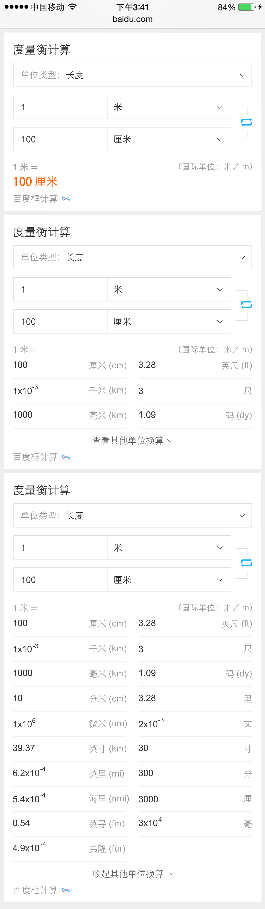

# 李阳阳

> 从2015-03-14到2015-03-18

## 法律法规推理

### 背景和目标
法律垂类通过法律法规和法律问答满足基本需求，法律法规方面，目前对部分查询以及推理需求仍未满足，因此上线法律法规问答推理&部分查询。

### 本周进度

    * delay下周二左右完成~

## 法律问答聚合

### 背景和目标

法律垂类通过法律法规和法律问答满足基本需求，目前线上关于法律方面的问答多来自普通用户，回答缺失权威性和时效性，因此引入法律网站问答资源，进行挖掘、聚合；同时借助基础需求满足进行铺量，成为后续引入服务的入口。

### 本周进度

    * xml已给出、下午5点半对一下

## 度量衡卡片的开发

### 背景和目标
度量衡卡片的query需求分类主要为三大类：问答精准类，如q=1米等于多少厘米;精准需求类，如q=公尺；泛需求类;q=度量衡/单位转换器

### 本周进度

    * 已测试通过，下午（3月18号）上线模板

### 效果截图

