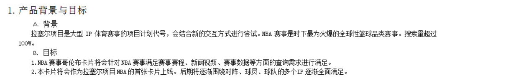

# 【阿拉丁产品方向周报】

> 从2016-03-21到2015-03-25

## 哥伦布

### 背景

哥伦布（Columbus）项目，是大搜索在2016年的重点创新大方向，主要在移动搜索上开展，目标是把“传统搜索”演进为“有灵魂的搜索”

- 基于对移动互联网内容的深度理解，展现有组织的、结构化的、有机联系的搜索结果
- 根据用户需求，来重新定义具体的各个搜索功能元素
- 功能元素布局合理、逻辑清晰、交互简捷
- 深度满足用户需求，实现沉浸式的搜索体验
- 通过对用户自身特点和用户所在场景的理解，引导和激发用户的“更广义”的需求，使得用户的“更广义”的需求，更多地得到“一站式”的、更快捷的满足.


目前哥伦布包括的项目有  

* 中途岛: 资讯(owner：吴海，FE：陈锐、王培、黎明),  
* 天宁岛: 旅游、poi出行(owner：谭待，FE：泉有、小武),
* 民生: 天气、万年历、车主服务(owner：永志，FE：朱雷、玲娟),
* 娱乐: 人物明星、影视视频、音乐(owner：李萌，FE：浪波、佳隆、李晓),
* 招聘: FE: 斐凡、玲玲
* 学术: FE: 郭勇

## 其他垂类

* 体育、游戏、汽车、房产、医疗、母婴、政务、自有产品(吴忧、李晓、阳阳、健驰）

## 哥伦布-中途岛

### 背景和目标
哥伦布（Columbus）项目，是大搜索在2016年的重点创新大方向。中途岛作为哥伦布的一级垂类，针对新闻资讯领域，致力给用户提供更好的搜索体验。

### 本周进度

#### 体验相关

- BUG修复：QA新一轮回归，可修复BUG待审中（@黎明）

#### 广告相关

- feed页接入广告（@陈锐）

    ```
    - 周一（03/21）前端上线
    - 周三（03/23）上线流量
    - 周五（03/25）优化一版（当前资源方名字为域名是替换"热点推荐"）上线
    ```

- 详情页接入广告

    ```
    - 待后端加上分资源方展示的策略后上线
    - 预计上线时间为下周一（03/28）   
    ```

#### 视频相关

- 播放器：已经输出初版组件，已经输出初版组件，有一些bug待修复（@根磊@清乾）

- 视频feed页：开发中（@根磊）

#### 评论系统相关

* 待定（@陈锐）

#### 订阅功能相关
- 订阅页面（@王培）

    ```
    - UE图已确认
    - 前端页面开发已经完成（日志问题沟通中）
    - 后端异步接口RD开发中
    - 下周一（03/28）与RD联调，周二（03/29)提测
    ```

- 订阅入口
  
    ```
    - 结果页搜索query直接跳转『我的订阅』页面（RD开发中）
    - feed跳转『我的订阅』页面（@陈锐）
    ```
#### MIB外部接入试点

- 线下调试环境：已经提供给站长
- MIB页模板：本周三（3/21）提供给站长
- MIB页统计：建议站长统一使用百度统计，还在与站长沟通

#### MIB框架相关：

- 测速：开发中（@王培@清乾）
- 迁移/测速/日志/广告/视频/平台：TODO


## 哥伦布-民生类-摇号(无更新)

### 背景

摇号这部分用户画像清晰，这部分用户主要为有买车打算但当前无车（或无购买本地车牌资格）的用户，因为摇车中签比例日渐走低，这部分用户数量可观且持续变多，目前及未来对各类新车的需求庞大，有激发的潜力，同时对政策车（如新能源车）有较强的需求。

在用户搜索摇号后，且主需求满足很好，我们将针对这部分用户推荐用户新车（尤其是不摇号车）等汽车信息，以及推荐用户新车试驾等服务内容。

### 进度

已上线小流量, sid=103868，影响面3w。

### 示例query

[杭州摇号](https://m.baidu.com/s?from=844b&vit=fps&word=%E6%9D%AD%E5%B7%9E%E6%91%87%E5%8F%B7&sid=103868)

### 效果图


## 哥伦布-民生类-天气（马文号项目）

### 背景

哥伦布项目的探索先驱，在满足用户对天气情况的搜索主需求之后前置其他与天气相关的需求，如饮食、娱乐、运动等。

### 完成情况

目前线上有50+城市全流量，100+城市小流量中，影响面合计1100w。

### 本周更新

* <span class="style:color:red;">评审了天气搜索结果页自然结果改造需求，3.30开始开发</span>

#### 示例query

[北京天气](https://m.baidu.com/from=844b/s?word=%E5%8C%97%E4%BA%AC%E5%A4%A9%E6%B0%94)


### 效果图


## 哥伦布-民生类-万年历（无更新）

### 背景

* 在万年历和一些日期搜索的query下进行需求激发，在满足用户对日期信息获取的主需求下，将当下的热点新闻、热卖商品推荐给用户，激发用户与日期相关的潜在需求。

* 目前仍在小流量实验中，预计3.28(下周一)能出实验结论

## 哥伦布-民生类-pc违章

### 背景

pc违章项目资源方和后端接口有变更，前端需要做接口迁移，同时还有产品形态的调整，把查询结果页面放到车辆列表下面。

### 完成情况

3.24模板已上线，线上暂无效果

## 哥伦布-民生类-wise快递v2

### 背景

对寻址类相关的query推出sigma大卡，优化线上已有大卡的样式。整合自然结果，满足用户的主需求，激发用户潜在需求

### 项目进度

模板开发中，预计3.28联调后端数据，3.30提测，清明节前上线。


## 哥伦布-民生-快递v1（无更新）

### 背景

* 主要针对海外购和寄送东西的用户 ，搜索快递单号或者快递公司时候除了常规的快递跟踪信息之外，新增快递助手、手机号码跟踪快递、以及免邮好物的推荐。满足更深需求。

* 实验结论预计3.28（下周一给出）

## 哥伦布-民生-星座运势二期

### 背景

用户搜索星座运势卡片时，需求较为明确，更加关注运势本身的需求。期望对卡片升级以进一步提高星座类需求的流量激发、体验提升、以及进一步的搜索动机激活。在上一版迭代的小流量实验中，实验结论为负收益，主要表现为点击率下降27%左右，换query比例增加0.21%。正向收益为：页面停留时间增加13s。分析原因后发现，运势卡片头部所占空间太大，卡片主需求满足不好，估对运势卡片进行修改迭代。

### 完成情况

3.25rd给出环境，预计3.25提测，3.29上线

### 后续计划

后续会与资源方谈判后会新增星座运势更多信息的情景页

## 哥伦布-民生-限行二期

ue终稿预计今天给出。下周一介入限行二期开发。

## 哥伦布-民生-解梦

已评审，具体排期未定

## 哥伦布-民生-起名

已评审，具体排期未定

## 哥伦布-娱乐类-音乐

### 背景

2号项目的意义是在满足用户主需求的情况下,激发用户的额外需求.
在满足用户单曲精确查找的需求基础上，充分利用搜索结果的后面点击率较少的区域，激发用户在音乐上的需求。  
Query示例：小幸运（只有一位歌手唱过）  
依赖张靓颖（精准明确歌手与歌曲）  
影响面：首先针对可以在线播放的百度音乐资源的，排在首位的资源。  
初步按照圈定歌曲的方式，小流量测试10w/day  
全量约25w/day  

### 最新进展

* <span style="color:red;">开发完成50%;目前hold</span>

### 效果图


## 哥伦布-音悦台v榜中间页

### 背景

* 方便用户查看打榜歌曲
* 效果图


### 最新进展

* <span style="color:red;">pc wise 都已经开始小流量. 数据还没出来</span>


## 哥伦布-短漫范需求

### 背景

* 为积极探索沉浸式阅读体验，打造创新型媒体时长，同时提升搜索的对外分发能力和流量的危机抵御能力，哥伦布项目应运而生。
* 其中，娱乐漫画领域的相关需求，因漫画本身定期更新，具有一定的时间周期性，现聚焦于漫画更新的中间空档期，以搜索结果页—漫画情景页—漫画内容页，三级跳转的形式，希望为用户提供较为全面的周边信息聚合。
* 展现形式


* 预计收益  pv 2w

### 最新进展

* <span style="color:red;">无进展</span>

## 哥伦布-人物通用框架实验

### 背景

* 哥伦布要求对整体生态有更强把控力，不仅局限于阿拉丁和sigma的内容增加，而是从用户需求出发整体考虑搜索结果的组织形式。
* 娱乐人物相关需求主要由阿拉丁和八卦自然结果满足
* 在明星query下增加八卦、图片、作品导流入口
* 将八卦类自然结果纳入到“明星八卦中心”里，搜索结果页结构改为阿拉丁+重点需求入口

### 样式图


### 最新进展

* 开发中,预计还有4天工作量. 


## 哥伦布-糯米所有卡片sdk调起开发

### 最新进展

3月23日还在对接搜索结果页的跳转数据。因糯米数据还没有完全ok，已经反馈给pm王玥，同意等待糯米数据ok后继续。。

## 哥伦布-糯米所结构化开发

### 最新进展

24号rd提供了wise端的联调环境，只有商户的数据Ok,只联调了一个wise的商户模板，其他三个模板的联调25号进行。

## 哥伦布-糯米唯一答案样式升级

### 最新进展

排期3月25号下午3个小时，下周一提测

## 天宁岛 - 旅游城市二期优化

### 背景

当前的旅游类搜索结果页包含卡片较多，尤其是同质内容卡片使得页面结构凌乱。以景区和典型旅游城市作为试水Query，依托于场景化卡片优化搜索结果页整体效果，优化内容包括：增加特价线路子卡、百度图片子卡、相关地点推荐子卡、相关咨询子卡，同时尝试兼容广告的浅色大卡样式和自然结果融合的样式。

### 完成情况

针对线上模板(`tinian_trav`)进行优化，预计03-25测试并上线，优化列表如：

* 去掉百科下面的tip，文字改成3行截断
* 增加半卡时收起按钮功能 - 半卡展开后变成收起按钮，点击收起时会定位到卡片刚显示收起按钮的位置（同线上场景化一致）
* 外部站点增加icon. 目前先暂时过渡版本，需要下次再优化(目前在各屏上兼容不太好，居中兼容好但icon不对齐了）
* 情景页 游记改版
* 酒店住宿优化跳转链接

召回：[北京](https://m.baidu.com/s?word=北京&sid=104214)


### 后续计划

使用哥伦布机制开发天宁岛旅游城市2.0版本，目前确认稿还没有完成

### 试验方案

实验组一组：（SID：104214）,根据Query确定默认展开半卡或全卡

对照组两组：1.（SID：104215）线上城市场景化半卡样式；2.（SID：104216）纯白卡样式；

小流量PV预计16W.

### 最终效果图


* 状态1：全展开灰卡 - 默认


* 状态2：半展开灰卡


## 天宁岛 - 景点二期

只是初步评审，无更新

## 天宁岛 - 餐饮二期

> pm: 正波

只是初步评审，无更新

## 天宁岛 - 周边游，周末游，无更新

只是初步评审，无更新

## 哥伦布-招聘 

### 进展情况

* zhaopin_society  开发完毕，qa测试中

* 测试地址： http://cp01-aladdin-product-06.epc.baidu.com:8003/s?word=%E9%98%BF%E9%87%8C%E5%B7%B4%E5%B7%B4%E6%8B%9B%E8%81%98&sa=tb&ts=3766108&t_kt=0&ie=utf-8&rsv_t=44cfs%252BX5GoVJGQOsNibBL5%252B2%252BQkURAZs5eAXr01jZfbSY6bRz2lf&rsv_pq=14195977660285842684&ss=100&t_it=1&rsv_sug4=45301&inputT=2666&oq=%E5%AF%8C%E5%A3%AB%E5%BA%B7%E6%8B%9B%E8%81%98


#########################################
# 非哥伦布上线

## 整体结果页loading效果

### 背景

sigma会在结果返回后去修改头部搜索框皮肤，会造成头部明显的跳动，正常结果也会出现下面空白情况，为了优化体验，增加重新搜索的loading效果

### 完成情况

3月14号上线小流量实验

实验地址：http://m.baidu.com/s?word=%E4%B9%8C%E9%95%87&sid=104007

实验组：104007 流量3%

对照组：104008 流量3%

### 本周进展

小流量实验结论已产出，基本持平，等待UBS同事的评估邮件

## 阿拉丁协同项目

### 背景

缩减阿拉丁样式，使结果页10条样式保持风格一致

### 进展

* 增加一种带子链的样式，29号上线

* 弱化流程已经敲定，暂时由我这边和pm接口，完成平稳退化，后续放开权限给pm同学

* 平台配置和ODP选模板机制已经上线

* 本周统一跟pm同学培训退化流程

## 阿拉丁模板性能优化

### 背景

缩减阿拉丁展现的不可见图片，提升页面展现速度

### 进展

* 文档地址：http://sfe.baidu.com/#/阿拉丁/无线网页搜索/模板性能优化/图片懒加载方案

* 已推送各个负责的fe操作

## wise旅游门票

### * 背景与目标

- 之前的旅游门票模板,更换糯米数据。

### * 完成情况

- 3-21全量上线,PV3W.

## 第四期度秘适配

### 进展情况

 * zx_wenda （线上无此模板，同时数据也不召回板）
 * wz_lvyoudetai（线上无此模板，同时数据也不召回板）
 * moviesongs （暂不做适配）
 * wise_dish_menu  （适配完毕，待测试及自测）
 * generalshopping2（适配完毕，待测试及自测）
 * wise_car_comment（效果确认）

## wise招聘精需求 异步跳转链接修改 

### 进展情况
* 问题：异步跳转链接由原来跳第三方，修改为跳百度招聘中间页
* wz_zhaopinexactnew (周四上线 2016.3.24)

## 按律法规推理

### 背景

法律垂类通过法律法规和法律问答满足基本需求，法律法规方面，目前对部分查询以及推理需求仍未满足，因此上线法律法规问答推理&部分查询。

### 完成情况

基本完成~后来改了一版样式上，需要处理下现在的样式和逻辑~大概今天可以搞好~预计今天或者下周一提ubs评估

### 最终效果图


<br/>


## 按律问答聚合模板

### 背景

法律垂类通过法律法规和法律问答满足基本需求，目前线上关于法律方面的问答多来自普通用户，回答缺失权威性和时效性，因此引入法律网站问答资源，进行挖掘、聚合；同时借助基础需求满足进行铺量，成为后续引入服务的入口。

### 完成情况

总的进度是还没开始，上周给了一版xml,由于线上有问答聚合的类似卡片，想在哪一套模板上继续扩展，需要重新出xml，醉醉的

## 拉塞尔nba的模板

### 背景(上图)



### 完成情况

xml给到了pm，已让资源方准备数据的阶段，后续问答聚合和nba的卡片pk下优先级看看怎么搞着~

## 手表数据处理

新增三个类目的数据映射，新闻聚合类、出行规划类、公交线路类，基本完成，后续的小问题，慢慢跟进

## dumi这边的数据映射

weibo
wz_micro_video
muying_opinion_general
experience
lvyouraiders
wz_xunzhimore

这6个模板的dumi数据映射~已完成，但是我这边还没有部署到平台上给pm评估效果~一会就部署上去~

## xml转macpack的模板处理~

tiebaxml模板的数据处理，24号已处理上线

## pc端歌词反查

### 背景

* 用户搜索歌词,可以直接定位到该歌曲的歌词,并且可以播放音乐.

### 最新进展

* <span style="color:red;">无更新</span>