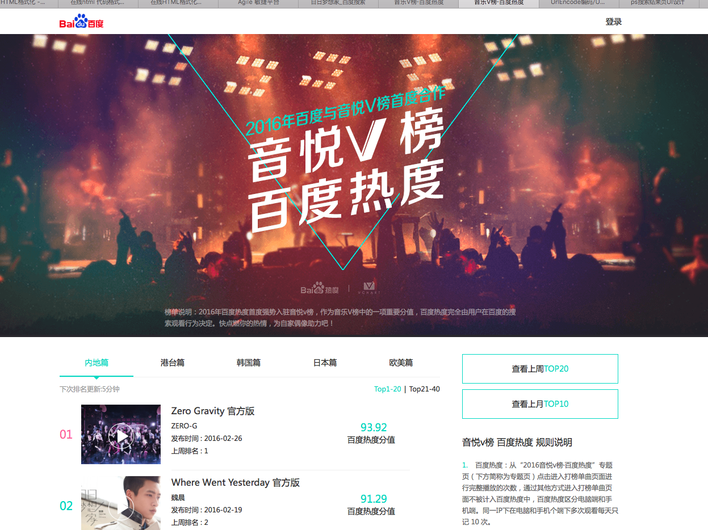

# 李佳隆

> 从2016-03-18到2016-3-25

##	2号项目-音乐

### 背景

2号项目的意义是在满足用户主需求的情况下,激发用户的额外需求.
在满足用户单曲精确查找的需求基础上，充分利用搜索结果的后面点击率较少的区域，激发用户在音乐上的需求。  
Query示例：小幸运（只有一位歌手唱过）  
依赖张靓颖（精准明确歌手与歌曲）  
影响面：首先针对可以在线播放的百度音乐资源的，排在首位的资源。  
初步按照圈定歌曲的方式，小流量测试10w/day  
全量约25w/day  

### 最新进展

* 开发完成50%;目前hold

### 效果图

## pc端歌词反查

### 背景

* 用户搜索歌词,可以直接定位到该歌曲的歌词,并且可以播放音乐.

### 最新进展

* 无更新

## 音悦台v榜,pc中间页

### 背景

* 方便用户查看打榜歌曲
* 效果图

### 最新进展

* pc wise 都已经开始小流量. 数据还没出来

## 哥伦布-短漫范需求

### 背景

* 为积极探索沉浸式阅读体验，打造创新型媒体时长，同时提升搜索的对外分发能力和流量的危机抵御能力，哥伦布项目应运而生。
* 其中，娱乐漫画领域的相关需求，因漫画本身定期更新，具有一定的时间周期性，现聚焦于漫画更新的中间空档期，以搜索结果页—漫画情景页—漫画内容页，三级跳转的形式，希望为用户提供较为全面的周边信息聚合。
* 展现形式

* 预计收益  pv 2w

### 最新进展

* 无进展

## 哥伦布-人物通用框架实验

### 背景

* 哥伦布要求对整体生态有更强把控力，不仅局限于阿拉丁和sigma的内容增加，而是从用户需求出发整体考虑搜索结果的组织形式。
* 娱乐人物相关需求主要由阿拉丁和八卦自然结果满足
* 在明星query下增加八卦、图片、作品导流入口
* 将八卦类自然结果纳入到“明星八卦中心”里，搜索结果页结构改为阿拉丁+重点需求入口

### 样式图

### 最新进展

* 开发中,下周二上线

## 下周计划

* 跟进人物哥伦布
* 跟进音乐二号项目的迭代
