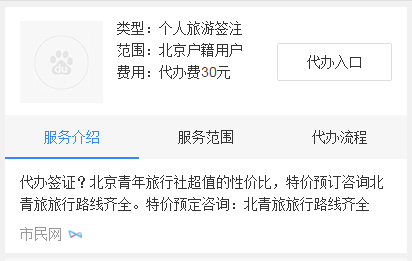

# 常健驰

> 从2016-03-21到2016-03-25

## 图片阿拉丁沉浸式体验项目

### 背景与目标

在用户需求明确为图片时，对该情景下的图片样式进行优化，采用sigma+瀑布流形式，提升用户体验。

### 收益

影响面：PV:160w,小流量实验10%，16w

### 完成情况

新增模板，模板`3月24日`已上线，暂时看不到效果。预览：[美女](https://wwwhttps.baidu.com/s?dev_workspace=platform&dev_tpl=image_waterfall&dev_path=searchaladdin&dev_tpltype=default&tn=iphone&sid=99999&dev_online=0&dev_module=aladdin-wise&dev_file=default.xml&dev_fileformat=xml&dev_pos=asResult&wd=%E7%BE%8E%E5%A5%B3&word=%E7%BE%8E%E5%A5%B3)

### 效果截图

## 阿拉丁客服电话

### 背景与目标

用户使用百度搜索客服电话，即搜即所得，使用户方便获取到企业电话服务，并保证电话准确性，解决用户遇到的问题；
整合阿拉丁客服电话数据：使数据完整清晰可方便维护；
阿拉丁样式优化：提升体验；

### 完成情况

新增模板，模板`3月24日`提测。预览：[招商银行客服](http://cp01-ala-fe-5.epc.baidu.com:8003/s?word=%E6%8B%9B%E5%95%86%E9%93%B6%E8%A1%8C%E5%AE%A2%E6%9C%8D&sa=thr_2&ts=4603607&t_kt=0&ie=utf-8&rsv_t=9087JhTxrVWis61Dh3eHh4%252BBLPNG6uQk29dTeCptlxI9aJgj3qoJ&rsv_pq=16313390155767265035&ss=101&rsv_sug4=2615&inputT=1392&oq=1&sid=103288)

### 效果截图

## wise政务_服务卡片

### 背景与目标

政务项目目前同政府合作接入进度缓慢，因此寻找第三方商业资源接入其服务，以先覆盖服务入口为目标。第一步先采用H5页面跳转的方式进行接入，因此需要考虑一套可适用于多服务、多地区、多资源方来覆盖的通用模板，以保证服务全面铺量。

### 完成情况

新增模板，模板已测试完成。预览：[政务](https://wwwhttps.baidu.com/s?dev_workspace=platform&dev_tpl=zhengwu_fuwu&dev_path=searchaladdin&dev_tpltype=default&tn=iphone&sid=99999&dev_online=0&dev_module=aladdin-wise&dev_file=default.xml&dev_fileformat=xml&dev_pos=asResult&wd=%E6%94%BF%E5%8A%A1&word=%E6%94%BF%E5%8A%A1)

### 效果截图

## 影视宣发打卡

### 背景与目标

为了能够充分利用百度搜索流量入口地位，构建影视宣发平台，与电视台、制作方、视频站点合作推出影视宣发大卡。首先尝试在爱奇艺独播热剧《太阳的后裔》上开展。

### 收益

影响面：70w/day

### 完成情况

新增模板，环境昨天刚刚搭好，25号下午可以搭出整体框架
