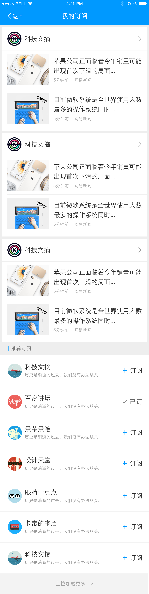
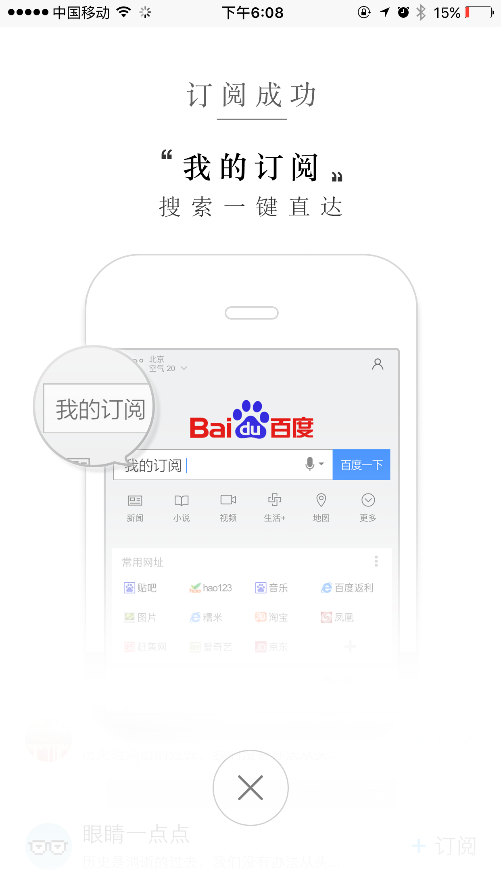

# 【阿拉丁产品方向周报】

> 从2016-03-28到2015-04-01

## 哥伦布

### 背景

哥伦布（Columbus）项目，是大搜索在2016年的重点创新大方向，主要在移动搜索上开展，目标是把“传统搜索”演进为“有灵魂的搜索”

- 基于对移动互联网内容的深度理解，展现有组织的、结构化的、有机联系的搜索结果
- 根据用户需求，来重新定义具体的各个搜索功能元素
- 功能元素布局合理、逻辑清晰、交互简捷
- 深度满足用户需求，实现沉浸式的搜索体验
- 通过对用户自身特点和用户所在场景的理解，引导和激发用户的“更广义”的需求，使得用户的“更广义”的需求，更多地得到“一站式”的、更快捷的满足.


目前哥伦布包括的项目有  

* 中途岛: 资讯(owner：吴海，FE：陈锐、王培、黎明),  
* 天宁岛: 旅游、poi出行(owner：谭待，FE：泉有、小武),
* 民生: 天气、万年历、车主服务(owner：永志，FE：朱雷、玲娟),
* 娱乐: 人物明星、影视视频、音乐(owner：李萌，FE：浪波、佳隆、李晓、吴丽黎),
* 招聘: FE: 斐凡、玲玲
* 学术: FE: 郭勇

## 其他垂类

* 体育、游戏、汽车、房产、医疗、母婴、政务、自有产品(吴忧、李晓、阳阳、健驰）


## 哥伦布-中途岛

### 背景和目标
哥伦布（Columbus）项目，是大搜索在2016年的重点创新大方向。中途岛作为哥伦布的一级垂类，针对新闻资讯领域，致力给用户提供更好的搜索体验。

### 本周进度


#### 整体进度
* 本周五（04-01）上线全流量
    
#### 广告相关 （@黎明）

* 增加展现策略和小流量 今天上线
* feed页接入凤巢：周四（03-31）添加点击日志和展现日志（@陈锐）
* 详情页接入网盟：周四（03-31）已上线（@黎明）

#### detail增加统计参数  （@黎明）

* 将feed的数据传到detail页的请求接口中

#### feed增加新的手百下载推广  （@黎明）

效果


#### 体验相关

- BUG修复：QA新一轮回归，可修复BUG待审中（@黎明）
    - feed登录完后跳转百度首页
    - mib登录跳首页 加白名单
    - mib域下的登录信息接口出错

#### 视频相关
    * 视频feed页：周三（03-30）已提测（@根磊）

#### 评论系统相关
    * 待定（@陈锐）

#### 订阅功能相关
    * 订阅页面：周五（04-01）全量上线（@王培）
    * 订阅feed入口：开发完成，周五（04-01）上线（@陈锐）

#### MIB外部接入试点
    * 统计插件：已输出方案，并完成开发，下周上线（@陈锐）
    * 百度统计插件：完成开发，下周上线（@陈锐）
    * 提供站长的文档：梳理中（@陈锐）

#### MIB框架相关：
    * 测速：开发中（@王培@清乾）
    * 迁移/测速/日志/广告/视频/平台：TODO
    
### 订阅频道页迁移

#### 背景与目标

    为梳理、明确订阅功能的产品逻辑，提供短线调整方案，营造稳定入口，提升交互用户体验。主要优化功能包括通过指定Q=“我的订阅“作为固定入口导入订阅页面，以及订阅页面的产品逻辑进行梳理。
    
#### 完成情况

- PV：暂无

- 状态：

    - 前端出版已上线（03-31），线上登录测试中，页面入口还未上线
    
    - bug修复、样式及功能升级，周五（04-01）全量上线
    
#### 效果图

<table algin="center" >
<tr>
<td style="vertical-align:top"></td>
<td style="vertical-align:top"></td>
<td style="vertical-align:top"></td>
<td style="vertical-align:top"></td>
</tr>
</table>

### 运营--愚人节特效项目

#### 背景与目标

```
愚人节是一个全民恶搞的节日，在这一天用户希望有一些意外之惊，因此希望通过红包雨+愚你同乐的特效形式，和用户形成互动，并传达愚人节以愚为乐的态度。
```

#### 完成情况

- PV：暂无

- 状态

    - 模板已上线（2016-04-01）
    
#### 效果图

- <table algin="center">
<tr>
<td></td>
<td></td>
</tr>
</table>

#### 下周计划

- 中途岛-订阅频道页迁移

- 运营愚人节项目


## 天宁岛  （@耀武 @泉友）

### 天宁岛 - 旅游城市2.0过渡版本 

#### 背景

由于现在哥伦布机制时间，本周的迭代是过渡版本，主要添加一个新的问答子卡和情景页，修改收起状态的页面向2.0靠拢。

#### 收益

属于小流量（抽样ID为104212-104214），抽60%流量，全量后日均PV48W

> 以下分析基于3月19日~3月21日期间的小流量数据，下面数据描述中使用的对照组为线上纯白样式（无城市场景化卡片）

整体效果（不区分强弱旅游需求）：总的来说用户体验是略正的，比之前一版有了很大的提升。

* 点击率：+9.33%（113.34% → 122.67%）
* 有点击行为比例：+0.02%（54.88% → 54.90%）
* 有跳转点击比例：-0.03%（49.72 → 49.69%）
* 换query比例：-0.98%（22.08% → 21.10%）
* 哥伦布长点击率*：-6.16%（55.70% → 49.55%）
* 导流率*：+17.79%（4.16% → 21.95%）
* 总跳转点击率*：-9.30%（79.48% → 70.19%）
* 卡片跳转点击占比*：64.04%

#### 完成情况

针对线上模板(`tinian_trav`)进行优化，预计04-01测试并上线，优化列表如：

- 扩展到108个城市,全量后预计80W PV.
* 玩法情景页拆分为=>路线+游记2个情景页
* 添加问答子卡、问答情景页
* 修改收起页面

召回：[北京](http://cp01-ps-fe-2.epc.baidu.com:8003/s?word=%E5%8C%97%E4%BA%AC)


#### 后续计划

使用哥伦布机制开发天宁岛旅游城市2.0版本，目前确认稿还没有完成

#### 最终效果图

* 添加的问答子卡

<a href="http://gitlab.baidu.com/psfe/ala-weeklyreport/uploads/a320fb4850fc19c8c1fde38b9fe1e4ea/image.png">
    
</a>

* 添加的问答情景页

<a href="http://gitlab.baidu.com/psfe/ala-weeklyreport/uploads/382a9a8b30268d4e6b63150827e97e65/image.png">
    
</a>


* 修改收起状态

<a href="http://gitlab.baidu.com/psfe/ala-weeklyreport/uploads/4ef721ed80da1ee68a6e442a79551f3d/image.png">
    
</a>

### 天宁岛-餐饮(二期)

#### *背景与目标

- 整合地图、糯米、美味不用等的poi基础数据和团购、买单、排号服务，打造闭环就餐体验；
- 利用sigma和天使之翼的产品形态，提升交互体验；
- 并在美食泛搜索下尝试主题推荐；

#### * 完成情况
<p style="color:red">已由qingqian负责</p>

### 周边游

#### * 背景与目标

- 由于用户对周边出行呈迅猛增长的势头,且现有市场各竞品并没有明显优势来满足对于用户所需信息。

#### * 完成情况
- 02-24第一次评审,细节PM与UE商定.
<p style="color:red">暂无更新</p>

### 天宁岛-景点（二期)

#### * 背景与目标

- 通过对现有子卡的设计优化,结构重组和增加新子卡,提升用户体验,适配进一步扩招.

#### * 完成情况
- 02-24第一次评审
- 03-08已给PM提供schema，PM与资源方提数据.
<p style="color:red">暂无更新</p>

### 场景化景点（wise_scene_trav）

#### * 背景与目标
通过时间、地点场景信息定位有出行需求的用户，展现场景化出行卡片，围绕出行需求，集合信息、交通、消费等功能，精准满足其出行需求。

#### * 完成情况
- 11月26日上线。
- 约200个景点,pv约3.5w/天；策略触发后，场景化卡片覆盖的pv约1w/天。
- Query=香山(天安门，故宫等)，地点策略+时间策略。
- [点这里~点这里~](https://www.baidu.com/from=844b/s?word=%E9%A6%99%E5%B1%B1&ts=0015366&t_kt=0&rsv_iqid=5504612005285293655&rsv_t=f77fpuYM6PishRuwv6A9PSlfWEsQ%252FkBKd%252FtsgBcmqwBGyhR9vBwtIJNd3A&sa=ib&ms=1&rsv_sug4=3888&ss=101&inputT=2065&sid=102251)
<p style="color:red">暂无更新</p>


##3 场景化餐饮（wise_scene_food）

#### * 背景与目标
各种餐饮名店信息聚合，吃货的福利。为用户提供更便捷的餐饮搜索信息，给部分产品线导流。

#### * 完成情况
- 12月1日已上线。
- 实验圈定query总 pv约3.5w/天；根据策略，卡片会在午饭和晚饭时段触发；触发后，卡片覆盖的pv约1w/天
- Query=全聚德(麻辣诱惑，海底捞等)。
- [点这里~点这里~](http://cq01-aladdin-product-05.epc.baidu.com:8003/s?word=%E6%B5%B7%E5%BA%95%E6%8D%9E&ts=2862183&t_kt=0&sa=ib&rsv_sug4=5921&inputT=4644&ss=100&cip=47.153.191.255&tn=iphone&sid=102122)
<p style="color:red">暂无更新</p>

### 场景化城市（wise_scene_city）

#### * 背景与目标
不同地方的用户，在搜索相同的地域Query时，需求不同；根据用户所在地，用户搜索时间等条件，判断用户搜索的真实需求，整合现有资源，为用户提供高颜值高精准度的搜索结果展现。

###3 * 完成情况

- Query=广州(上海，北京等)。
- [点这里~点这里~](http://cq01-aladdin-product-05.epc.baidu.com:8003/s?word=%E8%A5%BF%E5%AE%89&sa=tb&ts=7886850&t_kt=0&rsv_t=d93dQMJ8oDkEP%252FAP42XH91G2DzxGN7euopVrqPYifT3ciDlwi6TI&rsv_pq=1595416660186666569&ss=101&t_it=1&rsv_sug4=3603&inputT=1781&oq=%E9%A2%90%E5%92%8C%E5%9B%AD)

<p style="color:red">暂无更新</p>


## 民生类  （@朱雷 @玲娟）

### 哥伦布-民生-星座运势二期

### 背景

用户搜索星座运势卡片时，需求较为明确，更加关注运势本身的需求。期望对卡片升级以进一步提高星座类需求的流量激发、体验提升、以及进一步的搜索动机激活。在上一版迭代的小流量实验中，实验结论为负收益，主要表现为点击率下降27%左右，换query比例增加0.21%。正向收益为：页面停留时间增加13s。分析原因后发现，运势卡片头部所占空间太大，卡片主需求满足不好，估对运势卡片进行修改迭代。

### 进度

三单中，4.1模版上线。

### 后续计划

后续会与资源方谈判后会新增星座运势更多信息的情景页

### 效果图

* sigma卡： 
* sigma绑定的白卡：
* 线上星座大全白卡迁移栅格化： 

## 哥伦布-民生-限行二期

### 背景

* 一期收益负向，二期砍掉了一期“行车路线”、“在线打车”这两个点击率极低的需求，通过添加sigma“主卡部分的title”、“子卡部分的限行政策和限行新闻”刺激用户点击。同时针对登录用户导入车辆的违章信息，导流同时增强用户粘性。

#### 最新进度

* 3.31已提测，qa排期4.5开始测试，预计4.6上小流量

### 哥伦布-民生-解梦二期

#### 背景

* 一期负收益，二期缩扁了头图，新增了梦境的可点，进入情景页，展现给用户梦的详细含义。

#### 最新进度

排期未定

### 哥伦布-民生-起名

#### 背景

用户可根据输入的姓氏，性别，单双名字，出生日期等选项查询到来自资源方的姓名大全，通过情景页展现。同时激发用户“起名周边的买买买需求”、“星座和生肖相关的运势查看需求”。

#### 最新进度

schema已备好，节后4.5开发。

## 哥伦布-民生类-摇号

### 背景

摇号这部分用户画像清晰，这部分用户主要为有买车打算但当前无车（或无购买本地车牌资格）的用户，因为摇车中签比例日渐走低，这部分用户数量可观且持续变多，目前及未来对各类新车的需求庞大，有激发的潜力，同时对政策车（如新能源车）有较强的需求。

在用户搜索摇号后，且主需求满足很好，我们将针对这部分用户推荐用户新车（尤其是不摇号车）等汽车信息，以及推荐用户新车试驾等服务内容。

### 收益

影响pv：3w.

负收益：

- 有点击行为比例相对减少 9.11%，绝对减少 6.76%（74.22% --> 67.46%）。用户换query增加，同时没有title和官网显著标识，会降低有点
- 换query比例相对增加 41.39%，绝对增加 6.55%（15.82%-->22.37%）。一方面，卡片颜色比较浅，会降低对用户的吸引力；另一方面，没有title，官网标识不明显，大量用户换到摇号官网搜索
- 点击率相对增加 5.34%，绝对增加 8.03%（150.34% --> 158.38%）。主要是不同车型推荐增加
- 长点击率相对减少13.39%，绝对减少 8.41%（62.76% --> 54.36%）；长点击占比相对减少 1.80%，绝对减少1.36%（75.88% --> 74.51%）
- 卡片输入框点击 41.33%，查询点击 40.43%，进入官网点击 22.90%，左右滑动点击 11.45%，新能源汽车链接点击2.04%，修改政策点击1.50%，新能源汽车推荐第一条点击 1.31%，其余链接点击均低于1%，总计 6.92%

### 完成情况

新增模板，小流量上线，sid=103868，2.26上线，query:  [杭州摇号](https://m.baidu.com/s?from=844b&vit=fps&word=%E6%9D%AD%E5%B7%9E%E6%91%87%E5%8F%B7&sid=103868)


### 效果


### 后续计划

* 摇号二期已评审，预计4.12介入，工作量5天

## 哥伦布-民生类-天气

### 背景

哥伦布项目的探索先驱，在满足用户对天气情况的搜索主需求之后前置其他与天气相关的需求，如饮食、娱乐、运动等。

### 收益

影响pv:1100w。有点击行为比例：绝对增加0.87%，相对增加2.8%（31.09%--->31.96%）,整体点击率：绝对增加1.96%，相对增加5.25%（37.28%--->39.24%）,换query比例：绝对增加0.21%，相对增加28.84%（0.73%--->0.94%）

### 完成情况

目前线上有50+城市全流量，100+城市小流量中，影响面合计1100w。query: [北京天气](https://m.baidu.com/from=844b/s?word=%E5%8C%97%E4%BA%AC%E5%A4%A9%E6%B0%94)


### 效果


### 后续计划

* <span style="color: red;">评审了天气搜索结果页自然结果改造需求，4.1开始开发</span>

## 哥伦布-民生类-万年历

### 背景

在万年历和一些日期搜索的query下进行需求激发，在满足用户对日期信息获取的主需求下，将当下的热点新闻、热卖商品推荐给用户，激发用户与日期相关的潜在需求。

### 收益

影响pv:18w.实验的正式结论等待UBS发出，预计3.28日。

### 完成情况

新增模板，小流量上线，sid=104193,104194,3.18上线,query：万年历。[实验组一](https://m.baidu.com/ssid=794557616465334a756e65ae10/s?word=%E4%B8%87%E5%B9%B4%E5%8E%86&sid=104193)    [实验组二](https://m.baidu.com/ssid=794557616465334a756e65ae10/s?word=%E4%B8%87%E5%B9%B4%E5%8E%86&sid=104194)  

### 效果


### 后续计划

* <span style="color: red;">万年历三期方案已评审，预计4.8开始开发，工作量2天</span>

## 哥伦布-民生类-pc违章

### 背景

pc违章项目资源方和后端接口有变更，前端需要做接口迁移，同时还有产品形态的调整，把查询结果页面放到车辆列表下面。

### 收益

影响pv：17w.

### 完成情况

新增模板，在老模板的基础上迭代，全流量上线，query: [北京违章查询](https://www.baidu.com/s?ie=UTF-8&wd=%E5%8C%97%E4%BA%AC%E8%BF%9D%E7%AB%A0%E6%9F%A5%E8%AF%A2)

### 效果


## 哥伦布-民生类-wise快递v2

### 背景

对寻址类相关的query推出sigma大卡，优化线上已有大卡的样式。整合自然结果，满足用户的主需求，激发用户潜在需求。

### 项目进度

模板联调中，预计3.28联调后端数据，4.1提测

### 效果


## 哥伦布-娱乐类-音乐

###	2号项目-音乐

#### 背景

2号项目的意义是在满足用户主需求的情况下,激发用户的额外需求.
在满足用户单曲精确查找的需求基础上，充分利用搜索结果的后面点击率较少的区域，激发用户在音乐上的需求。  
Query示例：小幸运（只有一位歌手唱过）  
依赖张靓颖（精准明确歌手与歌曲）  
影响面：首先针对可以在线播放的百度音乐资源的，排在首位的资源。  
初步按照圈定歌曲的方式，小流量测试10w/day  
全量约25w/day  

#### 最新进展

* <span style="color:red;">开发完成,4月1日上线小流量</span>

#### 效果图


### 音悦台v榜,pc中间页

#### 背景

* 方便用户查看打榜歌曲

#### 效果图


#### 最新进展

* <span style="color:red;">pc wise 都已经开始小流量.各200万流量,抽30%.  目前数据还没出来</span>
* pc线上query: close  sid=19474     [传送门](http://hit.baidu.com/vchart?type=ustrends)
* wise线上query: 冒险时间 sid=104351 [传送门](https://m.baidu.com/s?word=冒险时间&ssid=0&from=0&pu=sz%40224_220%2Cta%40iphone___3_537&qid=14375009055327957314&rn=10&wpo=base&ts=0849727&sa=ib&sid= &isid=14375009055327957314)

### 哥伦布-人物通用框架实验

#### 背景

* 哥伦布要求对整体生态有更强把控力，不仅局限于阿拉丁和sigma的内容增加，而是从用户需求出发整体考虑搜索结果的组织形式。
* 娱乐人物相关需求主要由阿拉丁和八卦自然结果满足
* 在明星query下增加八卦、图片、作品导流入口
* 将八卦类自然结果纳入到“明星八卦中心”里，搜索结果页结构改为阿拉丁+重点需求入口

#### 样式图


#### 最新进展

* <span style="color:red;">3.29日小流量上线</span>
* 线上query 陈伟霆  sid=103289  [传送门](http://m.baidu.com/s?word=%E9%99%88%E4%BC%9F%E9%9C%86&sid=103289)

### 明星人物wise中间页开发

#### 最新进展

* 3月30日下午至3月31日调研实现登录方案
* 等待mrd和ue设计稿，排期待定

### 糯米卡片sdk调起开发

#### 最新进展

* 3月28号上线。由于糯米数据方没有准备好，3月25号才和石海杰联调完数据，导致上线延后。

### 糯米结构化开发

### 最新进展

* 联调修复Bug。
* 3月31号pc、wise的模板已经上线。

### 糯米唯一答案样式升级

#### 最新进展

* 3月25日已经开发完毕，等待与后端联调，因后端rd搬家耽搁了时间，4月1日进行联调开始联调，联调完毕并提测，pm计划4月6日上线。


### 图片阿拉丁沉浸式体验项目

#### 背景与目标

* 在用户需求明确为图片时，对该情景下的图片样式进行优化，采用sigma+瀑布流形式，提升用户体验。

#### 收益

* 影响面：PV:160w,小流量实验10%，16w

#### 完成情况

* 新增模板，模板`3月24日`已上线，小流量地址预览：[手机壁纸](https://m.baidu.com/s?word=%E6%89%8B%E6%9C%BA%E5%A3%81%E7%BA%B8&ts=1152353&t_kt=0&ie=utf-8&rsv_iqid=15181774178391790736&rsv_t=9d80Hm3U8SHap6VPDuL1MUvbnEntZ%252BeWxWRJBI41rLBWplr26KmG&sa=ihr_1&rsv_pq=15181774178391790736&rsv_sug4=1899&ss=001&sid=104408)

#### 效果截图


### 扫描二维码


### 阿拉丁客服电话

#### 背景与目标

用户使用百度搜索客服电话，即搜即所得，使用户方便获取到企业电话服务，并保证电话准确性，解决用户遇到的问题；
整合阿拉丁客服电话数据：使数据完整清晰可方便维护；
阿拉丁样式优化：提升体验；

#### 完成情况

新增模板，走三级单中。预览：[招商银行客服](http://cp01-ala-fe-5.epc.baidu.com:8003/s?word=%E6%8B%9B%E5%95%86%E6%9C%9F%E8%B4%A7%E5%AE%A2%E6%9C%8D&sa=thr_2&ts=4603607&t_kt=0&ie=utf-8&rsv_t=9087JhTxrVWis61Dh3eHh4%252BBLPNG6uQk29dTeCptlxI9aJgj3qoJ&rsv_pq=16313390155767265035&ss=101&rsv_sug4=2615&inputT=1392&oq=1&sid=103288)

#### 效果截图


#### 扫描二维码


### 影视宣发打卡

###3 背景与目标

为了能够充分利用百度搜索流量入口地位，构建影视宣发平台，与电视台、制作方、视频站点合作推出影视宣发大卡。首先尝试在爱奇艺独播热剧《太阳的后裔》上开展。

#### 收益

影响面：70w/day

#### 完成情况

新增模板，模板于3月31号上线，预览：[太阳的后裔](http://cp01-ala-fe-6.epc.baidu.com:8003/s?word=%E5%A4%AA%E9%98%B3%E7%9A%84%E5%90%8E%E8%A3%94&ts=1599207&t_kt=0&rsv_iqid=3292381481101539672&sa=ihr_1&rsv_sug4=1015&ss=001)

#### 效果截图


#### 扫描二维码


#### 后续排期

* wise政务卡模板开发

* 安瑞的体育模板开发

## 招聘  （@玲玲）

### 第四期度秘适配

###3 进展情况

 * 上周五（3.25）跟pm 效果确认的度秘模板，周一（3.28）上线
 * generalshopping2（已上线）
 * wise_car_comment（已上线）

### wise招聘弱需求 bug 修改

#### 进展情况

* 问题：query=快递员招聘，title的跳转链接，跳至中间页，有乱码问题
* sam_wz_zhaopinexactnew (今天上线)

### 招聘哥伦布卡片 

###3 背景
应2016年，搜索结果页改造，之后招聘阿拉丁的模板为哥伦布类型，目前百度招聘模块，项目拆分后的阿拉丁卡（哥伦布类型）的类别有： 公司型、职位型、寻址型、地区型、符合型、兼职型、其他。

#### 进展情况

* 现公司型 哥伦布卡开发完毕，周四（3.31）已上线，目前模板只做抽样小流量（sid=104482)
* 模板名：zhaopin_society  
* 线上测试地址：http://m.baidu.com/s?word=%E7%99%BE%E5%BA%A6%E6%8B%9B%E8%81%98&sid=104482

### 值周 

* 问题：编译、或构建时，平台时常出现问题，致上线受阻

### 下周计划

* 宠物bug 修复
* 招聘职位型 哥伦布卡 开发
* 图片懒加载 优化（11个模板）
* 原招聘弱需求的卡片，进行样式退化优化 （6个模板）排期4.15后开发


#########################################
# 非哥伦布上线

## wise sigma体验优化项目 （@浪波）

### 背景与目标

sigma展现明显有白屏，然后再出现模板;低端机器ipod、iphone5等，页面比较复杂是上下滑动卡顿

### 完成情况

* 1、分析页面卡顿原因，通过排查，发现去掉iscroll功能体验会好很多，并且手百上下滑动一次会触发resize30多次

* 2、解决方案未定，初步推手百优化，产品层面看看能否少用iscroll功能。

### 本周进展

* 上周五25号转全流量

* 28号出初步评估数据，产出以后横滑标准文档：http://sfe.baidu.com/#/阿拉丁/无线网页搜索/模板性能优化/图片横滑使用原生scroll组件——pmd%2Fscroll%2Fscroll

* 推广到各个产品先开发使用，并强调值周同学需检查这个功能点

* 03-29号产出评估报告，报告地址：http://dayu.baidu.com/dayu/eva/statement/getStatement/fid/56f4d12ca1979


## 哥伦布sigma机制重构及哥伦布1.0短线方案

### 背景与目标

线上sigma机制优化已接近尾声，但整体实现方案还是存在问题，固重构新的实现方案，老的机制保留

### 本周进度

1、本周产出哥伦布1.0短线方案，并于30号进行公司内部各个需求产品线培训和答疑

2、文档地址：http://sfe.baidu.com/#/阿拉丁/圣玛利亚平台


## 整体结果页loading效果

### 背景

sigma会在结果返回后去修改头部搜索框皮肤，会造成头部明显的跳动，正常结果也会出现下面空白情况，为了优化体验，增加重新搜索的loading效果

### 完成情况

3月14号上线小流量实验

实验地址：http://m.baidu.com/s?word=%E4%B9%8C%E9%95%87&sid=104007

实验组：104007 流量3%

对照组：104008 流量3%

### 本周进展

申请三级单转全，预计下周可以操作，目前就差关总审批通过

## 阿拉丁协同项目

### 背景

缩减阿拉丁样式，使结果页10条样式保持风格一致

### 进展

* 增加一种带子链的样式，29号已上线

* 弱化流程已经敲定，暂时由我这边和pm接口，完成平稳退化，后续放开权限给pm同学

* 平台配置和ODP选模板机制已经上线

* 进一步梳理mini、mcpack等数据形势的退化方案，模板支持mini和ae格式，4月1号模板上线支持

* 将本周要退化的schema提交给平台统一添加

## 阿拉丁模板性能优化

### 背景

缩减阿拉丁展现的不可见图片，提升页面展现速度

### 进展

* 文档地址：http://sfe.baidu.com/#/阿拉丁/无线网页搜索/模板性能优化/图片懒加载方案

* 已推送各个负责的fe操作，目前统计已有40个左右的模板做了升级，还有60%的模板未修改，正推各个负责人加速处理，若有排期困难，需要他们邮件告知

## url编码错误（含原始中文）统一修改

### 背景

* 在safari https 302跳转存在问题，需要url规范化

### 本周进展

* 小琴将模板对应的querylist提交给雨梅，让雨梅跑存在问题的模板list，目前还在进行中


## 上线时间持续跟进优化  （@齐健）

### 背景与目标

目前wise上线时间比较久，比PC慢了一倍多。需要持续跟进和优化上线时间，以减少上线人力成本和快速响应紧急需求。

### 进度

1、op人力问题，需要FE给上线过程中的机器数据    
2、原订三月底去掉高峰期上线封禁，OP有delay。具体时间节后给出

## 哥伦布2.0机制

### 背景

原有机制对2.0样式支持的不够好，一些需求支持不了。需要升级哥伦布机制

### 进度

1、长线方案把千岛湖、哥伦布垂类的机制合并在一起。    
    涉及FE的改动及排期：   
    a、平台升级支持  @小琴    
    b、修改www主模板支持模板渲染    @雪冉    
    c、修改阿拉丁统计，支持组、簇相关日志    @雪冉    
    d、修改阿拉丁基础库。支持组、簇的JS渲染。以及层级间的绑定。    @齐健    
    e、开发2.0样式中的组、簇模板。    @齐健    
    排期：除平台外  4月12日开发完，4月13联调，4月18提测，4月25上线。平台因高优支持上线优化，时间待定。    
2、短线方案暂时沿用之前的哥伦布1.0机制。在主模板内升级至2.0样式，对一些2.0的样式做trick升级。 - 周五上线    

## tc跳转相关

### 背景

目前模板中tc链接的生成比较混乱，许多项目有依赖，需要统一

### 进度

1、l和srd参数移至odp。需要odp插件支持，支持后部分写死l和srd参数的模板开始迁移。- odp高优支持哥伦布2.0，排期暂未给出    
2、线上有问题的链接整理 - 整理中，下周给出列表。


## 日志相关

### 背景

日志后续需要迁移到webb，短期内需要把现有日志迁移到webb格式，供ubs迁移。   
有很多需求需要在前端打展现日志，日志沟通。

### 进度

升级日志统计 - 周一已上线    
前端打展现日志的方案沟通

### 按律法规推理  （@阳阳）

#### 背景

法律垂类通过法律法规和法律问答满足基本需求，法律法规方面，目前对部分查询以及推理需求仍未满足，因此上线法律法规问答推理&部分查询。

#### 完成情况

已测试完成，三级单已过，下午4月1号上线，预计pv：2w

#### 最终效果图


<br/>


### 按律问答聚合模板

#### 背景

法律垂类通过法律法规和法律问答满足基本需求，目前线上关于法律方面的问答多来自普通用户，回答缺失权威性和时效性，因此引入法律网站问答资源，进行挖掘、聚合；同时借助基础需求满足进行铺量，成为后续引入服务的入口。

#### 完成情况

已完成~接下类给ubs评估~然后测试，预计下周三上线

#### 最终效果图


<br/>

<br/>

<br/>

<br/>

<br/>


### 拉塞尔nba的模板

#### 背景(上图)


#### 完成情况

已着手开始开发，还在继续

## wise模板开发平台化二期 （@小琴）

### 项目背景
wise阿拉丁模板开发未平台化，部署环境、调试代码成本比较高，而且目前参与wise阿拉丁模板开发的产品线有十几个，急需一个平台来管理开发人员及相关模板，以提高后续模板开发及人员管理成本。

### 目标
* 开发统一：所有产品线及所有端模板，开发统一，规范统一，流程统一
* 上线统一：统一所有搜索结果模板权限控制和上线控制
* 管理统一：所有产品线及所有端模板，统一平台管理、监控、验证等

### 整体计划
* 发单之前部署沙盒预览环境  1.20-1.25
* wise添加例行日志信息  1.25-2.1
* 支持哥伦布开发升级    2.2-3.15
    * 模板开发模块支持多根目录升级  2.22-3.1
    * 任务模块升级  3.2-3.3
    * pc&wise smarty编译脚本升级 3.4
    * 新增模板升级  3.7-3.8
        * 增加主模板类型 
    * 预览升级
        * 支持多模板编译    3.8
        * 子卡预览选项增加“选择子卡”和“选择主模板”  3.9-3.11
        * 预览数据在线merge 3.11-3.14
* 静态文件增加数据库管理    3.16-3.30
* 上线流程自动化管理 4月份

### 本周工作

* 整理平台使用说明文档，已完成
* 支持没有模块svn权限的同学发code review及提测模板
* wise base模板支持日志添加
* 继续收集平台二期需求
* 参加哥伦布2.0机制沟通

## 度秘
### 项目背景

wise结果同步度秘，度秘访问wise的json接口和度秘对大搜索阿拉丁截图通用展现方案已经完成，
下一步展开阿拉丁模板适配度秘信息模板的映射，以便获得最优展现。

### 目标

度秘为用户提供更优的数据资源，大大提高用户体验

### 整体计划及排期

* 一期适配（24个），现有信息模板已经支持的，预计12.7上线
* 二期适配（14个），需要多实体卡片上线后支持的（NA1.1和手百7.1），预计12.14上线
* 三期适配（15个+13个问题模板），多实体卡片升级和现有模板调整的（NA和手百的下一个版本，时间待定）
* <span style="color:green">四期适配（17个），多实体15个，单实体2个，预计3.15开发，3月底上线</span>

### 本周工作

* 四期模板已完成适配，共上线5个模板

## 手表适配
### 项目背景

华为于2015Q4在国内推出了一款基于安卓系统的智能手表 ，计划2016年Q1把手表上的语音服务替换成百度语音服务

### 目标

2016年1月底交付首个版本给华为；体验上至少超越竞品

### 整体计划及排期

* －12.17：确定详细技术方案并产出技术文档（已完成）
* －12.18：跑通语音搜索的demo（已完成）
* －12.25：完成第一批垂类（6个）UI设计，进行设计评审（已完成）；
* －12.31：跑通语音指令的demo（已完成）；
* －01.08：完成第一批垂类开发与联调，完成语音指令的QU开发（已完成）；
* －02.01：完成第二批垂类（6个）开发与联调（已完成）；
* －02.04：完成语音识别对方言的优化（已完成）；
* －完成所有搜索、指令的开发与联调（有部分新需求，排期下周重新梳理）；
* －完成测试与问题修复，交付华为（有部分新需求，排期下周重新梳理）；

### 本周工作

* 无

## xml转mcpack
### 项目背景
xml数据大小比mcpack大，需要和pc端打平

### 问题
* 单个result转mcpack是数组形式，xml是object形式，7个模板需兼容，预计3.15之前上线
* mini属性字段现状是_xxx，转mcpack后变成@xxx，7个模板需兼容，预计3.15之前上线
* num_baidu字段diff存在17个模板需兼容处理，预计3.15之前上线
* kv资源转mcpack的属性字段会跟pc一样，变成二维数组，涉及模板约200多个，需分批迁移

### 进度

* 无

## odp后端数据gbk转utf8及字段统一
### 项目背景
后端数据编码未统一，对模板选择方式的升级带来很大的不便

### 目标
统一后端数据编码为utf8

### 方案
* us或者odp对编码统一转换成utf8
* 上线方案：odp给个标识字段，模板做兼容判断，模板先上线

### 排期
* 梳理预处理和模板所有带编码转换的阿拉丁列表（1.8）@小琴