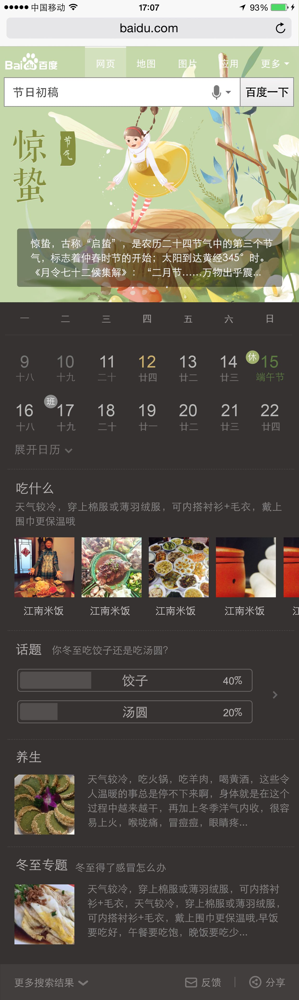

# 【阿拉丁运营方向周报】

> 从2016-03-28到2016-04-01

## 愚人节特效项目

### 背景与目标

```
愚人节是一个全民恶搞的节日，在这一天用户希望有一些意外之惊，因此希望通过红包雨+愚你同乐的特效形式，和用户形成互动，并传达愚人节以愚为乐的态度。
```

#### 完成情况

- PV：暂无

- 状态

    - 模板已上线（2016-04-01）
    
#### 效果图

- <table algin="center">
<tr>
<td></td>
<td></td>
</tr>
</table>


## 五一节运营项目

### 背景与目标

```
通过往年用户在五一期间的需求分析，在结果页策划了与劳动节定位相关的休闲小游戏，激发用户互动，增加用户在搜索结果页的停留时长，同时促进检索PV上升。
```

### 完成情况

- 状态
    - MRD 已输出，UE 4/13输出WISE图，4/15输出PC图
    - FE 4/13接入开发
    
### 效果图

- 暂无


## 运营类通用事件模板升级(无更新)

### 背景与目标

```
老模板不能满足新的功能需求，修改及维护成本较大。因此开发新的模板，栅格迁移及功能升级，
```

### 完成情况

- PV：暂无

- 状态

    - 模板已上线，0流量测试中，需求有变动，待需求确定后需要进一步改进
    
### 效果图

<table algin="center">
<tr>
<td></td>
</tr>
</table>

## 节日通用卡升级（无更新）

### 背景与目标

```
为适应导流中途岛需求，模板需增加更优质、丰富阅读内容，以提高用户停留时长。
```

### 完成情况

- PV：暂无

- 状态

    - 因UE调整哥伦布sigma设计标准，修改设计图，预计今天出终稿（delay）
    
    - 预计下周一（2016/03/14）进入开发状态

### 效果图

<table algin="center">
<tr>
<td></td>
</tr>
</table>


