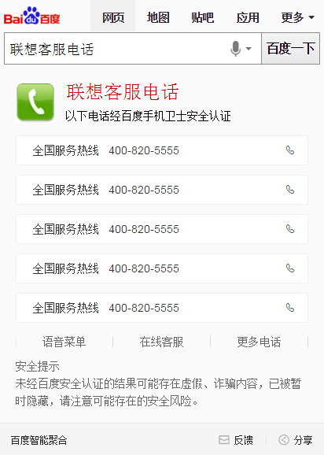

# 常健驰

> 从2016-04-04到2016-04-08

## 阿拉丁客服电话

### 背景与目标

用户使用百度搜索客服电话，即搜即所得，使用户方便获取到企业电话服务，并保证电话准确性，解决用户遇到的问题；
整合阿拉丁客服电话数据：使数据完整清晰可方便维护；
阿拉丁样式优化：提升体验；

### 收益

老模板：
主需求：200w/day
次需求：1800w/day

### 完成情况

已于4号下午上线，准备今天上小流量。预览：[招商银行客服](http://cp01-ala-fe-5.epc.baidu.com:8003/s?word=%E6%8B%9B%E5%95%86%E6%9C%9F%E8%B4%A7%E5%AE%A2%E6%9C%8D&sa=thr_2&ts=4603607&t_kt=0&ie=utf-8&rsv_t=9087JhTxrVWis61Dh3eHh4%252BBLPNG6uQk29dTeCptlxI9aJgj3qoJ&rsv_pq=16313390155767265035&ss=101&rsv_sug4=2615&inputT=1392&oq=1&sid=103288)

### 效果截图

### 扫描二维码

## wise端政务办事迁移卡简版

### 背景与目标

`背景`政务wise办事指南类卡片影响面约占政务项目wise端整体影响面的30%。而wise目前没有覆盖到政务办事指南类目，用户对查找服务指南类信息的操作成本高且流程复杂；因此将指南类服务信息在搜索结果页进行聚合，满足用户便捷查询获知的需求。

`目标` wise端政务指南类服务信息在搜索结果页进行聚合，满足用户便捷查询获知的需求

### 收益

影响面：30w/day

### 完成情况

新增模板，模板于3月31号上线，

### 效果截图

暂无

### 扫描二维码

暂无

## 后续排期

* 电影卡片开发 `负责人：pm-王玥`

* 体育模板开发 `负责人：pm-安瑞`
