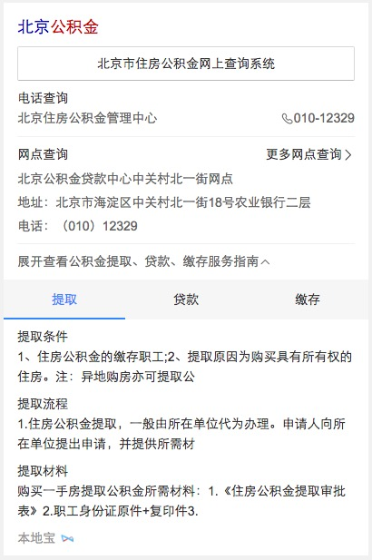

# 常健驰

> 从2016-04-11到2016-04-15

## wise端政务办事迁移卡简版

### 背景与目标

`背景`政务wise办事指南类卡片影响面约占政务项目wise端整体影响面的30%。而wise目前没有覆盖到政务办事指南类目，用户对查找服务指南类信息的操作成本高且流程复杂；因此将指南类服务信息在搜索结果页进行聚合，满足用户便捷查询获知的需求。

`目标` wise端政务指南类服务信息在搜索结果页进行聚合，满足用户便捷查询获知的需求

### 收益

影响面：30w/day

### 完成情况

新增模板，模板已在 `4月14日` 下午完成，目前数据还有些问题，`4月15号` 可以提测。[query](http://cp01-ala-fe-6.epc.baidu.com:8003/s?word=%E5%85%AC%E7%A7%AF%E9%87%91%E6%9F%A5%E8%AF%A2&sa=tb&ts=3224885&t_kt=0&ie=utf-8&rsv_t=37c5xgYhtyMOJNNrAJyf8EW1qWvXbD8TIXsC59xqklgYaxQVjZut&rsv_pq=10594020536277783468&ss=101&t_it=1&rsv_sug4=4812&inputT=4200&oq=%E9%99%84%E8%BF%91%E7%9A%84%E7%BE%8E%E9%A3%9F)

### 效果截图

### 扫描二维码

## 解决的问题

* 修改poetry和sockdynamic_moretab模板mcpack数据格式 - 已上线
* 修改wise_nba_match（NBA主卡）多条结果在返回为一条的时候会从数组变成对象 - 已上线
* 修改wise_xunzhi（寻址）和kefu（客服）拨打电话无法触发点击日志问题。 - 已上线
* 修改投票一星期换一个话题功能 - 暂时不上线

## 后续排期

* 体育模板开发 `负责人：pm-安瑞 and pm-詹利君`，已初步看了下效果图。
