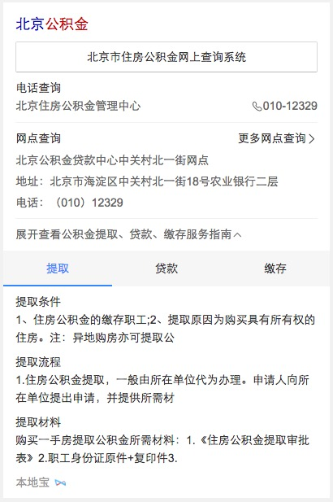

# 常健驰

> 从2016-04-18到2016-04-22

## wise端政务办事迁移卡简版

### 背景与目标

#### 背景：
政务wise办事指南类卡片影响面约占政务项目wise端整体影响面的30%。而wise目前没有覆盖到政务办事指南类目，用户对查找服务指南类信息的操作成本高且流程复杂；因此将指南类服务信息在搜索结果页进行聚合，满足用户便捷查询获知的需求。

#### 目标：
wise端政务指南类服务信息在搜索结果页进行聚合，满足用户便捷查询获知的需求

### 收益

影响面：30w/day

### 完成情况

新增模板，模板测试通过，预计 `4月22日` 模板上线。[query](http://cp01-ala-fe-6.epc.baidu.com:8003/s?word=%E5%85%AC%E7%A7%AF%E9%87%91%E6%9F%A5%E8%AF%A2&sa=tb&ts=3224885&t_kt=0&ie=utf-8&rsv_t=37c5xgYhtyMOJNNrAJyf8EW1qWvXbD8TIXsC59xqklgYaxQVjZut&rsv_pq=10594020536277783468&ss=101&t_it=1&rsv_sug4=4812&inputT=4200&oq=%E9%99%84%E8%BF%91%E7%9A%84%E7%BE%8E%E9%A3%9F)

### 效果截图

### 扫描二维码

## [拉塞尔项目] NBA赛事赛程

### 背景与目标

#### 背景：
拉塞尔项目是大型 IP 体育赛事的项目计划代号,会结合新的交互方式进行尝试。NBA 赛事是时下最为火爆的全球性篮球品类赛事。搜索量超过
100W。

#### 目标：
1.NBA 对阵卡片将会针对 NB 比赛文字直播、新闻视频、数据统计等方面的查询需求进行满足。
2.本卡片将会作为拉塞尔项目 NBA 的第二张卡片上线。后期将逐渐围绕对阵、球员、球队的多个 IP 逐渐全面满足。

### 收益

影响面：100W+/day

### 完成情况

现在正在写schema，由于没有给效果图最终稿，所以schema的格式不是完整版。正在催`pm-詹利君`

## 解决的问题

* 修改music_lrc和album_v2模板xml转mcpack格式 - 已上线
* 修改wise_nba_match（NBA主卡）多条结果tab不可点 - 已上线
* 修改zhidao（知道）当有一条数据的时候不出现下边框线 - 已上线
* 栅格化travel2滑动组件的间距 - 已上线
* wise_qanda模板做退化处理 - 已上线
* 替换模板底部左侧logo - 已上线
* 足球对阵样式模板调整需求 - 预计22日下午修改

## 后续排期

暂无
