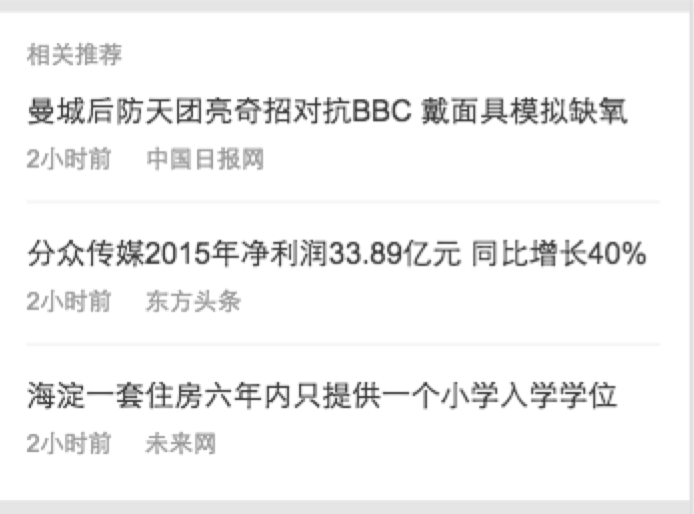
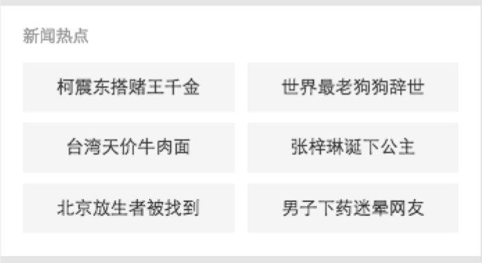

# 王培

> 从2016-04-18到2016-04-22

## 本周跟进

- 中途岛mib页第三方接入相关跟进
- 中途岛mib页数据接口打平
- 中途岛外站mib页跳转闭环修复
- 中途岛外站mib页相关推荐问题跟进

## 资讯垂类

### 1. 问题及BUG跟进、修复

###### - 外站mib页相关推荐全部来自『寻医问药』

- 问题原因：外站mib页的相关推荐数据来自于默认推荐，而默认推荐的数据，是离线定时扫tera库获取的。 扫tera库现在变得很慢，导致没有很长时间扫库不能结束，后续的默认推荐也就不能获取数据，无法更新

- 解决方案（短期）：先保证默认推荐数据种不只有一个站点的数据，临时解决问题  [2-3天]

- 解决方案（长期）：打通，相关推荐的数据通路，使外站mib和站内mib页走同一条数据流，都从推荐数据池种取数据，既满足随机性，又保证相关性

- 解决进度：推荐同学正在跟进解决


###### - 外站mib页相关推荐跳转闭环修复

- 问题原因：外站mib页的host为站外地址，之前未做这种情况的容错

- 解决方案：跳转之前先判断当前location的host，如果不是baidu.com域的，则将跳转地址改为baidu.com域下对应的连接

- 解决进度：已修复上线


### 2. mib页数据接口打平

#### 背景与目标

    后端数据接口与好看打平，前端兼容修改前后的数据格式，达到不影响线上展现的效果
    
#### 完成情况

- 状态：前端后端均已上线

#### 效果图

- 暂无


### 3. 接口加sid

#### 背景与目标

    为了能够在上线过程中进行分级验证，机制类似于大搜的分级验证机制，将所有到headline的请求都带上结果页请求中的url的sid参数
    
#### 完成情况

- 状态：代码已完成，待验证

#### 效果图

- 暂无


### 4. mib页推荐组件开发

#### 背景与目标

    目前资源方提交的数据中没有推荐和热词两个模块，为了统一样式，需要开发相关组件（类似于mib-img组件）
    
#### 完成情况

- 状态：已上线

#### 效果图



### 5. mib页热词组件开发

#### 背景与目标

    目前资源方提交的数据中没有推荐和热词两个模块，为了统一样式，需要开发相关组件（类似于mib-img组件）
    
#### 完成情况

- 状态：已上线

#### 效果图




### 6. 订阅频道页

#### 背景与目标

    为梳理、明确订阅功能的产品逻辑，提供短线调整方案，营造稳定入口，提升交互用户体验。主要优化功能包括通过指定Q=“我的订阅“作为固定入口导入订阅页面，以及订阅页面的产品逻辑进行梳理。
    
#### 完成情况

- PV：统计中

- 状态：

    - 点击加载更多改为无限下滑加载更多
    
    - 周五（04/15）上线
        
#### 效果图

<table algin="center" >
<tr>
<td style="vertical-align:top"></td>
<td style="vertical-align:top"></td>
<td style="vertical-align:top"></td>
<td style="vertical-align:top"></td>
</tr>
</table>

### 7. mib页性能监控（无更新）

- 状态：（开发中...）

    - 监控体系已确定（各个时间已和清乾沟通并明确）
    
    - 后端时间需要和曦洋，清乾沟通后确定获取方案

#### 速度监控

##### 监控体系

也可以称之为『监控指标』，更直接的对页面加载速度进行描述

- 时间点
    
      1. 用户点击调起mib页按钮或文案的时间点T1
                
      2. iframe页面解析到title节点的时间点T2
          
      3. iframe页面文章内容dom加载完成的间点T3（相关推荐之前的内容）
          
      4. iframe页面首屏（window高度内）的所有图片、视频等加载完成的时间点T4
      
      5. 后端时间 mib_ST放在返回的HTTP头部的SetCookie中，JS使用读取Cookie的方式获取时间值mib_ST.
                
- 监控指标定义 

    
   **首屏时间**
    
    含义：用户从触发调起mib页面事件到页面首屏区域全部加再完（包括图片、视频）的时间。

	计算方法： T4 - T1

    日志字段名：mib_fs
 
 
   **核心dom可用时间**
    
    含义：用户从触发调起mib页面事件到mib页面全部文字和框架布局的时间。

    计算方法： T3 - T1

    日志字段名：mib_tti

    
   **后端处理时间**
    
    含义：后端服务的时间开销

    计算方法： mib_ST, bws在接到请求和即将发出返回数据的时候记下时间点，两者相减得到后端处理时间。放入返回HTTP头部的setCookie中。

    日志字段名：mib_srv
    
   **网络时间**
    
    含义：从用户触发调起mib页面事件，到iframe中的页面下载完成开始执行时的网络开销（含少许浏览器开销）。
          
    网络开销包括：1、发送HTTP请求数据（1个RTT）；2、接受返回数据的第一个RTT

    少许浏览器开销包括：1、点击事件处理；2、解压gzip；3、把HTML装入解析器

         
    计算方法： T2 - mib_ST - T1

    日志字段名：mib_net
          
   **核心Dom前端渲染时间**
     
    含义：iframe页面从开始渲染到核心Dom（iframe区域全部文字和框架）渲染完成的耗时。
     
    计算方法：T3 - T2

    日志字段名：mib_fsdom
          
   **其他首屏元素时间**
 
    含义：从核心Dom渲染完成后出现首屏内元素加载完成的耗时。要注意的是首屏元素并不是在核心Dom渲染完成后才开始加载，在首屏元素的加载往往和Dom的渲染是并行的。在没有图片或者图片较少的情况下，核心Dom渲染完成后首屏就已经OK了。所以这个指标主要体现的是在核心Dom加载完成后，依然影响首屏展现的元素加载的额外开销。
		  
    计算方法：T4 - T3

    日志字段名：mib_frext
    
##### 监控机制

    即对页面加载速度等进行监控的代码
    
##### 日志数据 & 平台

    数据以日志的方式发送，speedup平台获取相关数据进行分析，总结
  
    更直接的向使用者展现mib页性能
  
    目前，speedup平台已经可以拿到mib页的日志数据
  
#### 后续计划

- 速度监控

- 速度优化

#### 完成情况

- 监控体系

    - 各个监控指标已确定，在实际测试中会根据测试数据进行调整
    
- 监控机制

    - 开发中
    
- 测试

    - delay


## 运营（无更新）

### 1. 运营类通用事件模板升级（无更新）

#### 背景与目标

```
老模板不能满足新的功能需求，修改及维护成本较大。因此开发新的模板，栅格迁移及功能升级，
```

#### 完成情况

- PV：暂无

- 状态

    - 模板已上线，0流量测试中，需求有变动，待需求确定后需要进一步改进
    
#### 效果图

<table algin="center">
<tr>
<td></td>
</tr>
</table>

### 3. 节日通用卡升级（无更新）

#### 背景与目标

```
为适应导流中途岛需求，模板需增加更优质、丰富阅读内容，以提高用户停留时长。
```

#### 完成情况

- PV：暂无

- 状态

    - 因UE调整哥伦布sigma设计标准，修改设计图，预计今天出终稿（delay）
    
    - 预计下周一（2016/03/14）进入开发状态

#### 效果图

<table algin="center">
<tr>
<td></td>
</tr>
</table>

## 下周计划

- 新交互改版图集功能
- mib跟进


 


