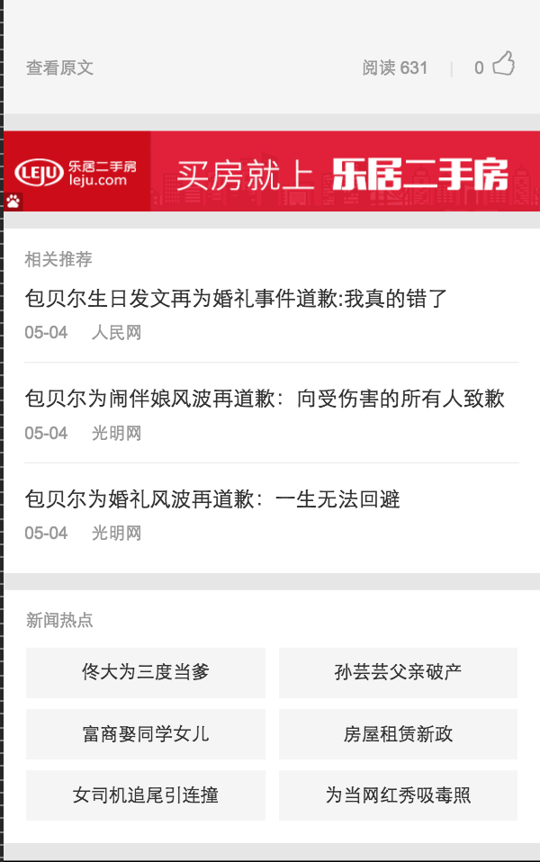
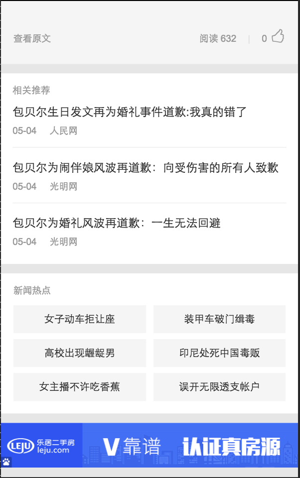
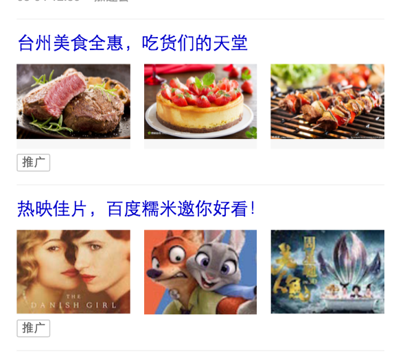
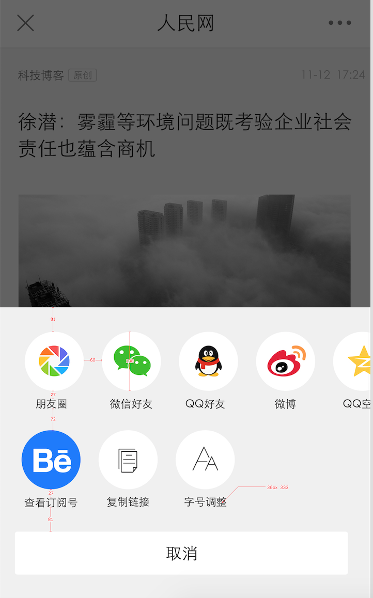

# 范黎明

> 从2016-4-29到2016-5-06

## 详情页增加广告实验

### 背景

资讯垂类详情页增加不同类型的广告展现形式，通过数据确定出收益最好的，本次增加banner图和多图

### 完成情况

* banner图周二已经上线
* 多图下周一上线

### 效果

## feed流增加糯米广告

### 背景

除过凤巢的推广外，feed流再插入糯米电影和美食的多图 图文的推广

### 完成情况

* 和后端接口已经调试完成 前端适配下周一上线

### 效果

## 详情页分享增加qq好友和复制链接功能

### 背景

完善详情页的功能，会增加复制链接 调整字号 查看媒体号等功能

### 完成情况

* 完成分享组件的迁移和实现最终样式
* 预计下周二上线

### 效果

## feed交互改成上拉刷新

### 背景

之前是初始会加载一页数据，给后端服务和策略都有影响，故改成上拉再请求数据

### 完成情况

* 今天上线

### 效果

类同sigma卡的上拉刷新

## 屏蔽评论入口

### 背景

黄反

