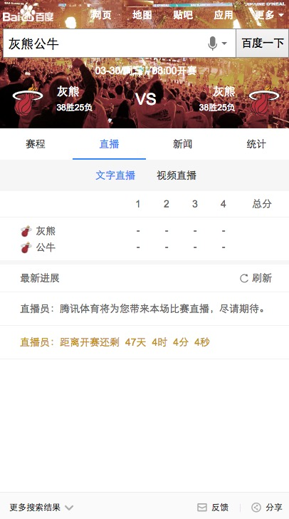

# 常健驰

> 从2016-05-09到2016-05-13

## [拉塞尔项目] NBA赛事赛程

### 背景与目标

#### 背景：
拉塞尔项目是大型 IP 体育赛事的项目计划代号,会结合新的交互方式进行尝试。NBA 赛事是时下最为火爆的全球性篮球品类赛事。搜索量超过
100W。

#### 目标：
1.NBA 对阵卡片将会针对 NB 比赛文字直播、新闻视频、数据统计等方面的查询需求进行满足。
2.本卡片将会作为拉塞尔项目 NBA 的第二张卡片上线。后期将逐渐围绕对阵、球员、球队的多个 IP 逐渐全面满足。

### 收益

影响面：100W+/day

### 完成情况

模板正在开发中，预计`5月17日~5月18日`联调，由于其他项目的中间介入，可能延期。[query](http://cp01-ps-fe-5.epc.baidu.com:8003/s?word=%E7%81%B0%E7%86%8A%E5%85%AC%E7%89%9B&ts=8088358&t_kt=0&rsv_iqid=6179829749448875471&sa=ihr_1&rsv_sug4=867&ss=001)

### 效果截图

### 扫描二维码

## 阿拉丁客服电话

### 背景与目标

#### 背景：
背景：提升准召率的策略在kv上实现不好，需要在ae上实现；

#### 目标：
提升客服电话准召率；预估准确率可由88.89%提升至94.44%；召回率保持在96.75%；

### 完成情况

模板已于`5月12日`上线 [query](http://cp01-ala-fe-5.epc.baidu.com:8003/s?word=%E6%8B%9B%E5%95%86%E9%93%B6%E8%A1%8C%E5%AE%A2%E6%9C%8D&ts=7444227&t_kt=0&rsv_iqid=1558272841467245562&sa=ihr_3&rsv_sug4=2100&ss=001)

### 效果截图

### 扫描二维码

## pc端失信人阿拉丁升级优化

### 背景与目标

#### 背景：
有些公司已履行业务，走书面流程中，政府企业时间跨度大，高院失信人信息不更新，导致搜索结果一直展示，失信公司反馈百度，希望修改；但实际上百度无法修改。
失信记录事情小，但搜索结果展示样事情强，会导致用户对企业产生误会。

#### 背景：
弱化失信人阿拉丁产品样式；

### 完成情况

模板`5月12日`开始联调 [query](https://alahttps.baidu.com/s?dev_workspace=platform&dev_tpl=right_sxr&dev_path=aladdin&dev_tpltype=default&tn=tpldev&dev_online=0&dev_module=dev-aladdin&dev_file=default.xml&dev_fileformat=xml&dev_pos=rightResult&wd=%E5%85%B3%E9%94%AE%E8%AF%8D&word=%E5%85%B3%E9%94%AE%E8%AF%8D)

### 效果截图

## 哥伦布-Wise宠物精确需求

### 背景与目标

为满足用户在搜索端搜索宠物相关query的搜索结果需求，以及在提升搜索体验的同时进行隐藏需求的激发验证。

### 完成情况

已跟 `pm-张子童` 对接了模板需求，数据结构已给出并同步到了schema中。

## 车系哥伦布

### 背景与目标

#### 背景：
线上的结果较为杂乱，详细分析用户需求后，把汽车用户按照场景分为：初步了解、我要买车、我是车主 三个阶段。
每个阶段展示和需求场景更为贴切的内容。希望打造一个买车、用车的稳定入口。

#### 目标：
打造汽车领域搜索结果的app化体验，提升用户体验。

### 完成情况

先给出了mini卡片的数据结构，其他的卡片先让`pm-张雅雯`找下线上模板，看是否可以复用。

## 后续排期

* 车系哥伦布
* 哥伦布-Wise宠物精确需求
