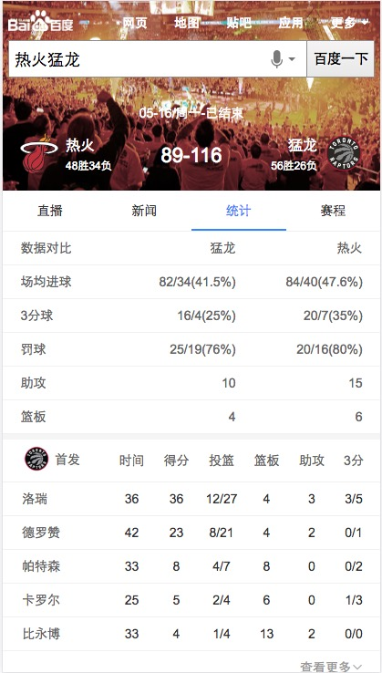

# 常健驰

> 从2016-05-16到2016-05-20

## [拉塞尔项目] NBA赛事赛程

### 背景与目标

#### 背景：
拉塞尔项目是大型 IP 体育赛事的项目计划代号,会结合新的交互方式进行尝试。NBA 赛事是时下最为火爆的全球性篮球品类赛事。搜索量超过
100W。

#### 目标：
1.NBA 对阵卡片将会针对 NB 比赛文字直播、新闻视频、数据统计等方面的查询需求进行满足。
2.本卡片将会作为拉塞尔项目 NBA 的第二张卡片上线。后期将逐渐围绕对阵、球员、球队的多个 IP 逐渐全面满足。

### 收益

影响面：100W+/day

### 完成情况

模板除了腾讯接口，其他已开发完，正在联调。接口预计`5月24日`能给出。[query](http://cp01-ps-fe-5.epc.baidu.com:8003/s?word=%E7%81%B0%E7%86%8A%E5%85%AC%E7%89%9B&ts=8088358&t_kt=0&rsv_iqid=6179829749448875471&sa=ihr_1&rsv_sug4=867&ss=001)

### 效果截图

### 扫描二维码

## pc端失信人阿拉丁升级优化

### 背景与目标

#### 背景：
有些公司已履行业务，走书面流程中，政府企业时间跨度大，高院失信人信息不更新，导致搜索结果一直展示，失信公司反馈百度，希望修改；但实际上百度无法修改。
失信记录事情小，但搜索结果展示样事情强，会导致用户对企业产生误会。

#### 背景：
弱化失信人阿拉丁产品样式；

### 完成情况

模板已于`5月18日`上线完成 [query](https://alahttps.baidu.com/s?dev_workspace=platform&dev_tpl=right_sxr&dev_path=aladdin&dev_tpltype=default&tn=tpldev&dev_online=0&dev_module=dev-aladdin&dev_file=default.xml&dev_fileformat=xml&dev_pos=rightResult&wd=%E5%85%B3%E9%94%AE%E8%AF%8D&word=%E5%85%B3%E9%94%AE%E8%AF%8D)

### 效果截图

## 哥伦布-Wise宠物精确需求

### 背景与目标

为满足用户在搜索端搜索宠物相关query的搜索结果需求，以及在提升搜索体验的同时进行隐藏需求的激发验证。

### 完成情况

`5月18日`开始开发 [query](http://cp01-ala-fe-5.epc.baidu.com:8003/s?word=%E5%93%88%E5%A3%AB%E5%A5%87&ts=8429016&t_kt=0&rsv_iqid=4555661904413861062&sa=ib&rsv_sug4=6758&ss=101&inputT=5466)

## 车系哥伦布

### 背景与目标

#### 背景：
线上的结果较为杂乱，详细分析用户需求后，把汽车用户按照场景分为：初步了解、我要买车、我是车主 三个阶段。
每个阶段展示和需求场景更为贴切的内容。希望打造一个买车、用车的稳定入口。

#### 目标：
打造汽车领域搜索结果的app化体验，提升用户体验。

### 完成情况

出了评测子卡和更多相关信息子卡数据格式(schema)

## 后续排期

* 车系哥伦布
