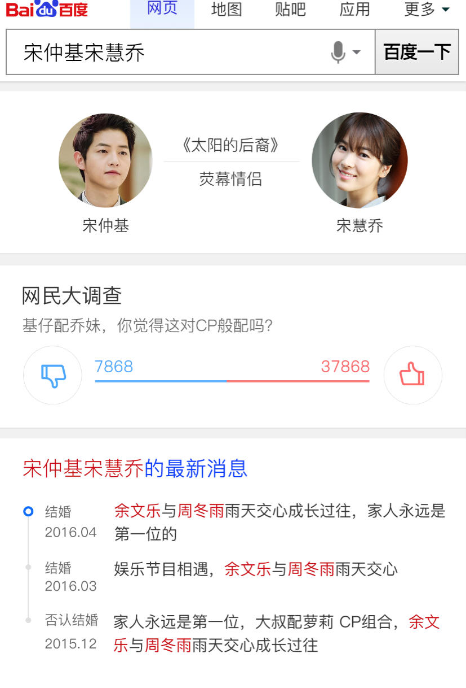

# 李佳隆

> 从2016-5-21到2016-5-27

## 哥伦布-人物cp(有结论)

### 背景

* CP类query是人物需求中一类特殊的存在，基于两个人名，寻求与两者均相关的信息，目前线上搜索结果页多为自然结果，满足一般。 现以哥伦布思路，将CP类query整个结果页纳入优化范畴，影响面约170w。 一期小流量实验，抽取热门cp7对，影响面约10w。 预期页面停留时长提升10s，换query比例下降1%左右。

### 收益

* pv:60w

### 完成情况

* 4.22日接入开发,4.29日小流量上线
* 模板已开发完毕,原定4.29日上线,但由于人物时间轴的子卡使用了最新时效性数据和老数据merge,时效性那边反馈,如果人物cp正好出了一些时效性新闻,就会牵扯到以前的负面新闻,这个责任不好划分谁来背. 和pm,rd讨论,最后确定方案为去掉时效性最新的那条数据,整个项目迁移到哥伦布2.0机制,节后上线
* 5.10号已小流量上线,
*  人物CP类小流量实验结论为： 1）无时间轴子卡query下，用户体验略正，结论依据为有点持平、换query比例降低等；建议对关系子卡等继续优化，参见产品建议。 
* 2)有时间轴子卡query下，用户体验略正，结论依据为换query比例降低；建议对关系子卡、时间轴子卡等继续优化，参见产品建议。

### 效果图

query : 杨洋和宋茜

sid :  105013

[传送门](http://m.baidu.com/s?word=%E5%AE%8B%E4%BB%B2%E5%9F%BA%E5%AE%8B%E6%85%A7%E4%B9%94&sid=105013)

## 哥伦布-人物idol个性化二期-

### 背景

* 迁移线上鹿晗为哥伦布3.0,改为白卡样式,并做粉丝,和路人在不同样式的收益实验

### 完成情况

* 目前哥伦布3.0不支持展开收起,对实验有巨大影响,故先实现此通用功能
* 5.26日同齐建,浪波以AE,odp同学对出了初步方案,预计5.30日提测
* 整体项目推迟到5.31日提测,6.1日上线

## 哥伦布-人物通用框架实验一期(无更新)

### 背景

* 哥伦布要求对整体生态有更强把控力，不仅局限于阿拉丁和sigma的内容增加，而是从用户需求出发整体考虑搜索结果的组织形式。
* 娱乐人物相关需求主要由阿拉丁和八卦自然结果满足
* 在明星query下增加八卦、图片、作品导流入口
* 将八卦类自然结果纳入到“明星八卦中心”里，搜索结果页结构改为阿拉丁+重点需求入口

### 完成情况

* 3.29日小流量上线
* 首版小流量数据显示有点有略微下降
* 4.8日上线白卡样式实验
* 4.12日上线黑卡样式实验
* 4.13日优化中间页调起,修复一些bug
* 4.14日上线人物轮播实验
* 4.19日上线无限下拉图片滚动加载优化
* 目前的4版实验中,发现在不同人群下数据不一样, 经典人物，在有百科摘要的效果持平。小鲜肉，深色版效果持平
* A类页面基本持平，A类往B类导流比例底，近期的计划两个方向，①重新建立A类页面框架（demo已出，UE设计中）②A对B导流方案迭代（目前已接入wd的数据，待上线.后续会给中途岛提需求,）

### 效果图

* 线上query 陈伟霆  sid=103289
* [传送门](http://m.baidu.com/s?word=%E9%99%88%E4%BC%9F%E9%9C%86&sid=103289)

## 哥伦布-人物通用框架实验二期

### 背景

* 哥伦布要求对整体生态有更强把控力，不仅局限于阿拉丁和sigma的内容增加，而是从用户需求出发整体考虑搜索结果的组织形式。
* 娱乐人物相关需求主要由阿拉丁和八卦自然结果满足
* 在明星query下增加八卦、图片、作品导流入口
* 将八卦类自然结果纳入到“明星八卦中心”里，搜索结果页结构改为阿拉丁+重点需求入口

### 完成情况

* 与浪波和rd确认了线上模板复用的方案,弱样式模板复用的方案,簇title数据来源方案
* 5.10日给出了头卡schema
* 5.11日rd给出了联调环境
* 开发中, 排期暂定下周3上线
* 开发完成,5.17日模板上线, 目前吴海和关总等老大对蓝色头部有异议,故先hold资源上线,等最后结果
* 新增白卡样式,短线方案先上线. 已开发完毕,5.27日上线

## 修改tc链接

### 背景

* 统一tc链接的拼接

### 完成情况

* 5.26日 已完成所有模板修复

## 公共issue收集

### 背景

* 为开发者能分享自己的开发经验,或者遇到过的坑提供一个交流平台,形成问题集.作为sfe文档的补充.
* [传送门](http://gitlab.baidu.com/psfe/ala-duty-case/issues)

### 最新进展

* 本周新增1个issue,已回答

## 值周
