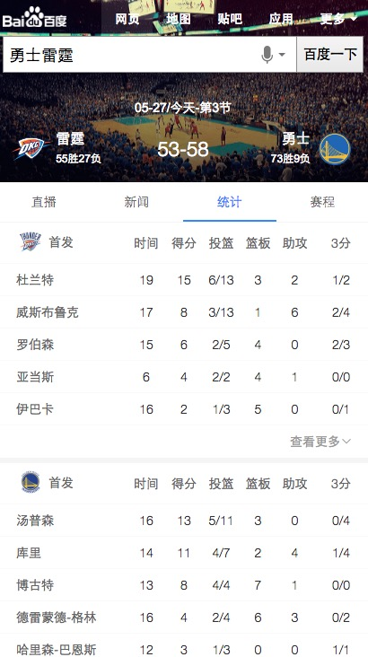
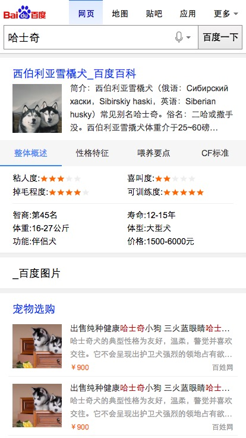

# 常健驰

> 从2016-05-30到2016-06-03

## [拉塞尔项目] NBA赛事赛程

### 背景与目标

#### 背景：
拉塞尔项目是大型 IP 体育赛事的项目计划代号,会结合新的交互方式进行尝试。NBA 赛事是时下最为火爆的全球性篮球品类赛事。搜索量超过
100W。

#### 目标：
1.NBA 对阵卡片将会针对 NB 比赛文字直播、新闻视频、数据统计等方面的查询需求进行满足。
2.本卡片将会作为拉塞尔项目 NBA 的第二张卡片上线。后期将逐渐围绕对阵、球员、球队的多个 IP 逐渐全面满足。

### 收益

影响面：100W+/day

### 完成情况

测试完成，`pm-詹利君`预计`6月3日`上线，但`6月3日`提出把原来修改的细线改回正常的栅格边框线，不确定今天能否上线 [query](http://cp01-ps-fe-5.epc.baidu.com:8003/s?word=%E5%8B%87%E5%A3%AB%E9%9B%B7%E9%9C%86&ts=6644187&t_kt=0&rsv_iqid=13607142978142302798&sa=ihr_2&rsv_sug4=868&ss=001)

### 效果截图

### 扫描二维码

## 哥伦布-Wise宠物精确需求

### 背景与目标

为满足用户在搜索端搜索宠物相关query的搜索结果需求，以及在提升搜索体验的同时进行隐藏需求的激发验证。

### 完成情况

已提测，预计`6月3日`测试完成 [query](http://cp01-ala-fe-5.epc.baidu.com:8003/s?word=%E5%93%88%E5%A3%AB%E5%A5%87&ts=8429016&t_kt=0&rsv_iqid=4555661904413861062&sa=ib&rsv_sug4=6758&ss=101&inputT=5466)

### 效果截图

### 扫描二维码

## 车系哥伦布

### 背景与目标

#### 背景：
线上的结果较为杂乱，详细分析用户需求后，把汽车用户按照场景分为：初步了解、我要买车、我是车主 三个阶段。
每个阶段展示和需求场景更为贴切的内容。希望打造一个买车、用车的稳定入口。

#### 目标：
打造汽车领域搜索结果的app化体验，提升用户体验。

### 完成情况

预计：模板开发周期为7天,数据联调为1天，提测并修改问题2天，`6月16日`上线

## 后续排期

* 宠物泛需求
