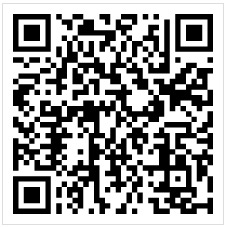

# 常健驰

> 从2016-06-13到2016-06-17

## 车系哥伦布

### 背景与目标

#### 背景：
线上的结果较为杂乱，详细分析用户需求后，把汽车用户按照场景分为：初步了解、我要买车、我是车主 三个阶段。
每个阶段展示和需求场景更为贴切的内容。希望打造一个买车、用车的稳定入口。

#### 目标：
打造汽车领域搜索结果的app化体验，提升用户体验。

### 完成情况

预计：模板开发周期为7天,数据联调为1天，提测并修改问题2天，`6月21日`上线 [query](http://cp01-ala-fe-5.epc.baidu.com:8003/s?word=%E5%AE%9D%E9%A9%AC3%E7%B3%BB&wiseus=10.94.189.142)

## 效果截图 - 需要先定位到北京

### 扫描二维码

## 模板修改
* nba球队vs球队新增需求直播时比分动态改变

## 后续排期

* 欧洲杯球队vs球队
* 宠物泛需求
