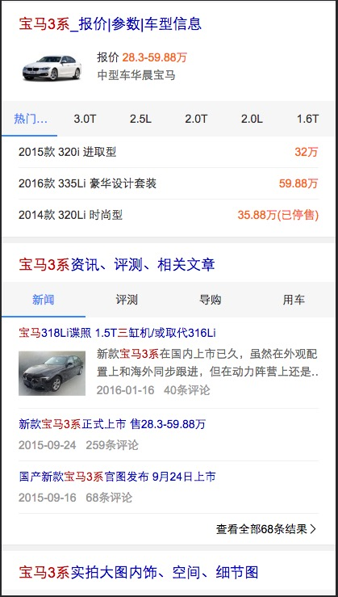
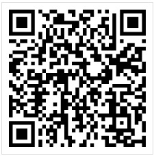

# 常健驰

> 从2016-06-20到2016-06-24

## 车系哥伦布

### 背景与目标

#### 背景：
线上的结果较为杂乱，详细分析用户需求后，把汽车用户按照场景分为：初步了解、我要买车、我是车主 三个阶段。
每个阶段展示和需求场景更为贴切的内容。希望打造一个买车、用车的稳定入口。

#### 目标：
打造汽车领域搜索结果的app化体验，提升用户体验。

### 完成情况

模板已 `6月21日` 提测，`6月23日`测试完成，目前存在的问题是资源放给不了等比例的图片，导致模板中图片有大有小，`6月24日`有结论，常识配置fn 定宽高比例。 [query](http://cp01-ala-fe-5.epc.baidu.com:8003/s?word=%E5%AE%9D%E9%A9%AC3%E7%B3%BB&wiseus=10.94.189.142)

## 效果截图 - 需要先定位到北京

### 扫描二维码

## 拉塞尔计划球队

### 背景与目标

#### 背景：
拉塞尔项目是大型 IP 体育赛事的项目计划代号,会结合新的交互方式进行尝试。NBA 赛事是时下最为火爆的全球性篮球品类赛事。搜索量超过
100W。后期将运用到篮球足球等大型比赛的需求满足,兼容样式。

#### 目标：
1.球队卡片将会针对赛事中球队 ip 进行满足。
2.本卡片将会作为拉塞尔项目第三张卡片上线。后期将逐渐围绕球员等多个 IP 逐渐全面满足。

### 完成情况

`6月22日`准备介入，schema已经写完并发给pm，由于是复用模板，已新建模板：sg-lasar-team，代码已从sg_lasar上copy过来，现在在等数据到位后配置环境，在召回模板的情况下修改模板的细节。

## 模板修改

#### tc连接修改
* 北京二手房 tpl=sh_house
* 肯德基团购 tpl=wise_tuan_brand
* 桥头排骨 tpl=wise_tuan_brand2

## 后续排期

* 宠物泛需求
