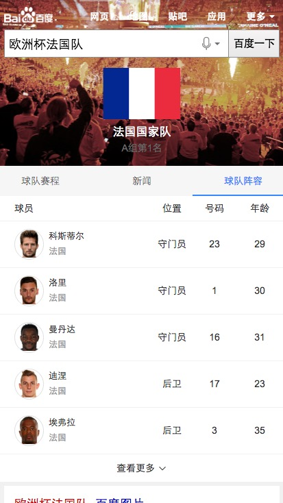
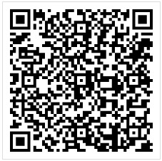

# 常健驰

> 从2016-6-27到2016-7-1

## 车系哥伦布

### 背景与目标

#### 背景：
线上的结果较为杂乱，详细分析用户需求后，把汽车用户按照场景分为：初步了解、我要买车、我是车主 三个阶段。
每个阶段展示和需求场景更为贴切的内容。希望打造一个买车、用车的稳定入口。

#### 目标：
打造汽车领域搜索结果的app化体验，提升用户体验。

### 完成情况

模板`6月23日`测试完成，开始走单，预计是`6月28日~6月29日`可以上线，后来提新需求模板的展现有些细节变化，目前`pm-张雅雯`正在确认是否要这么做。`7月1日`重新提三级单。[query](http://cp01-ala-fe-5.epc.baidu.com:8003/s?word=%E5%AE%9D%E9%A9%AC3%E7%B3%BB&wiseus=10.94.189.142)

## 效果截图 - 需要先定位到北京

### 扫描二维码

## 拉塞尔计划球队

### 背景与目标

#### 背景：
拉塞尔项目是大型 IP 体育赛事的项目计划代号,会结合新的交互方式进行尝试。NBA 赛事是时下最为火爆的全球性篮球品类赛事。搜索量超过
100W。后期将运用到篮球足球等大型比赛的需求满足,兼容样式。

#### 目标：
1.球队卡片将会针对赛事中球队 ip 进行满足。
2.本卡片将会作为拉塞尔项目第三张卡片上线。后期将逐渐围绕球员等多个 IP 逐渐全面满足。

### 完成情况

模板`6月27日`开始开发模板，`7月1日`模板开发完成，下午准备提测。原本打算复用原来写好的中超模板，但是由于中超模板本身已经兼容了其他样式，复用的效率并不高，所以单独开发了该模板，复用了部分样式。数据delay了两天。[query](http://cp01-ps-fe-5.epc.baidu.com:8003/s?word=%E6%AC%A7%E6%B4%B2%E6%9D%AF%E6%B3%95%E5%9B%BD%E9%98%9F&ts=0252296&t_kt=0&rsv_iqid=18410657037417513585&sa=ihr_2&rsv_sug4=2191&ss=001)

## 效果截图 - 需要先定位到北京

### 扫描二维码

## 模板修改

* 修改影视宣发卡`tvseries`模板投票票数的换行
* 修改nba球队对阵`sg_nbapk`模板直播结束后textLiveId参数默认设置为0

## 后续排期

* 宠物泛需求
