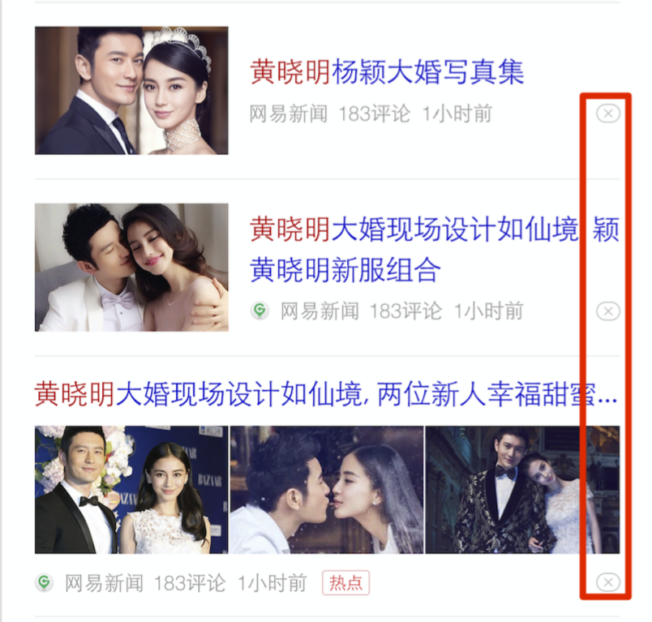
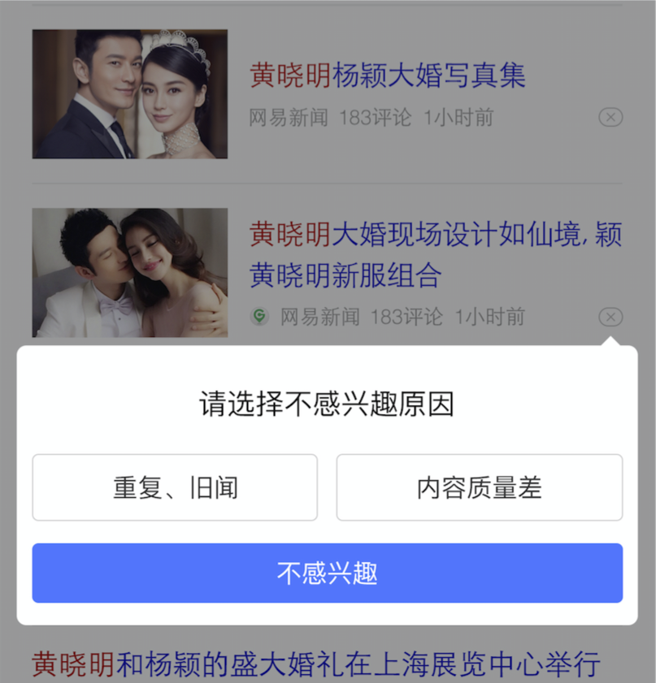
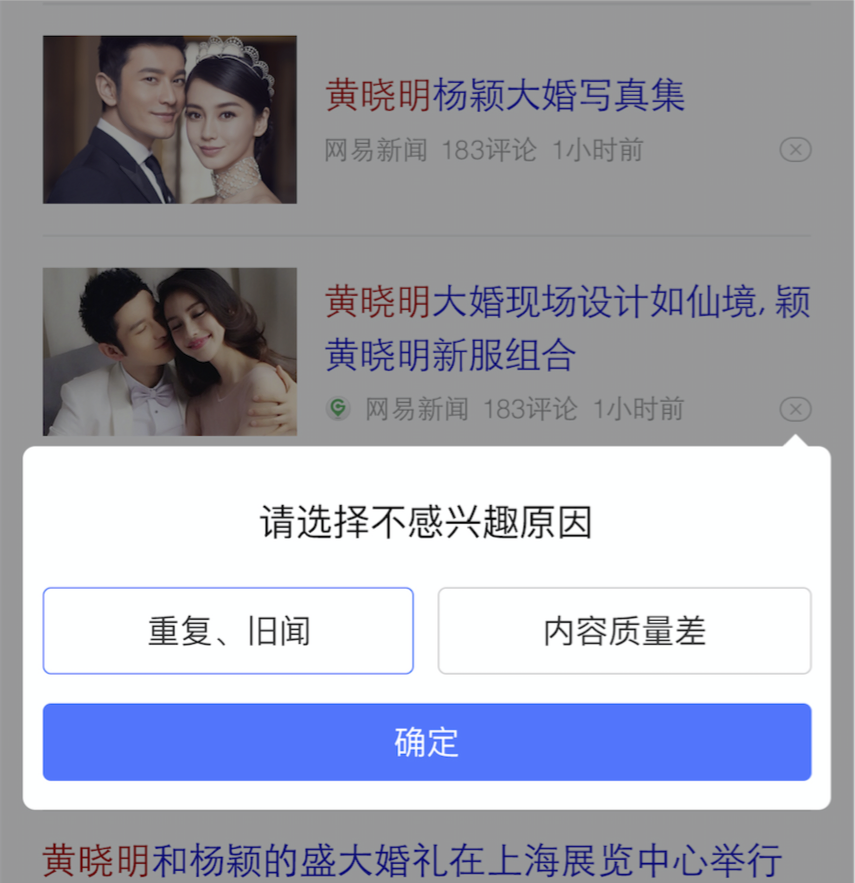

# 王培

> 从2016-06-06到2016-06-08

## 本周跟进

- 兴趣负反馈
- 已读新闻标记
- 图集升级
- mip cache
- mip 组件开发
- mip文档
- 用户反馈功能

## 资讯垂类

### 1. 专题页开发（无更新）

#### 背景与目标

    专题情景页，针对某些热点进行专题新闻运营

#### 完成情况

- 方案：新调起superframe

- 进度：已小流量（5%）上线，本周优化摘要截断行数，同步base文件升级

- 预览地址：http://m.baidu.com/s?word=%E7%99%BE%E5%BA%A6%E7%83%AD%E7%82%B9&sid=107290


#### 效果图

<table algin="center" >
<tr>
<td style="vertical-align:top">
    
</td>
<td style="vertical-align:top">
    
</td>
</tr>
</table>


### 2. 兴趣负反馈

#### 背景与目标

    提升用户体验，让用户参与个性化推荐的算法，通过用户反馈发现：
    
    1．新闻质量问题；
    2．用户个性偏好

#### 完成情况

- 进度：已经全量上线（06.30），用户登录的情况下，只在推荐频道展示负反馈按钮

- 预览地址：http://m.baidu.com/s?word=%E7%99%BE%E5%BA%A6%E7%83%AD%E7%82%B9


#### 效果图

<table algin="center" >
<tr>
<td style="vertical-align:top">
    
</td>
<td style="vertical-align:top">
    
</td>
<td style="vertical-align:top">
    
</td>
</tr>
</table>

### 3. 用户反馈

#### 背景与目标

    提升用户体验，收集用户反馈

#### 完成情况

- 进度：前端开发已经完成并且通过测试，待上线（需要pm确认上线时间）

- 方案：红点采用缓存策略实现


#### 效果图

<table algin="center" >
<tr>
<td style="vertical-align:top">
    
</td>
</tr>
</table>


### 4. 已读新闻标记（已完成）

#### 背景与目标

    提升用户体验

#### 完成情况

- 进度：今天（06.24）完成上线，- 

#### 效果图

- 暂无

### 5. 运营卡点击跳转时阿中间页（已完成）

#### 背景与目标

    提升用户体验，减少用户操作，直接跳转更多新闻页

#### 完成情况

- 进度：今天（06.24）完成小流量上线，

#### 效果图

- 暂无


### 6. 图集

#### 背景与目标

    针对图片资源，增强用户浏览的沉浸感和体验，提高媒体时长

#### 完成情况

- 状态：『回退位置hold在推荐图集』功能已经提测

- 线下预览地址：<a href="hhttp://cp01-ps-fe-11.epc.baidu.com:8003/s?word=%E7%99%BE%E5%BA%A6%E7%83%AD%E7%82%B9&sid=104656" target="_blank">http://cp01-ps-fe-11.epc.baidu.com:8003/s?word=%E7%99%BE%E5%BA%A6%E7%83%AD%E7%82%B9&sid=104656</a>


#### 效果图

<table algin="center" >
<tr>
<td style="vertical-align:top" rowspan="2"></td>
<td style="vertical-align:top"></td>
<td style="vertical-align:top"></td>
<td style="vertical-align:top" rowspan="2"></td>
</tr>
<tr>
<td style="vertical-align:top"></td>
<td style="vertical-align:top"></td>
</tr>
</table>


### 7. MIP Cache

######  - 组件相关代码拆分

- 背景：与pm一起配合rd同学完成mip cache的测试

- 方案：升级详细文档，及demo页面已经提供给pm和资源方

- 进度：已完善（06/23）


### 8. MIP 组件

######  - 组件相关代码拆分

- 背景：mip框架组件开发，为7月发版做准备

- 方案：参考amp

- 进度：

    ```
    mip-ad广告组件基础功能开发已完成，UE图未确认
    mip-appdl app下载组件未开始，缺少物料
    ```


## 运营（无更新）

### 1. 运营类通用事件模板升级（无更新）

#### 背景与目标

```
老模板不能满足新的功能需求，修改及维护成本较大。因此开发新的模板，栅格迁移及功能升级，
```

#### 完成情况

- PV：暂无

- 状态

    - 模板已上线，0流量测试中，需求有变动，待需求确定后需要进一步改进
    
#### 效果图

<table algin="center">
<tr>
<td></td>
</tr>
</table>

