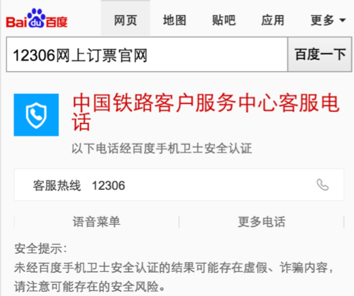
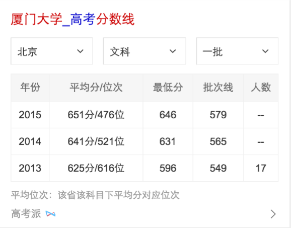

# 胡晓卉

> 从2016-07-04到2016-07-08

## 哥伦布-icon问题修复

### 背景

目前线上wise的自然结果使用阿拉丁模板时会出现图标，需要对自然结果和阿拉丁进行区分。

### 完成情况

联调中。

短线方案：91和traval2所有资源都加上showlamp字段，模板做foot的特殊处理。

开发：7.6，联调：7.7，7.11。联调过程中发现问题，前端需要修改预处理文件，后端的mini类的gss有bug,预计7.8打通。预计上线：7.12。

长线方案：kv/mini/ae都添加showlamp字段，前端统一根据这个字段判断。待跟进。

### 效果

## 哥伦布-客服优化

### 背景

目前线上pc和wise使用同一份数据资源，url字段相同，需要增加字段，对其进行区分。

### 完成情况

开发中。

开发：7.8，预计上线：7.11。

### 效果

## 哥伦布-教育-院校分数线优化

### 背景

目前线上院校分数线在匹配省份上无数据的时候没有召回卡片，优化为召回卡片提示“暂无数据”。

### 完成情况

待开发。

开发：7.12，联调：7.13，提测：7.14。

### 效果

