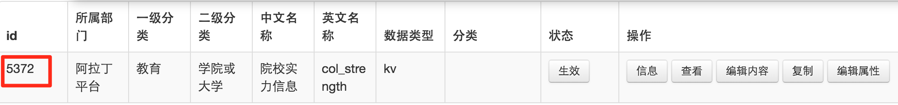
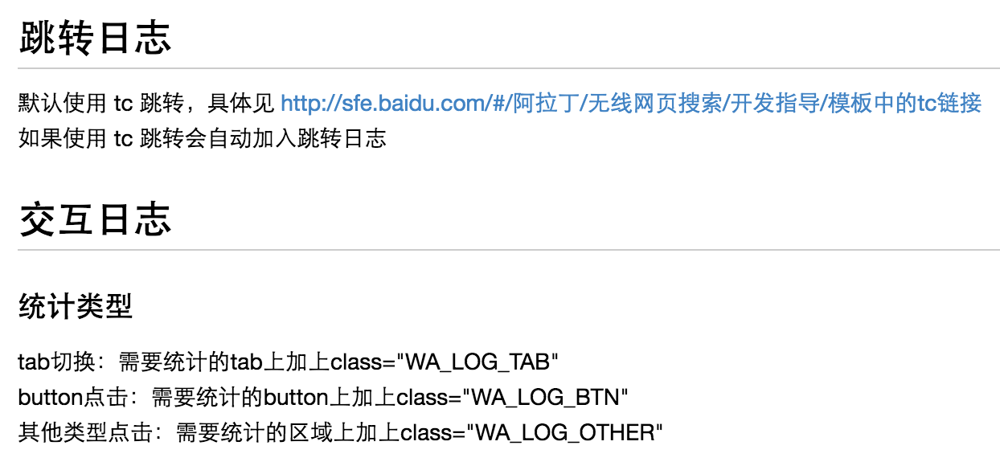
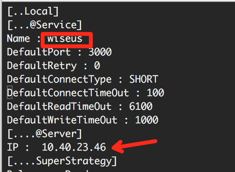
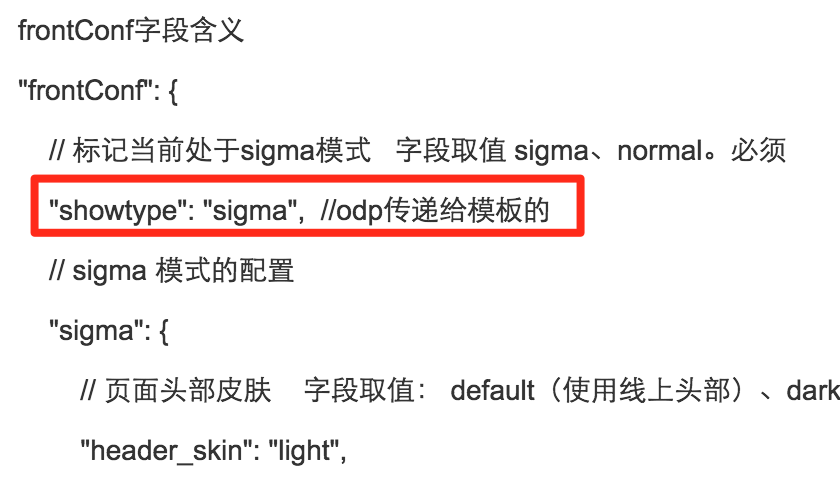

# 孟德丹

# 阿拉丁开发

> 1.对阿拉丁开发的流程进行串讲，开发中的经验与体会分享~~减少开发成本，提升效率 
> 2.并对网站性能优化方案简要介绍
 
| 模板类型 |资源类型|
|:----|:---:|
|普通阿拉丁|KV（PM提交资源，无需RD）|
|sigma|结构化（RD提供数据，配置召回）|

## Kv资源的普通阿拉丁开发

### 开发流程

1、定需求（psd, MRD）
* FE对PM提的需求及设计视觉，看是否可以复用线上已有模板，减少开发成本 <a href="http://tpldev.baidu.com:8082/#explore" target="_blank">模板浏览</a>
* 需要新开发的，看设计样式是否符合栅格化规范 <a href="http://pmd.baidu.com/doc/" target="_blank">栅格规范</a> 和 <a href="http://sfe.baidu.com/#/阿拉丁/无线网页搜索/开发规范/百度移动搜索体验设计规范" target="_blank">百度移动搜索体验设计规范</a>

* 如果ue设计不符合规范，按流程走<a href="http://sfe.baidu.com/#/阿拉丁/无线网页搜索/开发规范/UE设计打破栅格规范的确认流程" target="_blank">UE设计打破栅格规范的确认流程</a>
* 跟PM确定好需求细节，避免开发完修改（小屏换行展现问题等）

2、创建schema： <a href="http://pm.zz.baidu.com/" target="_blank">站长平台</a>
* schema是用于创建模板获取数据的格式，得到数据格式ID，具体操作见<a href="http://sfe.baidu.com/aladdin/wise/platform/zhanzhangpingtai.md" target="_blank">站长平台使用指南</a>
* schema创建的字段描述尽量详细一点，便于资源方提交资源，避免不必要的错误，节省时间。

3、创建模板：<a href="http://pm.open.baidu.com:8001/" target="_blank">模板平台</a>
* 在模板平台创建模板，并绑定数据格式ID，具体操作见<a href="http://sfe.baidu.com/#/阿拉丁/无线网页搜索/平台指南/02模板平台使用指南" target="_blank">模板平台使用指南</a>
* 把数据ID和模板名及ID给PM，让PM配置资源。大概20多分钟即可召回模板

4、一切准备就绪，可以开发了：<a href="http://tpldev.baidu.com:8082/#develop" target="_blank">开发平台</a>
* 在开发平台创建模板，编写代码，然后预览，提测，cr，上线操作都是在平台进行。具体平台操作见<a href="http://sfe.baidu.com/#/阿拉丁/圣玛利亚/平台使用手册" target="_blank">平台使用手册</a>
* 开发模板时参考<a href="http://sfe.baidu.com/#/阿拉丁/无线网页搜索/开发规范/模板开发基础规范" target="_blank">模板开发基础规范</a> 和<a href="http://sfe.baidu.com/#/阿拉丁/无线网页搜索/开发指导/base模板使用解析" target="_blank">base模板使用解析</a> 及 <a href="http://pmd.baidu.com/doc/" target="_blank">栅格规范源码</a>

5、开发完成后，点击预览可以看到效果
* 需要：query + us（资源是否上线） + srcid（资源号）+ sid(可选：小流量需要）
* wisetpl线下us：10.94.85.51
* 连的线上的us：10.40.23.46
* 如果没有召回：检查线下us是否最新，资源是否正常(找PM确定）

### 联调及提测
* Kv资源的不需要RD联调，在平台能召回对应资源的模板，没有召回查看文档<a href="http://sfe.baidu.com/#/阿拉丁/无线网页搜索/开发指导/召回问题总结" target="_blank">召回问题总结</a>查找问题
* 提测前一定要自测充分：

 1、添加交互日志；参加文档 <a href="http://sfe.baidu.com/#/阿拉丁/无线网页搜索/统计相关/wise统计日志" target="_blank">wise统计日志</a>

 2、大小屏测试充分；

* 测试时一定要测https下效果是否OK； 不支持的话参见文档 <a href="http://sfe.baidu.com/#/阿拉丁/无线网页搜索/开发指导/https开发指南" target="_blank">https开发指南</a>

### 上线

* 上线过程小流量的要加sid才能看到召回效果；

## 结构化模板类型的开发

1、结构化类型的开发创建模板时，模板类型是GSS2

2、联调需要RD配置召回

* 部署代码到测试机
* 部署后去测试机看是否部署成功：/home/work/odp/template/search/searchaladdin
* 配置测试机的us
  1. 登录测试机： ssh work@cp01-ala-fe-col-4.epc.baidu.com
  2. 找到配置文件：/home/work/odp/conf/ral/services/wise.conf
  3. 修改wiseus下的IP，改成测试机的us或者RD的us

  4. sh /home/work/odp/php/sbin/php-fpm start
* RD进行相关配置如资源号，哥伦布，sigma类型配置等
* 查看召回效果，如果没有召回，按照文档<a href="http://sfe.baidu.com/#/阿拉丁/无线网页搜索/开发指导/召回问题总结" target="_blank">召回问题总结</a>查找问题

## sigma卡的开发

1、开发
* 开发sigma卡参考文档 <a href="http://sfe.baidu.com/#/阿拉丁/无线网页搜索/开发规范/sigma2.0+开发规范" target="_blank">sigma2.0+开发规范</a>
* 平台可以配置sigma样式
* 配置文档 <a href="http://wiki.baidu.com/pages/viewpage.action?pageId=175020599" target="_blank">sigma配置详解</a>

2、联调（线下sigma环境）
* 需要RD配置US 参考文档 <a href="http://sfe.baidu.com/#/阿拉丁/无线网页搜索/开发规范/sigma2.0+开发规范" target="_blank">sigma2.0+开发规范</a>
* 召回sigma模板，如果没有召回sigma样式，查找odp传给模板的参数

* 例子：<a href="http://cp01-bihao.epc.baidu.com:8003/s?word=%E5%AF%92%E6%88%982" target="_blank">寒战2</a>  <a href="http://cp01-bihao.epc.baidu.com:8003/s?word=%E5%BE%AE%E5%BE%AE%E4%B8%80%E7%AC%91%E5%BE%88%E5%80%BE%E5%9F%8E" target="_blank">微微一笑很倾城</a>

3、上线
* sigma的配置需PM完成上线配置操作
* 一定要保证模板出现在首位，否则召回的是普通阿拉丁卡（也是PM配置）

## 网站性能优化

* 减少http请求：图片，js，css合并； 利用缓存(使用外部js,css)
* 减少组件体积大小：删除重复代码；精简js；压缩组件
* 加快渲染速度：避免使用css表达式；样式表在顶部；js脚本在底部
* 跟请求服务器的距离有关：内容分发网络(CDN)

## 代码规范的重要性

* CSS规范 <a href="http://styleguide.baidu.com/style/css/index.html#id7" target="_blank">百度CSS编码规范</a>
* JS规范 <a href="http://styleguide.baidu.com/style/js/index.html" target="_blank">百度JS编码规范</a>
* 大神们的规范总结 <a href="http://ala-fe.baidu.com/codereview/cr1.md" target="_blank">代码走查系列</a>

## 合作精神: 高效负责的完成每一项工作！
