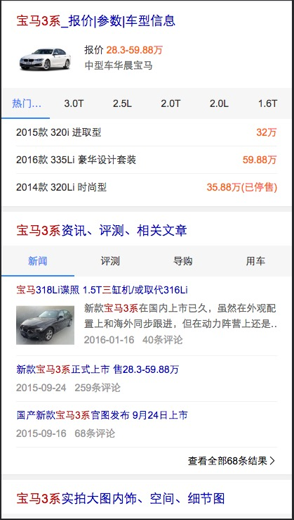

# 常健驰

> 从2016-7-4到2016-7-8

## 车系哥伦布

### 背景与目标

#### 背景：
线上的结果较为杂乱，详细分析用户需求后，把汽车用户按照场景分为：初步了解、我要买车、我是车主 三个阶段。
每个阶段展示和需求场景更为贴切的内容。希望打造一个买车、用车的稳定入口。

#### 目标：
打造汽车领域搜索结果的app化体验，提升用户体验。

### 完成情况

模板于`7月6日`上线 [query](https://m.baidu.com/ssid=22266368616e676a69616e636869df09/s?word=%E5%AE%9D%E9%A9%AC3%E7%B3%BB&sid=102162)

## 效果截图 - 需要先定位到北京

### 扫描二维码

## 拉塞尔计划球队

### 背景与目标

#### 背景：
拉塞尔项目是大型 IP 体育赛事的项目计划代号,会结合新的交互方式进行尝试。NBA 赛事是时下最为火爆的全球性篮球品类赛事。搜索量超过
100W。后期将运用到篮球足球等大型比赛的需求满足,兼容样式。

#### 目标：
1.球队卡片将会针对赛事中球队 ip 进行满足。
2.本卡片将会作为拉塞尔项目第三张卡片上线。后期将逐渐围绕球员等多个 IP 逐渐全面满足。

### 完成情况

模板临时提出需求，赛程的样式从原来的列表样式改为滑动的tab切换，改为跟欧洲杯的样式一样。模板已完成并测试通过，`pm-安瑞`于`7月7日`晚上开始走单 [query](http://cp01-ps-fe-5.epc.baidu.com:8003/s?word=%E6%AC%A7%E6%B4%B2%E6%9D%AF%E6%B3%95%E5%9B%BD%E9%98%9F&ts=0252296&t_kt=0&rsv_iqid=18410657037417513585&sa=ihr_2&rsv_sug4=2191&ss=001)

## 效果截图

### 扫描二维码

## 模板修改

* 修改影视宣发卡`tvseries`模板投票票数的换行
* 宠物精确需求哥伦布卡片 百科子卡模板改为复用线上百科模板，原子卡模板去掉百科部分改成tab切换 - 已上线

## 后续排期

* 宠物泛需求
