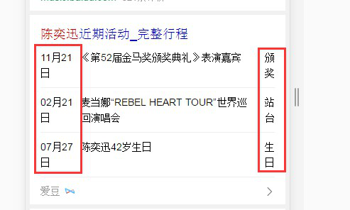

# 饶少艳

> 从2016-07-11号到2016-07-15

## 哥伦布-卡片收起位置调整

### 背景

哥伦布卡片组展开显示簇结果时，非哥伦布结果位置会下移；当收起时，其他结果上移，滚动条位置未变化，导致几条结果数据被浏览器窗口隐藏，用户可能无法正常浏览这几条数据。

### 完成情况

07.11上线。

* 方案：收起时按钮条位置放置浏览器顶部。滚动条距离设置为展开条距页面顶部距离。

* 07.06-07.08 开发，QA测试；07.11 上线。

### 效果

query : 鹿晗
sid : 106361

### 存在问题

手机百度浏览器中

原因：百度浏览器，导航栏会随上下滑动隐藏，gr_base通用性高，不能添加判断。

## we_table 文字截断修复

### 背景

we_table 中的列在小屏手机中存在文字截断的情况，需要对第一列和第三列数据不换行。

### 完成情况

07.13上线。

* 方案：第一列设置最小宽度，最后一列设置不换行。

* 07.12 开发，QA测试；07.13 上线。

### 效果

query : 陈奕迅 易烊千玺

## GMV项目：法律-连接人

### 背景

法律相关的搜索Query，展现百度律师咨询结果。

* 强需求：法律咨询、律师咨询、找律师等，默认插入第一条，参与点调

* 弱需求：离婚后孩子怎么判等问答需求，默认插入第三条，参与点调

### 完成情况

等待UE定稿中。

* 方案：新建模板开发。

* 07.12 需求提出。07.15 今天已根据MRD完成大致开发，后续需要UE给出定稿继续开发。预计07.19 UE给出定稿。

MRD基本样式。

