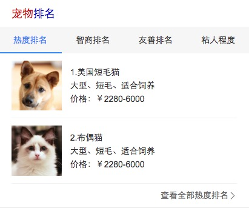
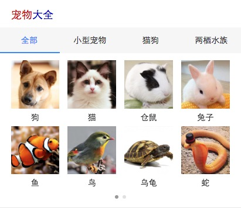

# 常健驰

> 从2016-7-11到2016-7-15

## 拉塞尔计划球队

### 背景与目标

#### 背景：
拉塞尔项目是大型 IP 体育赛事的项目计划代号,会结合新的交互方式进行尝试。NBA 赛事是时下最为火爆的全球性篮球品类赛事。搜索量超过
100W。后期将运用到篮球足球等大型比赛的需求满足,兼容样式。

#### 目标：
1.球队卡片将会针对赛事中球队 ip 进行满足。
2.本卡片将会作为拉塞尔项目第三张卡片上线。后期将逐渐围绕球员等多个 IP 逐渐全面满足。

### 完成情况

无更新 模板于`7月9日`申请紧急上线 [query](https://m.baidu.com/ssid=22266368616e676a69616e636869df09/s?word=%E6%AC%A7%E6%B4%B2%E6%9D%AF%E7%BD%97%E9%A9%AC%E5%B0%BC%E4%BA%9A%E9%98%9F&sa=re_1_sg_lasar_football&rqid=3181398352491397315)

## 效果截图

### 扫描二维码

## 哥伦布-Wise宠物泛需求

### 背景与目标

#### 背景与目标：
为满足用户在搜索端搜索宠物相关query的搜索结果需求，以及在提升搜索体验的同时进行隐藏需求的激发验证。

### 完成情况

宠物大全模板`tpl=pet_sorts`已完成，宠物排名模板`tpl=pet_rank`正在开发情景页，目前只是用的假数据，等模板完成后进入数据联调阶段，预计`7`月20日`联调 [宠物大全](https://wwwhttps.baidu.com/s?dev=1&dev_workspace=platform&dev_module=aladdin-wise&dev_tpl=pet_sorts&dev_path=searchaladdin&dev_tpltype=default&tn=iphone&sid=99999&dev_online=0&dev_file=default.xml&dev_fileformat=xml&dev_pos=asResult&wd=%E5%AE%A0%E7%89%A9&word=%E5%AE%A0%E7%89%A9) [宠物排名](https://wwwhttps.baidu.com/s?dev=1&dev_workspace=platform&dev_module=aladdin-wise&dev_tpl=pet_rank&dev_path=searchaladdin&dev_tpltype=default&tn=iphone&sid=99999&dev_online=0&dev_file=default.xml&dev_fileformat=xml&dev_pos=asResult&wd=%E5%AE%A0%E7%89%A9&word=%E5%AE%A0%E7%89%A9)

## 效果截图

### 宠物排名效果截图

### 扫描二维码

### 宠物大全效果截图

### 扫描二维码

## 模板修改

* petbk模板兼容多数据类型 - 已上线
* 二手房title和更多跳转失败 - 已修复上线

## 后续排期

* 暂无
