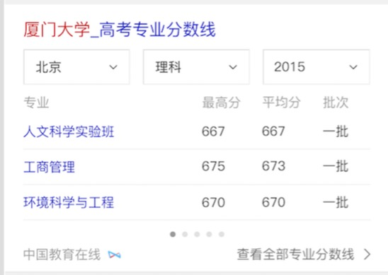
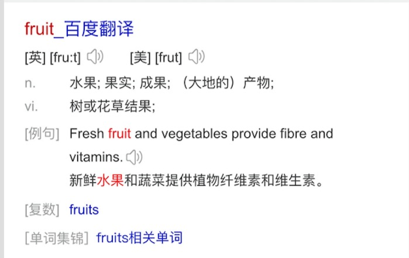

# 胡晓卉

> 从2016-07-18到2016-07-22

## 哥伦布-教育-专业分数线

### 背景

提供专业介绍、专业平均分等信息。在筛选院校基础上，为用户筛选专业提供依据。

### 完成情况

开发中。

开发：7.20-7.22，联调：7.26-7.27。提测：预计7.28。

ue图还未通过评审，没有给标注图；资源方7.25提供数据。

### 效果

## 哥伦布-教育-翻译卡片优化

### 背景

翻译卡片将单词集锦改为文字链形式。

### 完成情况

7.21上线。反转对照模板在等三级单，未上线。

开发：7.15，提测：7.18。

### 效果

[预览](https://m.baidu.com/s?word=apple)

## 哥伦布-教育-院校分数线优化

### 背景

目前线上院校分数线在匹配省份上无数据的时候没有召回卡片，优化为召回卡片提示“暂无数据”。ue规范调整，配合调整样式。

### 完成情况

待跟进。

功能点修改联调大致完成，后端还没ready，还需最后验证一下。

ue图未通过评审，暂未修改样式。

## 哥伦布-icon问题修复

### 背景

目前线上wise的自然结果使用阿拉丁模板时会出现图标，需要对自然结果和阿拉丁进行区分。

### 完成情况

短线方案7.11上线。长线方案在等待rd修复mini类bug，AE增加showlamp字段。

短线方案：91和traval2所有资源都加上showlamp字段，模板做foot的特殊处理。

长线方案：kv/mini/ae都添加showlamp字段，前端统一根据这个字段判断。

目前kv有showlamp字段。mini类bug预计本周上线。AE现在不支持showlamp透传，还没给出时间点。

### 效果

